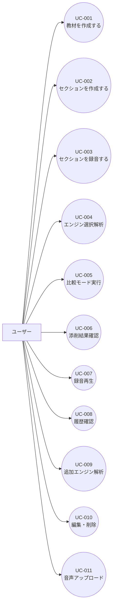

# 要件定義書

## 1. 目的

本プロジェクトは、日本語話者の英語学習者が、General American English のネイティブ発音に近い長文スピーチ発話を習得するためのWebアプリケーションを構築することを目的とする。

特に、単語単体の正確性だけでなく、スピーチやTED相当の長文におけるリンキング、弱形、脱落、同化、省略、強勢、リズム、イントネーション、ポーズ、話速を本文上で具体的に添削し、ユーザーが「どこが、なぜ、どのようにネイティブらしさから外れているか」を把握できる体験を提供する。

MVPでは、ローカル環境で実際の操作感と使用感を検証し、本格使用フェーズで公開形態、ログイン機能、同期、バックアップ、ブラウザ完結モードの採否を判断する。

## 2. スコープ

### 2.1 対象範囲

- ローカル環境で動作するWebアプリケーション
- ユーザーが題材を作成する機能
- 題材配下にセクションごとの英文本文を貼り付けて練習セクションを作成する機能
- セクション単位のブラウザ録音
- セクション画面内での録音、解析実行、進捗表示、結果確認
- OpenAI API解析エンジンとOSS Workerの切り替え
- OpenAI API解析エンジンとOSS Workerの比較実行
- エンジン別解析結果の保存、表示、比較
- General American Englishを基準とした厳しめのネイティブ模倣判定
- 本文ハイライト中心の添削結果表示
- 全文再生と指摘箇所の部分再生
- 教材、セクション、録音試行、解析結果の履歴保存
- 教材、セクション、録音試行、解析結果の削除
- PC/スマホのChromeおよびSafari対応

### 2.2 対象外

- TED等の外部サイト連携
- 外部サイトからの動画、字幕、スクリプト自動取得
- 本格公開、ユーザー登録、ログイン、認証、権限管理
- PC/スマホ間のユーザーアカウント同期
- 模範音声生成および模範音声再生
- 特定話者の完全コピー判定
- British English、Australian English等、General American English以外の発音変種対応
- 練習ドリル生成
- 口の形、舌位置、息の出し方の詳細指導
- 解析結果JSON、ZIP、CSV、Markdown等のエクスポート
- 完全ブラウザ完結解析のMVP提供
- ネイティブモバイルアプリ

## 3. 用語定義

| 用語 | 説明 |
|---|---|
| 教材 | TEDなどの練習元をまとめる題材コンテナ。タイトルと任意ソース情報を持つ |
| セクション | 題材配下にユーザーが英文本文を貼り付けて作成する練習単位 |
| セクション系列 | 題材内の練習セクション枠。表示順、タイトル、削除状態を持ち、本文改訂時も系列として履歴をまとめる |
| セクション本文版 | セクション系列に属する英文本文の版。改訂時は旧版を上書きせず新しい版を作る |
| 録音試行 | セクションに対してユーザーが録音した1回分の音声 |
| 解析エンジン | 録音音声と基準英文を比較し、スコアと指摘を生成する処理系 |
| OpenAI API解析エンジン | OpenAI APIを第一候補とするクラウドAI解析エンジン |
| Haskell OSS Worker | Haskellで実装する、ローカルCPUで実行可能なOSS解析worker |
| 比較モード | 同じ録音試行に対してOpenAI API解析エンジンとOSS Workerの両方を実行し、結果をエンジン別に比較するモード |
| General American English | 本アプリがMVPで基準とする米国英語発音 |
| IPA | International Phonetic Alphabet。UIで表示する発音記号体系 |
| ARPABET | CMUdict等で使われる英語音素表記。内部解析で利用を許容する |
| リンキング | 単語間の音が連結して発音される現象 |
| 弱形 | 機能語などが文中で弱く短く発音される現象 |
| 脱落 | 自然発話で一部の音が弱化または発音されなくなる現象 |
| 同化 | 隣接音の影響で音が変化する現象 |
| 省略 | `kind of` が `kinda` のように縮約的に発音される現象 |
| Prosody | 強勢、リズム、イントネーション、ポーズ、話速などの韻律要素 |
| 本文ハイライト | 問題箇所をセクション本文上に色、ラベル、アイコン、詳細パネルで表示するUI |

## 4. ステークホルダー

| ステークホルダー | 役割 | 関心事 |
|---|---|---|
| ユーザー | 日本語話者の中級前後の英語学習者。初期利用者は作者本人 | TED相当の長文をGeneral American Englishらしく発話できるようになること |
| 開発者 | Webアプリケーション、解析エンジン、保存機構の実装者 | ローカルMVPで素早く使用感を検証できること。将来の公開・認証・worker分離に備えた設計 |
| OpenAI | クラウドAI API提供元 | API仕様の遵守、音声・英文送信時の取り扱い、利用コスト |
| Haskell OSS Worker | Haskellで実装される解析処理 | CPU動作、将来サーバー配置、OpenAI API結果との比較可能性 |

## 5. ユースケース一覧

| ID | ユースケース名 | アクター | 優先度 |
|---|---|---|---|
| UC-001 | 教材を作成する | ユーザー | Must |
| UC-002 | セクションを作成する | ユーザー | Must |
| UC-003 | セクションを録音する | ユーザー | Must |
| UC-004 | 解析エンジンを選択して解析する | ユーザー | Must |
| UC-005 | 比較モードで両エンジンを実行する | ユーザー | Must |
| UC-006 | 本文ハイライトで添削結果を確認する | ユーザー | Must |
| UC-007 | 録音音声を再生する | ユーザー | Must |
| UC-008 | 履歴を確認する | ユーザー | Must |
| UC-009 | 同じ録音に対して別エンジンを追加実行する | ユーザー | Must |
| UC-010 | データを編集・削除する | ユーザー | Must |
| UC-011 | 音声ファイルをアップロードして解析する | ユーザー | Should |

### 5.1 ユースケース図

## 6. ユースケース詳細

### UC-001: 教材を作成する 

| 項目 | 内容 |
|---|---|
| **ID** | UC-001 |
| **アクター** | ユーザー |
| **事前条件** | ローカル環境でアプリケーションが起動している |
| **事後条件** | 題材が保存され、セクション作成に利用できる |
| **トリガー** | ユーザーが題材タイトルと任意ソース情報を保存する |

**基本フロー:**

1. ユーザーが教材作成画面を開く
2. ユーザーがタイトルを入力する
3. ユーザーが任意でソースURL、ソースタイトル、話者名を入力する
4. システムが題材を保存する
5. システムが教材詳細画面を表示する

**例外フロー:**

- タイトルが空の場合、システムは保存せずエラーを表示する
- ソース情報が不正な場合、システムは保存前に警告を表示する

### UC-002: セクションを作成する 

| 項目 | 内容 |
|---|---|
| **ID** | UC-002 |
| **アクター** | ユーザー |
| **事前条件** | 教材が作成済みである |
| **事後条件** | SectionSeriesと初版Section本文が保存される |
| **トリガー** | ユーザーが題材配下で「セクション作成」を実行する |

**基本フロー:**

1. ユーザーが題材詳細を表示する
2. ユーザーが「セクション作成」を実行する
3. ユーザーがセクション名、表示順、練習したい英文本文を入力する
4. システムが本文の最低限の妥当性を検証する
5. システムがSectionSeriesと初版Sectionを保存する

**例外フロー:**

- セクション名が未入力または空文字の場合、システムはセクションを作成しない
- 本文が空の場合、システムはセクションを作成しない
- 本文が長すぎる場合、システムは分割を促す

### UC-003: セクションを録音する 

| 項目 | 内容 |
|---|---|
| **ID** | UC-003 |
| **アクター** | ユーザー |
| **事前条件** | セクションが作成済みであり、ブラウザがマイク利用を許可している |
| **事後条件** | 録音試行と音声ファイルがサーバー側に保存され、同一画面で解析を開始できる |
| **トリガー** | ユーザーがセクション画面で録音を開始する |

**基本フロー:**

1. ユーザーがセクション画面を開く
2. システムが録音対象の英文を表示する
3. ユーザーが録音を開始する
4. ユーザーが英文を読み上げる
5. ユーザーが録音を停止する
6. システムが音声ファイルをサーバー側に保存する
7. システムが録音試行を履歴に追加する
8. システムが画面遷移せずに解析エンジン選択と解析開始操作を表示する

**代替フロー:**

- ユーザーが録音を取り消した場合、システムは音声ファイルと録音試行を保存しない
- ユーザーが録音停止後にそのまま解析を実行する場合、システムは同一セクション画面内でジョブを作成し、進捗を表示する

**例外フロー:**

- マイク権限が拒否された場合、システムは録音不可の理由を表示する
- 録音中にブラウザバック、タブ切り替え、画面ロックが発生した場合、システムは可能な範囲で録音状態を保持し、保持できない場合は録音失敗として扱う

### UC-004: 解析エンジンを選択して解析する 

| 項目 | 内容 |
|---|---|
| **ID** | UC-004 |
| **アクター** | ユーザー |
| **事前条件** | 録音試行が保存済みである |
| **事後条件** | 選択した解析エンジンの解析ジョブが作成される |
| **トリガー** | ユーザーがセクション画面内でOpenAI APIまたはOSS Workerを選択して解析を実行する |

**基本フロー:**

1. ユーザーが録音完了後のセクション画面、または履歴画面から録音試行を選択する
2. ユーザーが解析エンジンを選択する
3. システムが解析ジョブを作成する
4. システムが同一画面内でジョブ状態を表示する
5. 解析完了後、システムが結果を保存する
6. システムが同一画面内で解析結果を表示する

**代替フロー:**

- ユーザーが解析中に画面を閉じた場合も、ジョブはサーバー側で継続する
- ユーザーが履歴画面から解析を開始した場合、履歴画面または録音試行詳細画面内でジョブ状態と結果を表示する

**例外フロー:**

- OpenAI API呼び出しに失敗した場合、システムは失敗状態とエラー理由を保存する
- OSS Workerが失敗した場合、システムは失敗状態とエラー理由を保存する

### UC-005: 比較モードで両エンジンを実行する 

| 項目 | 内容 |
|---|---|
| **ID** | UC-005 |
| **アクター** | ユーザー |
| **事前条件** | 録音試行が保存済みである |
| **事後条件** | OpenAI API解析結果とOSS Worker解析結果がエンジン別に保存される |
| **トリガー** | ユーザーが比較モードで解析を実行する |

**基本フロー:**

1. ユーザーが録音試行を選択する
2. ユーザーが比較モードを選択する
3. システムがOpenAI API用ジョブとOSS Worker用ジョブを作成する
4. システムがエンジンごとのジョブ状態を表示する
5. 各ジョブ完了後、システムがエンジン別に解析結果を保存する
6. システムが比較ビューを表示する

**代替フロー:**

- 片方のエンジンのみ失敗した場合、成功したエンジンの結果は表示可能とする

**例外フロー:**

- 両エンジンが失敗した場合、システムは録音試行とジョブ失敗情報を保持し、再実行を可能にする

### UC-006: 本文ハイライトで添削結果を確認する 

| 項目 | 内容 |
|---|---|
| **ID** | UC-006 |
| **アクター** | ユーザー |
| **事前条件** | 解析結果が保存済みである |
| **事後条件** | ユーザーが本文上の問題箇所、スコア、詳細コメントを確認できる |
| **トリガー** | ユーザーが解析結果を開く |

**基本フロー:**

1. ユーザーが解析結果を開く
2. システムが総合スコアとカテゴリ別スコアを表示する
3. システムが本文上に重大度別ハイライトを表示する
4. ユーザーがハイライト箇所を選択する
5. システムが詳細パネルを表示する

**代替フロー:**

- 同じ単語または範囲に複数指摘がある場合、システムは統合表示し、詳細パネル内で個別指摘を確認できるようにする

**例外フロー:**

- 解析結果JSONの一部が欠損している場合、システムは表示可能な項目のみ表示し、欠損を警告する

### UC-007: 録音音声を再生する 

| 項目 | 内容 |
|---|---|
| **ID** | UC-007 |
| **アクター** | ユーザー |
| **事前条件** | 録音音声が保存済みである |
| **事後条件** | ユーザーが録音全体または指摘箇所だけを聞き返せる |
| **トリガー** | ユーザーが再生ボタンを押す |

**基本フロー:**

1. ユーザーが録音試行または解析結果を開く
2. ユーザーが全文再生を実行する
3. システムが録音音声全体を再生する
4. ユーザーが指摘箇所の部分再生を実行する
5. システムが該当時間範囲のみ再生する

**代替フロー:**

- 指摘箇所の時間範囲が未取得の場合、システムは近傍の単語またはセクション全体の再生を提供する

**例外フロー:**

- 音声ファイルが見つからない場合、システムは再生不可の理由を表示する

### UC-008: 履歴を確認する 

| 項目 | 内容 |
|---|---|
| **ID** | UC-008 |
| **アクター** | ユーザー |
| **事前条件** | 教材、セクション、録音試行、解析結果のいずれかが保存済みである |
| **事後条件** | ユーザーが過去の学習内容と解析結果を確認できる |
| **トリガー** | ユーザーが履歴画面を開く |

**基本フロー:**

1. ユーザーが履歴画面を開く
2. システムが教材一覧を表示する
3. ユーザーが教材を選択する
4. システムがセクション一覧を表示する
5. ユーザーがセクションを選択する
6. システムが録音試行一覧と解析結果一覧を表示する

**代替フロー:**

- ジョブ実行中の場合、システムは現在のジョブ状態を表示する

**例外フロー:**

- 保存データが存在しない場合、システムは教材作成導線を表示する

### UC-009: 同じ録音に対して別エンジンを追加実行する 

| 項目 | 内容 |
|---|---|
| **ID** | UC-009 |
| **アクター** | ユーザー |
| **事前条件** | 録音試行に対して少なくとも1つの解析結果が存在する |
| **事後条件** | 未実行エンジンの解析結果が追加保存される |
| **トリガー** | ユーザーが未実行エンジンの追加解析を実行する |

**基本フロー:**

1. ユーザーが録音試行の解析結果を開く
2. システムが実行済みエンジンと未実行エンジンを表示する
3. ユーザーが未実行エンジンを選択する
4. システムが追加解析ジョブを作成する
5. 解析完了後、システムが結果を保存し比較ビューに追加する

**代替フロー:**

- 既に同じエンジンの結果が存在する場合、ユーザーは再解析として新しい結果を追加できる

**例外フロー:**

- 追加解析が失敗した場合、既存結果は維持する

### UC-010: データを編集・削除する 

| 項目 | 内容 |
|---|---|
| **ID** | UC-010 |
| **アクター** | ユーザー |
| **事前条件** | 編集または削除対象のデータが存在する |
| **事後条件** | 対象データが編集または削除され、関連データの整合性が保たれる |
| **トリガー** | ユーザーが編集または削除操作を実行する |

**基本フロー:**

1. ユーザーが教材、セクション、録音試行、解析結果のいずれかを選択する
2. ユーザーが編集または削除を実行する
3. システムが必要に応じて確認を表示する
4. システムが対象データを更新または削除する
5. システムが関連する音声ファイルや解析結果の整合性を保つ

**代替フロー:**

- セクション本文を変更したい場合、システムは既存Section本文版を上書きせず、新しいSection本文版を作成する

**例外フロー:**

- 実行中ジョブに紐づくデータを削除する場合、システムは削除前にジョブキャンセルまたは削除後の扱いを確認する

### UC-011: 音声ファイルをアップロードして解析する 

| 項目 | 内容 |
|---|---|
| **ID** | UC-011 |
| **アクター** | ユーザー |
| **事前条件** | セクションが作成済みである |
| **事後条件** | アップロード音声が録音試行として保存され、解析可能になる |
| **トリガー** | ユーザーが音声ファイルをアップロードする |

**基本フロー:**

1. ユーザーがセクション画面を開く
2. ユーザーが音声ファイルを選択する
3. システムが形式とサイズを検証する
4. システムが音声ファイルを保存する
5. システムが録音試行として履歴に追加する

**代替フロー:**

- システムは`.wav`、`.m4a`、`.mp3`、`.webm`を対応候補とする

**例外フロー:**

- 未対応形式またはサイズ超過の場合、システムはアップロードを拒否する

## 7. 機能要件

### REQ-001: 教材作成機能 

| 項目 | 内容 |
|---|---|
| **ID** | REQ-001 |
| **カテゴリ** | 機能要件 |
| **優先度** | Must |
| **関連ユースケース** | [UC-001](#uc-001) |
| **説明** | ユーザーが練習元となる題材コンテナを保存できること |
| **受入基準** | タイトルと任意ソース情報を保存できること。TED相当の長文は題材配下のSection本文版として管理できること。保存後に教材詳細画面でSectionSeries一覧を表示できること |

### REQ-002: 手動セクション作成機能 

| 項目 | 内容 |
|---|---|
| **ID** | REQ-002 |
| **カテゴリ** | 機能要件 |
| **優先度** | Must |
| **関連ユースケース** | [UC-002](#uc-002) |
| **説明** | ユーザーが題材配下にセクション本文を貼り付け、練習セクションとして保存できること |
| **受入基準** | PCとスマホで必須のセクション名、表示順、英文本文を入力して作成できること。セクション名の空文字を拒否すること。SectionSeriesと初版Sectionが同時に作成されること。本文改訂時は旧版を上書きしないこと |

### REQ-003: ブラウザ録音機能 

| 項目 | 内容 |
|---|---|
| **ID** | REQ-003 |
| **カテゴリ** | 機能要件 |
| **優先度** | Must |
| **関連ユースケース** | [UC-003](#uc-003) |
| **説明** | セクション単位でブラウザから録音し、録音音声をサーバー側に保存できること |
| **受入基準** | Chrome/SafariのPC/スマホで録音開始、停止、保存ができること。録音音声が録音試行として履歴に追加されること。録音停止後、画面遷移せずに解析エンジン選択と解析開始ができること |

### REQ-004: 音声ファイルアップロード機能 

| 項目 | 内容 |
|---|---|
| **ID** | REQ-004 |
| **カテゴリ** | 機能要件 |
| **優先度** | Should |
| **関連ユースケース** | [UC-011](#uc-011) |
| **説明** | 既存音声ファイルをアップロードし、録音試行として解析できること |
| **受入基準** | `.wav`、`.m4a`、`.mp3`、`.webm`の対応可否が定義され、対応形式は録音試行として保存できること |

### REQ-005: 解析エンジン選択機能 

| 項目 | 内容 |
|---|---|
| **ID** | REQ-005 |
| **カテゴリ** | 機能要件 |
| **優先度** | Must |
| **関連ユースケース** | [UC-004](#uc-004) |
| **説明** | ユーザーがOpenAI API解析エンジン、OSS Worker、比較モードを選択して解析できること |
| **受入基準** | OpenAI APIのみ、OSS Workerのみ、両方同時実行を選択できること。選択したエンジンに応じたジョブが作成されること。録音完了後のセクション画面内で解析開始、進捗確認、結果表示まで行えること |

### REQ-006: OpenAI API解析エンジン機能 

| 項目 | 内容 |
|---|---|
| **ID** | REQ-006 |
| **カテゴリ** | 機能要件 |
| **優先度** | Must |
| **関連ユースケース** | [UC-004](#uc-004), [UC-005](#uc-005) |
| **説明** | OpenAI APIを第一候補とするクラウドAI解析エンジンで発音添削結果を生成できること |
| **受入基準** | 音声と英文をOpenAI APIに送信して解析できること。送信されることをUI上で明示できること。結果が共通JSON形式に正規化されること |

### REQ-007: OSS Worker解析機能 

| 項目 | 内容 |
|---|---|
| **ID** | REQ-007 |
| **カテゴリ** | 機能要件 |
| **優先度** | Must |
| **関連ユースケース** | [UC-004](#uc-004), [UC-005](#uc-005) |
| **説明** | Haskellで実装するOSS Workerにより、比較可能な基礎指標を安定して出せること |
| **受入基準** | ローカルCPUで動作すること。本文との単語一致/不一致、読み飛ばし、追加、置換、単語タイミング、ポーズ、話速、リズム基礎指標、リンキング/弱形/脱落候補を出力できること。結果が共通JSON形式に正規化されること |

### REQ-008: 解析エンジンアダプター機能 

| 項目 | 内容 |
|---|---|
| **ID** | REQ-008 |
| **カテゴリ** | 機能要件 |
| **優先度** | Must |
| **関連ユースケース** | [UC-004](#uc-004), [UC-005](#uc-005), [UC-009](#uc-009) |
| **説明** | 解析エンジンをアダプターパターンで抽象化し、将来別ベンダーや別実装に変更できること |
| **受入基準** | 各解析エンジンが共通の入力形式と出力JSON形式に準拠すること。解析エンジン名、バージョン、設定を結果に保存できること |

### REQ-009: ジョブキュー機能 

| 項目 | 内容 |
|---|---|
| **ID** | REQ-009 |
| **カテゴリ** | 機能要件 |
| **優先度** | Must |
| **関連ユースケース** | [UC-004](#uc-004), [UC-005](#uc-005), [UC-009](#uc-009) |
| **説明** | 解析をジョブキュー方式で非同期実行できること |
| **受入基準** | `queued`、`running`、`succeeded`、`failed`、`canceled`の状態を管理できること。画面を閉じても処理が継続すること。再アクセス時にジョブ状態を復元できること |

### REQ-010: エンジン別比較表示機能 

| 項目 | 内容 |
|---|---|
| **ID** | REQ-010 |
| **カテゴリ** | 機能要件 |
| **優先度** | Must |
| **関連ユースケース** | [UC-005](#uc-005), [UC-006](#uc-006), [UC-009](#uc-009) |
| **説明** | OpenAI API解析結果とOSS Worker解析結果を統合せず、エンジン別に表示・比較できること |
| **受入基準** | 結果をエンジン別タブまたは比較ビューで確認できること。同一録音に対する未実行エンジンを後から追加実行できること |

### REQ-011: スコアリング機能 

| 項目 | 内容 |
|---|---|
| **ID** | REQ-011 |
| **カテゴリ** | 機能要件 |
| **優先度** | Must |
| **関連ユースケース** | [UC-006](#uc-006), [UC-008](#uc-008) |
| **説明** | 発音解析結果に対して0から100のスコアを付与できること |
| **受入基準** | Overall Score、Accuracy Score、Native-likeness Score、Pronunciation Score、Connected Speech Score、Prosody Scoreを表示できること。基準は上級者向けに厳しめであること。減点理由が本文ハイライト箇所に紐づくこと |

### REQ-012: 本文ハイライト表示機能 

| 項目 | 内容 |
|---|---|
| **ID** | REQ-012 |
| **カテゴリ** | 機能要件 |
| **優先度** | Must |
| **関連ユースケース** | [UC-006](#uc-006) |
| **説明** | 添削結果を本文上にハイライト表示できること |
| **受入基準** | 重大度を主に色で表現し、問題カテゴリをアイコン、ラベル、詳細パネルで表現できること。色だけに依存せず識別できること |

### REQ-013: 重大度分類機能 

| 項目 | 内容 |
|---|---|
| **ID** | REQ-013 |
| **カテゴリ** | 機能要件 |
| **優先度** | Must |
| **関連ユースケース** | [UC-006](#uc-006) |
| **説明** | 指摘を重大度別に分類できること |
| **受入基準** | Critical、Major、Minor、Suggestionのいずれかを各指摘に付与できること |

### REQ-014: 詳細パネル表示機能 

| 項目 | 内容 |
|---|---|
| **ID** | REQ-014 |
| **カテゴリ** | 機能要件 |
| **優先度** | Must |
| **関連ユースケース** | [UC-006](#uc-006), [UC-007](#uc-007) |
| **説明** | 本文ハイライト選択時に指摘詳細を表示できること |
| **受入基準** | 対象テキスト範囲、重大度、問題カテゴリ、日本語コメント、英語コメント、期待される発音/発話、実際に検出された発音/発話、スコアへの影響、部分再生ボタン、関連スコアへのリンク、解析エンジン名、信頼度を表示できること |

### REQ-015: 添削コメント生成機能 

| 項目 | 内容 |
|---|---|
| **ID** | REQ-015 |
| **カテゴリ** | 機能要件 |
| **優先度** | Must |
| **関連ユースケース** | [UC-006](#uc-006) |
| **説明** | 各指摘に対して、問題説明、期待される発話、実際との差分、具体的な修正方法を表示できること |
| **受入基準** | 日本語コメントを必ず表示できること。英語併記を可能にすること。練習ドリル、口の形、舌位置、息の出し方の詳細説明はMVP対象外であること |

### REQ-016: 発音記号表示機能 

| 項目 | 内容 |
|---|---|
| **ID** | REQ-016 |
| **カテゴリ** | 機能要件 |
| **優先度** | Must |
| **関連ユースケース** | [UC-006](#uc-006) |
| **説明** | 人間向けUIではIPAベースのGeneral American発音記号を表示できること |
| **受入基準** | UIにはIPAベース表記を表示できること。内部解析ではARPABET/IPA変換を扱えること。カタカナ補助を表示しないこと |

### REQ-017: 録音再生機能 

| 項目 | 内容 |
|---|---|
| **ID** | REQ-017 |
| **カテゴリ** | 機能要件 |
| **優先度** | Must |
| **関連ユースケース** | [UC-007](#uc-007) |
| **説明** | 録音音声の全文再生と指摘箇所の部分再生ができること |
| **受入基準** | 録音全体を再生できること。指摘箇所クリックまたは詳細パネルから該当時間範囲のみ再生できること |

### REQ-018: 履歴表示機能 

| 項目 | 内容 |
|---|---|
| **ID** | REQ-018 |
| **カテゴリ** | 機能要件 |
| **優先度** | Must |
| **関連ユースケース** | [UC-008](#uc-008) |
| **説明** | 教材、セクション、録音試行、解析結果を履歴として確認できること |
| **受入基準** | 教材一覧、セクション一覧、録音試行一覧、日時、実行エンジン、ジョブ状態、総合スコア、カテゴリ別スコア、指摘数、録音再生、解析結果再表示、追加解析、過去試行比較ができること |

### REQ-019: データ保存機能 

| 項目 | 内容 |
|---|---|
| **ID** | REQ-019 |
| **カテゴリ** | 機能要件 |
| **優先度** | Must |
| **関連ユースケース** | [UC-001](#uc-001), [UC-002](#uc-002), [UC-003](#uc-003), [UC-004](#uc-004), [UC-005](#uc-005), [UC-008](#uc-008) |
| **説明** | 教材、セクション、録音音声、解析結果、ジョブ状態をサーバー側に保存できること |
| **受入基準** | メタデータと解析結果をDBに保存できること。録音音声をファイルストレージに保存できること。ローカルMVPではSQLiteとローカルファイルシステムを利用できること |

### REQ-020: データ編集・削除機能 

| 項目 | 内容 |
|---|---|
| **ID** | REQ-020 |
| **カテゴリ** | 機能要件 |
| **優先度** | Must |
| **関連ユースケース** | [UC-010](#uc-010) |
| **説明** | 教材、セクション、録音試行、解析結果を編集または削除できること |
| **受入基準** | 教材タイトルとセクション名を編集できること。教材、セクション、録音試行、解析結果を削除できること。録音試行削除時は関連音声ファイルも削除され、物理削除失敗後は同じ削除操作を再実行できること。本文改訂は既存Section本文版を上書きせず、新しいSection本文版として扱えること |

### REQ-021: PC/スマホ全機能対応 

| 項目 | 内容 |
|---|---|
| **ID** | REQ-021 |
| **カテゴリ** | 機能要件 |
| **優先度** | Must |
| **関連ユースケース** | [UC-001](#uc-001), [UC-002](#uc-002), [UC-003](#uc-003), [UC-006](#uc-006), [UC-008](#uc-008) |
| **説明** | PCとスマホの両方でMVPの全機能を利用できること |
| **受入基準** | Chrome/SafariのPC/スマホで、題材作成、セクション本文貼り付け、録音、解析、履歴、結果確認、削除が利用できること |

## 8. 非機能要件

### 8.1 性能要件

| ID | 要件 | 目標値 |
|---|---|---|
| REQ-NF-001 | 教材詳細画面の初期表示 | 3,000から4,000語程度の教材でp95 2秒以内 |
| REQ-NF-002 | セクション作成操作 | PC/スマホでセクション作成操作後1秒以内に作成フォームを表示 |
| REQ-NF-003 | 録音保存処理 | 録音停止後、音声ファイル保存完了までp95 10秒以内 |
| REQ-NF-004 | ジョブ状態更新 | 解析中は5秒以内の間隔で状態を確認または更新 |
| REQ-NF-005 | OpenAI API解析 | MVPでは明確な上限を設けず、処理時間を履歴に記録する |
| REQ-NF-006 | OSS Worker解析 | ローカルCPUで動作し、処理時間を履歴に記録する。GPU利用は任意最適化 |

### 8.2 可用性要件

| ID | 要件 | 目標値 |
|---|---|---|
| REQ-NF-010 | ローカル開発環境での利用 | 開発者PC上で起動し、ブラウザから利用できること |
| REQ-NF-011 | 画面を閉じた場合の解析継続 | サーバープロセスが動作している限り解析ジョブは継続すること |
| REQ-NF-012 | サーバープロセス停止時の復旧 | ローカルMVPではShould。停止前に保存済みのジョブ状態と結果は失われないこと |

### 8.3 セキュリティ要件

| ID | 要件 | 詳細 |
|---|---|---|
| REQ-NF-020 | ログインなしローカル利用 | MVPではアプリ内ログイン機能を実装しない |
| REQ-NF-021 | 外部公開なし | MVPはローカル検証用とし、外部公開を前提にしない |
| REQ-NF-022 | OpenAI API送信の明示 | OpenAI API解析エンジン利用時、音声と英文が外部APIへ送信されることをUIで明示する |
| REQ-NF-023 | APIキー保護 | OpenAI APIキーはブラウザに露出させず、Next.jsサーバー側で扱う |
| REQ-NF-024 | 保存データ削除 | ユーザーが保存された教材、録音音声、解析結果を削除できること |
| REQ-NF-025 | 将来公開時の再検討 | 本格使用フェーズでは認証、認可、バックアップ、暗号化、アクセス制限を再設計する |

### 8.4 ユーザビリティ要件

| ID | 要件 | 詳細 |
|---|---|---|
| REQ-NF-030 | 本文ハイライト中心UI | 結果確認の主導線は本文ハイライトとし、スコア表は補助情報とする |
| REQ-NF-031 | 録音・解析のシームレス性 | セクション画面内で録音、保存、解析エンジン選択、ジョブ進捗、結果表示まで完結し、毎回の画面遷移を必要としない |
| REQ-NF-032 | スマホ全機能対応 | スマホでもセクション本文入力、録音、結果確認、履歴操作ができること |
| REQ-NF-033 | アクセシビリティ | ハイライトは色だけに依存せず、ラベル、下線、アイコン、ARIA属性等で識別可能にする |
| REQ-NF-034 | 日本語コメント | 添削コメントは日本語をMustとする |
| REQ-NF-035 | 英語併記 | 添削コメントの英語併記はShouldとする |
| REQ-NF-036 | 厳しめ判定 | ネイティブ模倣にかなり厳しい上級者向け判定とする |

### 8.5 互換性要件

| ID | 要件 | 詳細 |
|---|---|---|
| REQ-NF-040 | PC Chrome対応 | PC版Chrome最新版でMVP全機能が動作すること |
| REQ-NF-041 | PC Safari対応 | PC版Safari最新版でMVP全機能が動作すること |
| REQ-NF-042 | スマホ Chrome対応 | スマホ版Chrome最新版でMVP全機能が動作すること |
| REQ-NF-043 | スマホ Safari対応 | iOS Safari最新版でMVP全機能が動作すること |
| REQ-NF-044 | 録音API差分検証 | MediaRecorder等の録音API差分を検証し、未対応時は代替またはエラー表示を行うこと |

### 8.6 拡張性要件

| ID | 要件 | 詳細 |
|---|---|---|
| REQ-NF-050 | 解析エンジン差し替え | アダプターパターンにより、OpenAI以外のクラウドAPIや別OSS実装を追加できること |
| REQ-NF-051 | worker分離 | OSS Workerは将来別サーバーへ移してもNext.js側のUI/API変更を最小化できること |
| REQ-NF-052 | GPU任意最適化 | CPU動作をMustとし、GPU利用は任意最適化とする。GPU backendの詳細をNext.js側の解析インターフェースへ漏らさないこと |
| REQ-NF-053 | ブラウザ完結モード余地 | 将来のブラウザ完結モードを検証できるよう、解析インターフェースを固定しすぎないこと |

## 9. 制約条件

- MVPはローカル環境での使用感検証を目的とし、外部公開を前提にしない
- アプリ内ログイン機能はMVP対象外とする
- 発音基準はGeneral American Englishに限定する
- 解析エンジンはOpenAI APIとOSS Workerの両方をMVPに含める
- OpenAI APIモードでは音声と英文を外部APIへ送信する
- OSS WorkerはOpenAI APIと同等精度をMVPでは求めない
- Haskell OSS WorkerはローカルCPUでの動作をMustとし、GPU利用は任意最適化とする
- スマホを含むChrome/Safariで全機能対応する
- セクション本文の直接上書きは既存録音・解析結果との整合性を壊すため、MVPではSection本文版管理を原則とする
- エクスポート機能はMVP対象外とする
- 模範音声と練習ドリルはMVP対象外とする

## 10. 前提条件

- ユーザーは発音記号を読める
- UI表示の発音記号はIPAベースのGeneral American表記とする
- 内部解析ではARPABET/IPA変換を扱う
- ユーザーはTED相当の英文スクリプトを手動で貼り付ける
- 1回の録音解析は教材全体ではなく、ユーザーが作成したセクション単位で行う
- 本格使用フェーズでログイン有無、公開形態、バックアップ、同期を再判断する
- Next.js + TypeScriptをUI兼API入口の第一候補とする
- 解析workerはNext.jsから同期HTTP API経由で呼び出し、ジョブ状態はNext.js側で管理する
- ローカルMVPではSQLiteとローカルファイルシステムを保存先の第一候補とする

## 11. リスク

| ID | リスク | 影響度 | 発生確率 | 対策 |
|---|---|---|---|---|
| RISK-001 | OSS Workerの音素・韻律評価精度が不足する | 高 | 高 | MVPではOpenAI APIと同等精度を求めず、基礎指標に限定する。比較結果を保存し改善材料にする |
| RISK-002 | スマホSafariで録音APIやセクション本文入力が不安定になる | 高 | 中 | 互換性テストを必須化し、録音失敗時の明確なエラー表示を行う |
| RISK-003 | OpenAI API利用コストが増える | 中 | 中 | 実行エンジンを選択可能にし、毎回必ずOpenAI APIを使わない設計にする |
| RISK-004 | 音声ファイル保存によりローカルストレージ容量が増大する | 中 | 中 | 録音試行削除と関連音声削除を必須にする。保存容量表示は将来検討する |
| RISK-005 | Section本文改訂により既存録音や解析結果との整合性が崩れる | 中 | 高 | 既存Section本文版を上書きせず、新しいSection本文版を作成する |
| RISK-006 | 上級者向け厳しめ判定が学習体験として厳しすぎる | 中 | 中 | スコアだけでなく、本文箇所に紐づく具体的コメントを必須にする |
| RISK-007 | OpenAI API結果とOSS Worker結果が大きく食い違う | 中 | 高 | 結果を統合せず、エンジン別に表示・比較する |
| RISK-008 | 長文教材のスマホ表示やハイライトが重くなる | 中 | 中 | セクション単位で操作し、長文本文のレンダリング性能を検証する |
| RISK-009 | ローカルMVPの設計が将来サーバー配置に流用しにくくなる | 中 | 中 | worker呼び出しと解析エンジンをインターフェースで抽象化する |

## 12. 要件トレーサビリティ

| 要件ID | ユースケース | 設計書参照 | テストケース |
|---|---|---|---|
| REQ-001 | [UC-001](#uc-001) | [SD-001](../02-system-design/system-design.md#sd-001) | TST-001（予定） |
| REQ-002 | [UC-002](#uc-002) | [SD-002](../02-system-design/system-design.md#sd-002) | TST-002（予定） |
| REQ-003 | [UC-003](#uc-003) | [SD-003](../02-system-design/system-design.md#sd-003), [SD-006](../02-system-design/system-design.md#sd-006) | TST-003（予定） |
| REQ-004 | [UC-011](#uc-011) | [SD-004](../02-system-design/system-design.md#sd-004) | TST-004（予定） |
| REQ-005 | [UC-004](#uc-004) | [SD-005](../02-system-design/system-design.md#sd-005) | TST-005（予定） |
| REQ-006 | [UC-004](#uc-004), [UC-005](#uc-005) | [SD-007](../02-system-design/system-design.md#sd-007) | TST-006（予定） |
| REQ-007 | [UC-004](#uc-004), [UC-005](#uc-005) | [SD-008](../02-system-design/system-design.md#sd-008) | TST-007（予定） |
| REQ-008 | [UC-004](#uc-004), [UC-005](#uc-005), [UC-009](#uc-009) | [SD-007](../02-system-design/system-design.md#sd-007), [SD-008](../02-system-design/system-design.md#sd-008) | TST-008（予定） |
| REQ-009 | [UC-004](#uc-004), [UC-005](#uc-005), [UC-009](#uc-009) | [SD-006](../02-system-design/system-design.md#sd-006), [SD-009](../02-system-design/system-design.md#sd-009) | TST-009（予定） |
| REQ-010 | [UC-005](#uc-005), [UC-006](#uc-006), [UC-009](#uc-009) | [SD-010](../02-system-design/system-design.md#sd-010) | TST-010（予定） |
| REQ-011 | [UC-006](#uc-006), [UC-008](#uc-008) | [SD-011](../02-system-design/system-design.md#sd-011) | TST-011（予定） |
| REQ-012 | [UC-006](#uc-006) | [SD-012](../02-system-design/system-design.md#sd-012) | TST-012（予定） |
| REQ-013 | [UC-006](#uc-006) | [SD-012](../02-system-design/system-design.md#sd-012), [SD-013](../02-system-design/system-design.md#sd-013) | TST-013（予定） |
| REQ-014 | [UC-006](#uc-006), [UC-007](#uc-007) | [SD-013](../02-system-design/system-design.md#sd-013), [SD-014](../02-system-design/system-design.md#sd-014) | TST-014（予定） |
| REQ-015 | [UC-006](#uc-006) | [SD-013](../02-system-design/system-design.md#sd-013) | TST-015（予定） |
| REQ-016 | [UC-006](#uc-006) | [SD-013](../02-system-design/system-design.md#sd-013) | TST-016（予定） |
| REQ-017 | [UC-007](#uc-007) | [SD-014](../02-system-design/system-design.md#sd-014) | TST-017（予定） |
| REQ-018 | [UC-008](#uc-008) | [SD-015](../02-system-design/system-design.md#sd-015) | TST-018（予定） |
| REQ-019 | [UC-001](#uc-001), [UC-002](#uc-002), [UC-003](#uc-003), [UC-004](#uc-004), [UC-005](#uc-005), [UC-008](#uc-008) | [SD-016](../02-system-design/system-design.md#sd-016) | TST-019（予定） |
| REQ-020 | [UC-010](#uc-010) | [SD-017](../02-system-design/system-design.md#sd-017) | TST-020（予定） |
| REQ-021 | [UC-001](#uc-001), [UC-002](#uc-002), [UC-003](#uc-003), [UC-006](#uc-006), [UC-008](#uc-008) | [SD-018](../02-system-design/system-design.md#sd-018) | TST-021（予定） |

## 変更履歴

| バージョン | 日付 | 変更者 | 変更内容 |
|---|---|---|---|
| 1.0.0 | 2026-05-30 | lihs | 初版作成 |
