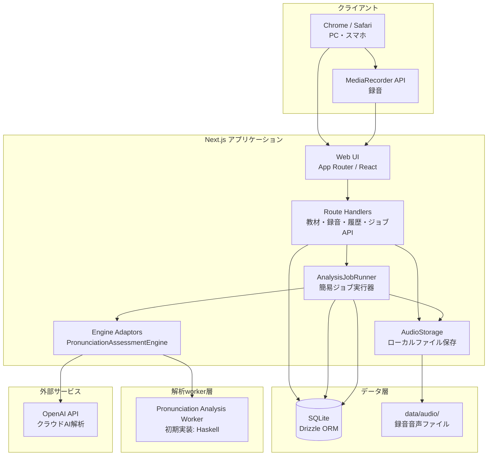
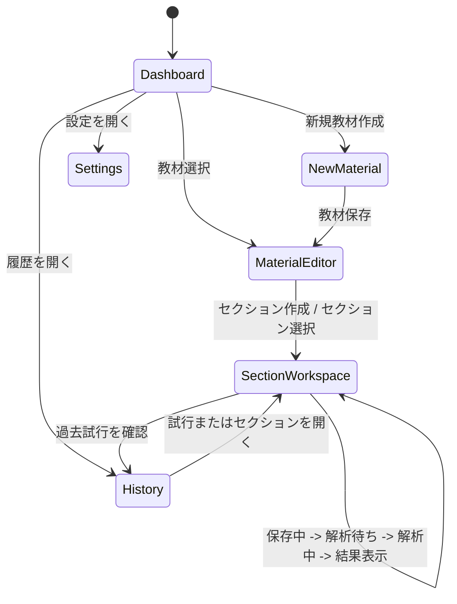
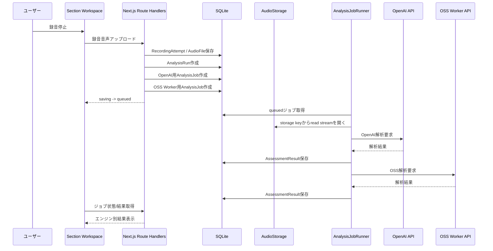
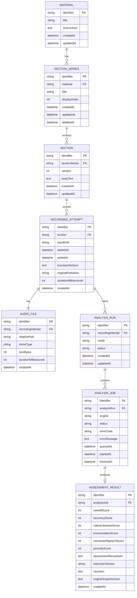

# 基本設計書

## 1. はじめに

### 1.1 目的

本文書は、英語発音チェックWebアプリケーション「NativeTrace」の基本設計を定義する。要件定義書で定めたローカルMVPを実現するため、システム全体の構成、技術スタック、主要機能、画面責務、外部インターフェース、概念データモデル、共通処理方針を整理する。

NativeTraceの中心体験は、ユーザーが作成したセクション本文に対して、録音、音声保存、解析開始、ジョブ進捗表示、エンジン別解析結果確認、本文ハイライト、指摘箇所の部分再生を同一画面でシームレスに行うことである。

### 1.2 対象読者

- 開発者
- UI/UX設計者
- 解析エンジン実装者
- 将来のインフラ設計者
- QA担当者

### 1.3 関連文書

- [要件定義書](../01-requirements/requirements-specification.md)
- [詳細設計書](../03-detailed-design/detailed-design.md)
- [API仕様書](../04-api-specification/api-specification.md)
- [データベース設計書](../05-database-design/database-design.md)
- UI/UX設計書（未作成）

## 2. システム概要

NativeTraceは、日本語話者の英語学習者が、General American Englishのネイティブ発話に近い長文スピーチ発音を練習するためのローカルWebアプリケーションである。

ユーザーはTED相当の長文スピーチを題材として登録し、題材配下にセクションごとの英文本文を貼り付ける。セクション画面では録音を行い、録音停止後にデフォルトの比較モードでOpenAI API解析エンジンとOSS解析workerの両方を自動実行する。解析結果は統合せず、エンジン別に保存・表示・比較する。

ローカルMVPでは、Next.jsアプリがUI、Route Handler、ジョブキュー所有者、簡易ジョブ実行器を担う。OSS解析workerは別プロセスとしてHTTP APIを提供し、Next.jsから`WORKER_API_ENDPOINT`経由で呼び出す。OpenAI APIも解析エンジンの一種としてAdaptor経由で呼び出し、どちらの結果も共通の`AssessmentResultDraft`へ正規化する。

## 3. システム構成図

図1: NativeTrace ローカルMVPのシステム構成。Next.jsがUI/API/ジョブ状態管理を担い、OpenAI APIとOSS解析workerをAdaptor経由で呼び出す。

## 4. 技術スタック

| レイヤー | 技術 | バージョン | 選定理由 |
|---|---|---|---|
| フロントエンド | Next.js / React / TypeScript | Next.js 15系想定 / TypeScript 5系 | Web UI、Route Handler、サーバー処理を同一技術で扱えるため |
| バックエンド入口 | Next.js Route Handlers | Next.js 15系想定 | 録音アップロード、教材管理、ジョブ作成、履歴取得をローカルMVPで簡潔に実装できるため |
| ジョブ実行 | AnalysisJobRunner | アプリ内実装 | ローカルMVPでは構成を増やさず、将来の別プロセス化に備えて境界を分離するため |
| データベース | SQLite | 3系 | ローカルMVPに適し、単一ファイルで扱いやすいため |
| ORM | Drizzle ORM / Drizzle Kit | 最新安定版 | TypeScriptで型安全にDBアクセスし、マイグレーションを軽量に管理できるため |
| 音声保存 | ローカルファイルシステム | - | ローカルMVPで録音音声を低コストに保存できるため |
| 音声保存抽象 | AudioStorage | アプリ内実装 | 将来S3互換ストレージへ差し替えられるようにするため |
| クラウド解析 | OpenAI API | 利用時点の安定版 | 発音添削の品質検証を早く行うため |
| OSS解析worker | Haskell製HTTP worker | GHC stable | CPU動作をMustとしつつ、将来サーバー配置や任意のGPU最適化、実装差し替えに備えるため |
| worker通信 | HTTP API | - | 将来workerを別ホストへ移しても同じ境界を維持できるため |

## 5. 機能一覧

| ID | 機能名 | 概要 | 関連要件 |
|---|---|---|---|
| SD-001 | 教材管理 | 題材コンテナを保存・一覧表示・削除する | [REQ-001](../01-requirements/requirements-specification.md#req-001), [REQ-020](../01-requirements/requirements-specification.md#req-020) | 
| SD-002 | セクション管理 | 題材配下にSectionSeriesとSection本文版を作成し、版管理する | [REQ-002](../01-requirements/requirements-specification.md#req-002) | 
| SD-003 | ブラウザ録音 | セクション画面で録音し、録音音声とブラウザ情報を保存する | [REQ-003](../01-requirements/requirements-specification.md#req-003) | 
| SD-004 | 音声アップロード | 既存音声ファイルを録音試行として保存する | [REQ-004](../01-requirements/requirements-specification.md#req-004) | 
| SD-005 | 解析モード選択 | OpenAI API、OSS Worker、比較モードを選択できる。デフォルトは比較モード | [REQ-005](../01-requirements/requirements-specification.md#req-005) | 
| SD-006 | 自動解析開始 | 録音停止後、選択中の解析モードで同一画面内に解析ジョブを自動作成する | [REQ-003](../01-requirements/requirements-specification.md#req-003), [REQ-009](../01-requirements/requirements-specification.md#req-009) | 
| SD-007 | OpenAI API解析 | OpenAI API Adaptor経由でクラウド解析を実行し、共通Draftへ正規化する | [REQ-006](../01-requirements/requirements-specification.md#req-006), [REQ-008](../01-requirements/requirements-specification.md#req-008) | 
| SD-008 | OSS Worker解析 | OSS Worker Adaptor経由で解析workerを呼び出し、共通Draftへ正規化する | [REQ-007](../01-requirements/requirements-specification.md#req-007), [REQ-008](../01-requirements/requirements-specification.md#req-008) | 
| SD-009 | ジョブ管理 | AnalysisRunとAnalysisJobを作成し、queued/running/succeeded/failed/canceled等の状態を管理する | [REQ-009](../01-requirements/requirements-specification.md#req-009) | 
| SD-010 | エンジン別比較 | OpenAI APIとOSS Workerの結果を統合せず、エンジン別に表示・比較する | [REQ-010](../01-requirements/requirements-specification.md#req-010) | 
| SD-011 | スコア表示 | Overall、Accuracy、Native-likeness、Pronunciation、Connected Speech、Prosodyの各スコアを表示する | [REQ-011](../01-requirements/requirements-specification.md#req-011) | 
| SD-012 | 本文ハイライト | 解析結果の指摘を本文文字範囲に紐づけてハイライト表示する | [REQ-012](../01-requirements/requirements-specification.md#req-012), [REQ-013](../01-requirements/requirements-specification.md#req-013) | 
| SD-013 | 指摘詳細 | 重大度、カテゴリ、期待発話、実際の検出、コメント、スコア影響、信頼度を表示する | [REQ-014](../01-requirements/requirements-specification.md#req-014), [REQ-015](../01-requirements/requirements-specification.md#req-015), [REQ-016](../01-requirements/requirements-specification.md#req-016) | 
| SD-014 | 録音再生 | 録音全体と指摘箇所の時間範囲を再生する | [REQ-017](../01-requirements/requirements-specification.md#req-017) | 
| SD-015 | 履歴・比較 | 教材、セクション、録音試行、解析結果、過去試行比較を表示する | [REQ-018](../01-requirements/requirements-specification.md#req-018) | 
| SD-016 | データ保存 | 教材、セクション、録音音声、解析ジョブ、解析結果を保存する | [REQ-019](../01-requirements/requirements-specification.md#req-019) | 
| SD-017 | データ削除 | 教材、セクション、録音試行、解析結果を削除し、関連音声ファイルを削除する | [REQ-020](../01-requirements/requirements-specification.md#req-020) | 
| SD-018 | PC/スマホ対応 | Chrome/SafariのPC/スマホでMVP全機能を提供する | [REQ-021](../01-requirements/requirements-specification.md#req-021) | 

## 6. 画面設計

本基本設計では、画面の責務、URL、主要操作のみを定義する。具体的なレイアウト、ワイヤーフレーム、ビジュアルデザインは後続のUI/UX設計および提供されるデザインを正とする。

### 6.1 画面一覧

| ID | 画面名 | 概要 | URLパターン |
|---|---|---|---|
| UI-001 | Dashboard / Materials | 教材一覧、最近の録音、実行中ジョブを確認する | `/` |
| UI-002 | New Material | 新しい教材を作成する | `/materials/new` |
| UI-003 | Material Editor | 題材情報、SectionSeries一覧、セクション本文作成・改訂を行う | `/materials/[materialIdentifier]` |
| UI-004 | Section Workspace | セクション本文、録音、録音保存、自動解析、ジョブ進捗、結果ハイライト、部分再生を同一画面で行う | `/materials/[materialIdentifier]/sections/[sectionIdentifier]` |
| UI-005 | History / Comparison | 過去の録音試行、エンジン別解析結果、試行比較を確認する | `/history` |
| UI-006 | Settings | 既定解析モード、OpenAI API利用表示、worker接続先、保存先確認を行う | `/settings` |

### 6.2 画面遷移図

図2: 画面遷移。通常の練習導線では、録音後に別画面へ遷移せずSection Workspace内で解析と結果確認を行う。

### 6.3 Section Workspace 状態モデル

| 状態 | 説明 |
|---|---|
| `idle` | 録音前または既存結果表示中 |
| `recording` | 録音中 |
| `saving` | 録音停止後、音声ファイル保存中 |
| `queued` | 解析ジョブ作成済み、実行待ち |
| `running` | 解析実行中 |
| `partial_succeeded` | 比較モードで一部エンジンのみ完了 |
| `succeeded` | 対象エンジンの解析がすべて完了 |
| `failed` | 対象エンジンの解析がすべて失敗 |
| `canceled` | ユーザー操作またはシステム都合でキャンセル済み |

録音停止後は、現在選択中の解析モードで自動的に`AnalysisRun`を作成する。既定解析モードは比較モードである。ユーザーは録音前に解析モードを変更でき、解析中のジョブをキャンセルできる。

AnalysisRun状態は子Jobから派生する。running/leasedがあれば`running`、それらがなくqueuedがあれば`queued`、全succeededなら`succeeded`、成功を1件以上含み残りがfailed/canceledなら`partial_succeeded`、全canceledなら`canceled`、成功なしでfailedを含み残りもfailed/canceledなら`failed`とする。

## 7. 外部インターフェース

### 7.1 外部システム連携一覧

| ID | 連携先 | プロトコル | 方向 | 概要 |
|---|---|---|---|---|
| IF-001 | OpenAI API | HTTPS | 送信/受信 | 音声と英文を送信し、クラウドAI解析結果を取得する |
| IF-002 | OSS Worker API | HTTP | 送信/受信 | ローカルまたは将来リモートの解析workerへ解析要求を送り、結果を取得する |

MediaRecorder APIは外部システムではなくブラウザAPIとして扱う。ただし録音機能の互換性に強く影響するため、Chrome/SafariのPC/スマホで録音開始、停止、MIME type、保存処理を検証対象とする。

### 7.2 解析シーケンス

図3: 比較モードの解析シーケンス。Next.js側DB上のジョブ状態を正とし、エンジンごとの結果を個別に保存する。

### 7.3 OSS Worker API 方針

OSS Worker APIの接続先は`WORKER_API_ENDPOINT`で設定する。API境界名や環境変数名には実装言語名を含めない。初期実装はHaskell製workerとし、将来別実装へ差し替え可能とする。

想定エンドポイント:

| エンドポイント | 用途 |
|---|---|
| `GET /health` | workerの生存確認 |
| `GET /version` | worker、モデル、設定のバージョン確認 |
| `POST /v1/pronunciation-assessments` | 発音解析要求 |

MVPではWorker側にジョブキューを持たせず、`POST /v1/pronunciation-assessments` は音声データとSection本文を受け取る同期HTTP APIとして扱う。Next.js側の`AnalysisJob`が状態の正であり、協調キャンセルはDB状態、保存直前のキャンセル確認、lease token一致確認で扱う。

Haskell Workerへの要求は `multipart/form-data` とし、`metadata` JSON partと`audio` binary partを送る。Worker側のジョブ作成/cancel APIは追加しない。詳細な必須フィールド、成功/エラーJSON、Content-Type、サイズ制約はACL設計書を正とする。

## 8. 概念ER図

図4: NativeTraceの概念ER。識別子命名はプロジェクトルールに従い、自己識別子は`identifier`、関連先識別子は`material`、`section`、`recordingAttempt`のように関連先名で表す。

### 8.1 エンティティ方針

- `Material`は題材コンテナであり、本文は保持しない。任意ソース情報をJSON相当で保持する。
- `SectionSeries`は題材内の練習セクション枠であり、タイトル、表示順、削除状態を保持する。
- `Section`は`SectionSeries`に属する本文版であり、解析と履歴表示は具体的なSection版の`bodyText`を正とする。
- `RecordingAttempt`は録音元をChoice Typeで保持する。`browser_recording` は録音開始/終了時刻とブラウザ情報を必須とし、`uploaded_file` はそれらを要求せず元ファイル名を保持する。
- `AnalysisRun`は録音停止後の自動解析単位を表す。比較モードでは1つの`AnalysisRun`に複数の`AnalysisJob`が紐づく。
- `AnalysisEngine`はDBマスタとして永続化せず、Composition Root / ACLのEngine Registryで解決する。ジョブと結果には作成時点のengine kind、設定、バージョンスナップショットを保存する。
- `AssessmentResult`はscores、identifier付きfindings、segments、summary、metadata、tokenizerVersion、raw、結果生成時点のエンジン情報スナップショットを保存する。

## 9. 共通処理方針

### 9.1 認証・認可

- MVPではアプリ内ログイン機能を実装しない。
- ローカル環境での個人利用を前提とし、外部公開しない。
- 本格使用フェーズでは、公開形態、認証、認可、同期、バックアップを再設計する。

### 9.2 エラーハンドリング

- 入力エラー、録音エラー、保存エラー、ジョブ実行エラー、外部APIエラー、workerエラーを区別する。
- `AnalysisJob`の失敗は`failed`状態としてDBに保存し、`errorCode`と`errorMessage`を保持する。
- 比較モードで片方のエンジンのみ成功した場合、`AnalysisRun`は`partial_succeeded`相当として扱い、成功した結果を表示可能にする。
- OpenAI APIまたはOSS Workerが失敗しても、録音試行と音声ファイルは保持し、再実行できるようにする。

### 9.3 ログ

- ローカルMVPではコンソールログとDB上のジョブ状態を主な診断情報とする。
- 解析ジョブには`identifier`、解析エンジン、状態、開始/終了時刻、エラー理由を残す。
- OpenAI APIへ送信する本文・音声の詳細内容を不要にログ出力しない。
- 将来サーバー配置時には構造化ログ、リクエスト識別子、監査ログを導入する。

### 9.4 バリデーション

- Materialタイトルは空文字を許可しない。
- Sectionタイトルは必須とし、空文字を許可しない。
- セクション本文は空文字を許可しない。
- 録音保存ではMIME type、サイズ、録音時間を検証する。
- 音声アップロードでは対応形式、サイズ上限、セクション紐づけを検証する。
- 解析ジョブ作成では、録音試行、音声ファイル、解析エンジンが有効であることを検証する。

### 9.5 解析エンジン抽象化

`PronunciationAssessmentEngine`インターフェースを定義し、OpenAI API AdaptorとOSS Worker Adaptorは同じ入力と出力に揃える。

入力の概念:

- 録音試行の`identifier`
- セクション本文スナップショット
- 音声ファイル参照
- 解析エンジン設定
- General American Englishを基準とする評価方針

出力の概念:

- `engine`: エンジン名、種別、バージョン、モデル、設定
- `scores`: Overall、Accuracy、Native-likeness、Pronunciation、Connected Speech、Prosody
- `segments`: 本文文字範囲、音声時間範囲、単語/句/音素情報
- `findings`: identifier、重大度、category（`accuracy | pronunciation | connectedSpeech | prosody | nativeLikeness`）、本文文字範囲、音声時間範囲、日本語コメント、英語コメント、期待発話、実際の検出、スコア影響、信頼度
- `summary`: 結果要約
- `metadata`: schema/rubric/model/worker等のversion情報
- `tokenizerVersion`: Highlight生成に使う共通tokenizer version
- `raw`: エンジン固有の生結果

UIは`AssessmentResult`を表示対象とし、エンジン固有のレスポンス形式に依存しない。

### 9.6 音声ファイル保存

- 録音音声はNext.jsサーバー側のローカルファイルシステムへ保存する。
- 保存先は`data/audio/`を想定する。
- DBには相対パス、MIME type、サイズ、録音時間を保存する。
- ブラウザへローカルファイルパスを直接公開せず、Next.jsのAPI経由で再生する。
- 将来S3互換ストレージへ差し替えられるよう、`AudioStorage`インターフェースを置く。

## 10. 非機能設計方針

### 10.1 性能

- 長文教材全体を扱いつつ、録音と解析はセクション単位で行う。
- Section Workspaceでは録音停止後に`saving`、`queued`、`running`を連続的に表示し、ユーザーが処理状態を把握できるようにする。
- 解析時間はエンジン、音声長、端末性能、API応答に依存するため、MVPでは処理時間を記録し、改善材料にする。
- Haskell製OSS WorkerはローカルCPUでの安定動作をMustとし、GPU利用は任意最適化とする。高速化や配置変更はworker内部の実装詳細に閉じ込め、Next.js側の解析境界へ漏らさない。

### 10.2 スケーラビリティ

- MVPではNext.jsプロセス内の`AnalysisJobRunner`がジョブを実行する。
- ジョブ実行ロジックは将来、別Node worker、Redis/BullMQ、外部キューへ移行できるよう分離する。
- OSS Worker APIはHTTP境界とし、将来別ホストへ移してもNext.js側のUI/API変更を最小化する。
- SQLiteはローカルMVPの第一候補とし、本格使用フェーズではPostgreSQL等への移行を検討する。

### 10.3 可用性

- ローカルMVPでは、Next.jsサーバープロセスが稼働している限り、ブラウザを閉じても解析ジョブを継続する。
- サーバープロセス停止時のジョブ復旧はMVPではShouldとし、保存済みデータの損失を避ける。
- ジョブ失敗時は再実行可能にする。
- OpenAI APIまたはOSS Workerの片方が利用不可でも、もう片方の結果は表示できるようにする。

## 変更履歴

| バージョン | 日付 | 変更者 | 変更内容 |
|---|---|---|---|
| 1.0.0 | 2026-05-30 | lihs | 初版作成 |
