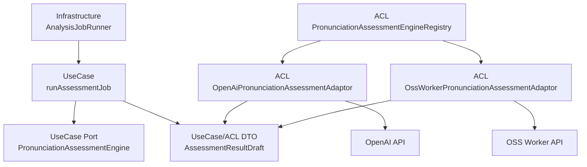

# ACL（腐敗防止層）設計書

## 1. はじめに

### 1.1 目的

本文書は、NativeTrace のローカルMVPにおける ACL（Anti-Corruption Layer）の設計を定義する。対象は発音解析エンジン連携であり、OpenAI API と OSS Worker API の外部モデル、HTTP仕様、エラー体系、出力揺れをUseCase層へ漏らさないことを目的とする。

ACLは、外部エンジン固有のrequest/responseを共通 `AssessmentResultDraft` へ変換する。UseCase層はOpenAI SDK型、OSS Worker HTTP DTO、prompt、worker内部出力を知らない。

### 1.2 関連文書

| 関係 | 文書 | 参照内容 |
|---|---|---|
| 上流 | [要件定義書](../01-requirements/requirements-specification.md) | OpenAI/OSS Worker、比較モード、スコア、重大度 |
| 上流 | [基本設計書](../02-system-design/system-design.md) | 外部IF、OSS Worker API、解析エンジン差し替え |
| 上流 | [ドメイン層設計書](./domain.md) | AnalysisEngine、AssessmentResult、DomainError |
| 上流 | [ユースケース層設計書](./use-case.md) | `runAssessmentJob`、`AssessmentResultDraft`、共通検証 |
| 同層 | [インフラストラクチャ層設計書](./infrastructure.md) | Config、raw response保存、Logger、Runner |
| 下流 | [API仕様書](../04-api-specification/api-specification.md) | Route Handler |
| 下流 | テスト仕様書（未作成） | ACL契約テスト |

### 1.3 対象範囲

| 対象 | 本文書で扱う内容 |
|---|---|
| OpenAI連携 | request生成、構造化出力検証、response正規化、prompt contract |
| OSS Worker連携 | HTTP request生成、response schema検証、response正規化 |
| Engine Registry | `AnalysisEngine` から `PronunciationAssessmentEngine` 実装を解決する |
| 共通Draft | `AssessmentResultDraft`、finding、segment、raw response envelope |
| エラー変換 | retryable / nonRetryable分類、DomainError変換 |
| 除外 | Drizzle保存、Route Handler、UI表示、OSS Worker内部アルゴリズム |

### 1.4 命名規約

具象実装名のsuffixは `Adaptor` に統一する。旧suffix表記は使わない。

```typescript
createOpenAiPronunciationAssessmentAdaptor
createOssWorkerPronunciationAssessmentAdaptor
```

TypeScriptのクラス構文は使用せず、factory関数とplain objectでPort実装を返す。

## 2. レイヤー位置づけ

### 2.1 全体構成



図1: ACLは外部エンジン固有モデルを `AssessmentResultDraft` へ変換する。UseCase層は外部DTOを直接参照しない。

### 2.2 設計原則

| 原則 | 方針 |
|---|---|
| 外部モデル遮断 | OpenAI/OSS Worker DTOをACL配下から外へ出さない |
| 共通Port | OpenAIとOSS Workerは同じ `PronunciationAssessmentEngine` Portを実装する |
| assessのみ | MVPのPortは `assess` のみ。`cancel` は持たない |
| 共通Draft | 両engineの出力は完全に同じ `AssessmentResultDraft` 構造へ正規化する |
| schema検証 | 外部responseは必ずACL内でschema validationする |
| version保存 | model/prompt/rubric/schema/worker/rule versionsをmetadataに残す |
| 結果非統合 | 比較モードでもACLは結果を統合しない |
| 設定分離 | API key、model、endpoint、timeoutはConfigから注入する |

## 3. Port / Registry

### 3.1 PronunciationAssessmentEngine Port

`PronunciationAssessmentEngine` はUseCase層のPortとして定義する。ACLはこのPortの具象実装を提供する。

```typescript
export type PronunciationAssessmentEngine = Readonly<{
  assess: (
    input: AssessPronunciationInput
  ) => ResultAsync<AssessmentResultDraft, DomainError>;
}>;
```

`cancel` はMVPでは定義しない。キャンセルは `AnalysisRun` / `AnalysisJob` のDB状態、保存直前のキャンセル確認、lease token一致確認で協調的に扱う。HTTP abortやSDK timeoutはAdaptor内部の呼び出し制御として閉じ込める。

### 3.2 Registry

`PronunciationAssessmentEngineRegistry` はUseCase層で定義されたPortであり、ACLはAdaptor registryとして具象実装を提供する。以下はUseCase Portの参照形である。

```typescript
export type PronunciationAssessmentEngineRegistry = Readonly<{
  find: (
    engine: AnalysisEngine
  ) => Result<PronunciationAssessmentEngine, DomainError>;
}>;
```

| 入力engine | 返す実装 |
|---|---|
| cloud engine | `OpenAiPronunciationAssessmentAdaptor` |
| oss worker engine | `OssWorkerPronunciationAssessmentAdaptor` |

`find` は未登録時に `null` を返さず、`DomainError` を返す。Adaptorが設定不足で起動できない場合はComposition RootまたはRegistry作成時に検出する。比較モードで片方のengineが未設定の場合、そのengineのjobだけfailedにできる。

## 4. 共通入力

### 4.1 AssessPronunciationInput

```typescript
export type AssessPronunciationInput = Readonly<{
  analysisJob: AnalysisJobIdentifier;
  analysisRun: AnalysisRunIdentifier;
  recordingAttempt: RecordingAttemptIdentifier;
  section: SectionIdentifier;
  engine: AnalysisEngine;
  sectionBodyText: SectionBodyText;
  audio: AssessmentAudioInput;
  targetLanguage: "en-US";
  targetAccent: "generalAmerican";
  requestedMetrics: NonEmptyArray<AssessmentMetric>;
  assessmentSchemaVersion: AssessmentSchemaVersion;
}>;
```

Sectionは版管理されるため、解析要求には解析対象のSection本文スナップショットを必ず含める。ブラウザ録音かアップロードかの違いはAdaptorへ漏らさない。

### 4.2 AssessmentAudioInput

```typescript
export type AssessmentAudioInput = Readonly<{
  storageKey: AudioStorageKey;
  mimeType: AudioMimeType;
  byteLength: ByteLength;
  durationMs: AudioDurationMs;
  openStream: () => ResultAsync<NodeJS.ReadableStream, DomainError>;
}>;
```

音声のNativeTrace共通上限である10分/100MBは保存時にUseCase/Domainで検証済みとする。各Adaptorは外部engine固有の入力制限を追加で検証する。

## 5. 共通出力

### 5.1 AssessmentResultDraft

`AssessmentResultDraft` はDomain型ではなく、UseCase層とACL層の境界DTOである。ACLはDraftまでを生成し、UseCase層が共通検証後に正式な `AssessmentResult` を作成する。

```typescript
export type AssessmentResultDraft = Readonly<{
  engine: AnalysisEngine;
  scores: ScoreDraftSet;
  findings: ReadonlyArray<AssessmentFindingDraft>;
  segments: ReadonlyArray<AssessmentSegmentDraft>;
  summary: AssessmentSummaryDraft;
  rawResponse: StoredRawEngineResponse;
  metadata: AssessmentEngineMetadataDraft;
  tokenizerVersion: string;
}>;
```

| フィールド | 方針 |
|---|---|
| `scores` | 6項目すべて必須。0から100の整数 |
| `findings` | 空配列可 |
| `segments` | ACLでは配列。UseCaseでNonEmpty検証 |
| `summary` | 日本語要約必須。英語要約は任意 |
| `rawResponse` | ACLで上限処理済みEnvelope |
| `metadata` | engine別versionと実行情報 |
| `tokenizerVersion` | ACLが前提とした共通tokenizer version |

### 5.2 ScoreDraftSet

```typescript
export type ScoreDraftSet = Readonly<{
  overall: number;
  accuracy: number;
  nativeLikeness: number;
  pronunciation: number;
  connectedSpeech: number;
  prosody: number;
}>;
```

UseCase層はスコアが0から100の整数であることだけを検証する。OpenAIとOSS Workerのスコア補正、平均化、統合は行わない。

### 5.3 Choice Type表現

`FindingCategory` と `FindingSeverity` はDomain層のChoice Typeを利用し、ACL固有の別型は定義しない。文字列表現はDomain定義と同じ `as const` objectとderived typeである。

```typescript
export const FindingCategory = {
  ACCURACY: "accuracy",
  PRONUNCIATION: "pronunciation",
  CONNECTED_SPEECH: "connectedSpeech",
  PROSODY: "prosody",
  NATIVE_LIKENESS: "nativeLikeness",
} as const;

export type FindingCategory =
  typeof FindingCategory[keyof typeof FindingCategory];

export const FindingSeverity = {
  CRITICAL: "critical",
  MAJOR: "major",
  MINOR: "minor",
  SUGGESTION: "suggestion",
} as const;

export type FindingSeverity =
  typeof FindingSeverity[keyof typeof FindingSeverity];
```

OpenAIが自由なカテゴリ名を返した場合も、OSS Workerが固有カテゴリを返した場合も、ACLで共通Choice Typeへ正規化する。変換できないカテゴリは丸めず、schema/normalization errorにする。

### 5.4 Finding / Segment

```typescript
export type TextRangeDraft = Readonly<{
  startChar: number;
  endChar: number;
}>;

export type AudioRangeDraft = Readonly<{
  startMs: number;
  endMs: number;
}>;

export type AssessmentFindingDraft = Readonly<{
  category: FindingCategory;
  severity: FindingSeverity;
  textRange: TextRangeDraft;
  audioRange: AudioRangeDraft | null;
  expected: PronunciationEvidenceDraft;
  detected: PronunciationEvidenceDraft;
  messageJa: string;
  messageEn: string | null;
  scoreImpact: number;
  confidence: number;
}>;

export type PronunciationEvidenceDraft = Readonly<{
  text: string | null;
  ipa: string | null;
}>;

export type AssessmentSegmentDraft = Readonly<{
  textRange: TextRangeDraft;
  audioRange: AudioRangeDraft;
  transcript: string | null;
  confidence: number;
}>;
```

`AssessmentFindingDraft` は外部engine出力を正規化する中間DTOなので `identifier` を持たなくてもよい。UseCaseが正式な `AssessmentResult` を作る際に各Findingへ `AssessmentFindingIdentifier` を付与する。

`textRange` は `sectionBodyText` に対するUTF-16 code unit offsetに統一する。`startChar` はinclusive、`endChar` はexclusiveである。token rangeはDraftに含めず、UseCase層が共通tokenizerで `textRange` から都度計算する。

`audioRange` はミリ秒整数に統一する。`startMs` はinclusive、`endMs` はexclusiveである。OpenAIが秒小数を返した場合、ACLでミリ秒整数へ変換する。OSS Workerがsample indexを返した場合も、ACLでミリ秒整数へ変換する。

`expected` と `detected` は発話テキストとGeneral American IPAを保持する。該当情報をエンジンが検出できない場合は属性単位で `null` を許可するが、`expected` / `detected` 自体は必須とする。`scoreImpact` は当該Findingが関連スコアを下げた影響量として保存する。

## 6. StoredRawEngineResponse

### 6.1 Envelope

外部レスポンスはそのまま保存せず、ACLで保存用Envelopeへ包む。

```typescript
export const RawEngineResponseProvider = {
  OPENAI: "openai",
  OSS_WORKER: "ossWorker",
} as const;

export type RawEngineResponseProvider =
  typeof RawEngineResponseProvider[keyof typeof RawEngineResponseProvider];

export type StoredRawEngineResponse = Readonly<{
  provider: RawEngineResponseProvider;
  capturedAt: Instant;
  contentType: "application/json" | "text/plain";
  body: unknown | string;
  truncated: boolean;
  originalSizeBytes: number;
  storedSizeBytes: number;
}>;
```

### 6.2 上限処理

| 項目 | 方針 |
|---|---|
| 上限 | 1 engine結果あたり最大1MB |
| 超過時 | `body` を切り詰め、`truncated: true` |
| 保存サイズ | `originalSizeBytes`, `storedSizeBytes` を保存 |
| 禁止 | API key、request header、ローカル絶対パスを含めない |
| ログ | 通常ログへ `body` を出さない |

raw responseのサイズ上限処理はRepositoryではなくACLの責務とする。RepositoryはEnvelopeをDB JSONカラムへ保存するだけで、外部レスポンスの意味判断をしない。

## 7. OpenAI Adaptor

### 7.1 役割

`OpenAiPronunciationAssessmentAdaptor` は、保存済み音声とSection本文をOpenAI APIへ送り、General American Englishの発音評価結果を構造化JSONとして受け取り、`AssessmentResultDraft` に変換する。

```typescript
export const createOpenAiPronunciationAssessmentAdaptor =
  (dependencies: OpenAiPronunciationAssessmentAdaptorDependencies): PronunciationAssessmentEngine => {
    return {
      assess: (input) => assessWithOpenAi(dependencies, input),
    };
  };
```

### 7.2 解析方式

MVPでは、音声を直接扱うマルチモーダル解析とStructured Outputsの1段構成を第一候補とする。文字起こしAPI単体は主経路にしない。必要な場合のみ、Adaptor内部の補助処理として利用する。

OpenAIの具体モデル名は設計書で固定しない。`OPENAI_ASSESSMENT_MODEL` をConfigで検証し、実行時に使ったmodel名を `metadata.model` に保存する。デフォルト値は実装時点の公式仕様で、音声入力と構造化出力に対応するモデルから選ぶ。

### 7.3 Prompt Contract

設計書にはprompt全文を固定せず、prompt contractとrubric要件を定義する。prompt本文は `applications/frontend/src/acl/pronunciation-assessment/openai/prompts/` 配下でversion管理する。

必須要件:

- General American English限定
- 日本語話者の英語学習者を主対象にする
- ネイティブ模倣に厳しめの上級者向け判定
- Overall、Accuracy、Native-likeness、Pronunciation、Connected Speech、Prosodyを必ず出す
- 減点理由は本文文字範囲に必ず紐づける
- connected speech、prosody、native-likenessを重視する
- 口の形、舌位置、息の出し方の指導は出さない
- 練習ドリル生成はMVP外
- 出力はJSON Schemaに厳密準拠する
- 日本語説明をMust、英語併記をShouldとする

### 7.4 OpenAI固有制限

OpenAI固有の入力制限はAdaptor内で事前検証する。

| 制限 | 超過時 |
|---|---|
| 対応MIME type | nonRetryable |
| 音声ファイルサイズ | nonRetryable |
| model別context/input制限 | nonRetryable |
| request body制限 | nonRetryable |
| timeout | retryable |

NativeTrace共通上限の10分/100MBとは別に、OpenAI固有制限を扱う。超過した場合は該当OpenAI jobだけをfailedにし、OSS Worker jobには影響させない。

### 7.5 OpenAI response検証

OpenAI応答はACL内でschema validationする。schema違反、JSON parse failure、カテゴリ変換不能、textRange不正、version不一致はnonRetryableとする。

## 8. OSS Worker Adaptor

### 8.1 役割

`OssWorkerPronunciationAssessmentAdaptor` は、OSS Worker APIへ音声と本文を送り、Worker固有JSONを `AssessmentResultDraft` へ変換する。Worker内部の実装言語や解析アルゴリズムはACL外へ出さない。

```typescript
export const createOssWorkerPronunciationAssessmentAdaptor =
  (dependencies: OssWorkerPronunciationAssessmentAdaptorDependencies): PronunciationAssessmentEngine => {
    return {
      assess: (input) => assessWithOssWorker(dependencies, input),
    };
  };
```

### 8.2 HTTP契約

MVPでは、Haskell Worker側にジョブキューを持たせず、同期HTTP APIとして扱う。cancel endpointも定義しない。

```http
POST {WORKER_API_ENDPOINT}/v1/pronunciation-assessments
Content-Type: multipart/form-data; boundary=...
```

multipart partは次の2つだけとする。

| part | Content-Type | 必須 | 内容 |
|---|---|---|---|
| `metadata` | `application/json; charset=utf-8` | Yes | 下記JSON。最大64KiB |
| `audio` | 保存済みAudioFileのMIME type | Yes | 音声binary。1byte以上100MiB以下 |

`metadata` JSON:

```json
{
  "analysisJob": "job_01JZ0000000000000000000000",
  "analysisRun": "run_01JZ0000000000000000000000",
  "recordingAttempt": "rec_01JZ0000000000000000000000",
  "section": "sec_01JZ0000000000000000000000",
  "sectionBodyText": "When I was nine years old...",
  "expectedLanguage": "en-US",
  "targetAccent": "generalAmerican",
  "requestedMetrics": [
    "overall",
    "accuracy",
    "nativeLikeness",
    "pronunciation",
    "connectedSpeech",
    "prosody"
  ],
  "assessmentSchemaVersion": "1",
  "tokenizerVersion": "native-trace-tokenizer-v1",
  "audio": {
    "mimeType": "audio/webm",
    "byteLength": 245760,
    "durationMilliseconds": 123456
  }
}
```

必須フィールドは `analysisJob`、`analysisRun`、`recordingAttempt`、`section`、空でない`sectionBodyText`、`expectedLanguage`、`targetAccent`、1件以上の`requestedMetrics`、`assessmentSchemaVersion`、`tokenizerVersion`、`audio.mimeType`、`audio.byteLength`、`audio.durationMilliseconds` である。`expectedLanguage` は `en-US`、`targetAccent` は `generalAmerican` に固定する。metadata上のbyteLength/MIME typeと実audio partが一致しない場合は400とする。音声時間は1ms以上600000ms以下、Section本文とmetadataを含むrequest全体は100MiB + 64KiBを上限とする。

成功時は `200 OK`、`Content-Type: application/json; charset=utf-8` で次のWorker JSONを返す。

```json
{
  "assessmentSchemaVersion": "1",
  "tokenizerVersion": "native-trace-tokenizer-v1",
  "scores": {
    "overall": 72,
    "accuracy": 86,
    "nativeLikeness": 61,
    "pronunciation": 78,
    "connectedSpeech": 55,
    "prosody": 64
  },
  "summary": {
    "messageJa": "本文一致は良好ですが、連結発話に改善余地があります。",
    "messageEn": "Accuracy is good, but connected speech can improve."
  },
  "findings": [],
  "segments": [
    {
      "textRange": {
        "startChar": 0,
        "endChar": 29
      },
      "audioRange": {
        "startMs": 0,
        "endMs": 123456
      },
      "transcript": "When I was nine years old...",
      "confidence": 0.91
    }
  ],
  "metadata": {
    "workerVersion": "0.1.0",
    "modelVersion": "model-v1",
    "ruleSetVersion": "rules-v1",
    "scoringRubricVersion": "rubric-v1"
  }
}
```

失敗時は `Content-Type: application/json; charset=utf-8` で次の形を返す。400/413/415/422はnonRetryable、500/502/503/504はretryableとしてACLで変換する。

```json
{
  "error": {
    "code": "unsupported_audio_type",
    "message": "The audio MIME type is not supported.",
    "retryable": false
  }
}
```

Workerのレスポンスは信頼せず、Next.js側ACLでZod schema検証してからDraftへ変換する。成功JSONのcategoryは `accuracy | pronunciation | connectedSpeech | prosody | nativeLikeness` のみ許可する。Worker response DTO schemaは `applications/frontend/src/acl/pronunciation-assessment/oss-worker/schema.ts` に置く。

### 8.3 Worker metadata

OSS Worker固有情報は `metadata` と `rawResponse` に閉じ込める。

| 項目 | 保存先 |
|---|---|
| `workerVersion` | `metadata.workerVersion` |
| `modelVersion` | `metadata.modelVersion` |
| `ruleSetVersion` | `metadata.ruleSetVersion` |
| `scoringRubricVersion` | `metadata.scoringRubricVersion` |
| 固有debug情報 | `metadata.engineSpecific` または `rawResponse.body` |

UseCase層はWorker固有metadataを採点補正や結果統合に使わない。

## 9. Metadata / Version

```typescript
export type AssessmentEngineMetadataDraft = Readonly<{
  assessmentSchemaVersion: AssessmentSchemaVersion;
  scoringRubricVersion: ScoringRubricVersion;
  promptVersion: PromptVersion | null;
  model: string | null;
  workerVersion: string | null;
  modelVersion: string | null;
  ruleSetVersion: string | null;
  engineSpecific: Record<string, unknown>;
}>;
```

| Adaptor | 必須metadata |
|---|---|
| OpenAI | `model`, `promptVersion`, `scoringRubricVersion`, `assessmentSchemaVersion` |
| OSS Worker | `workerVersion`, `modelVersion`, `ruleSetVersion`, `scoringRubricVersion`, `assessmentSchemaVersion` |

スコアリングrubricは各Adaptor内に閉じ込める。OpenAIはprompt/rubric、OSS Workerはモデル/ルール/重みで実装するが、version名は共通形式で保存する。

## 10. エラー変換

### 10.1 retryable分類

`AssessmentEngineFailureKind` はDomain層のChoice Typeを利用し、ACLは外部エラーをこの共通分類へ変換する。

```typescript
export const AssessmentEngineFailureKind = {
  RETRYABLE: "retryable",
  NON_RETRYABLE: "nonRetryable",
} as const;

export type AssessmentEngineFailureKind =
  typeof AssessmentEngineFailureKind[keyof typeof AssessmentEngineFailureKind];
```

`AssessmentEngineFailedError` には `failureKind` を含める。UseCase `runAssessmentJob` はこの分類に従い、retryableかつ `attemptCount < maxAttempts` の場合だけ再queueする。

### 10.2 エラー分類表

| 失敗 | 分類 |
|---|---|
| network timeout | retryable |
| connection reset | retryable |
| OpenAI 429 | retryable |
| OpenAI 5xx | retryable |
| OSS Worker 502/503/504 | retryable |
| 一時的なworker unavailable | retryable |
| API key不正 | nonRetryable |
| model未対応 | nonRetryable |
| OpenAI固有入力制限超過 | nonRetryable |
| schema validation failure | nonRetryable |
| response parse failure | nonRetryable |
| assessment schema version不一致 | nonRetryable |
| 音声MIME type非対応 | nonRetryable |
| prompt/rubric設定不正 | nonRetryable |

外部例外やHTTP error bodyはそのまま返さず、sanitizeした `DomainError` へ変換する。

外部通信自体は成功していても、JSON parse、共通schema、range、category、versionの検証に失敗した場合は `AssessmentSchemaInvalidError` へ変換する。`AssessmentEngineFailedError` とは別caseとして扱う。

## 11. 実装配置

```text
applications/frontend/src/acl/
  pronunciation-assessment/
    registry/
    shared/
      assessment-result-draft.ts
      assess-pronunciation-input.ts
      stored-raw-engine-response.ts
      schema.ts
      errors.ts
    openai/
      create-open-ai-pronunciation-assessment-adaptor.ts
      request-mapper.ts
      response-mapper.ts
      schema.ts
      prompts/
    oss-worker/
      create-oss-worker-pronunciation-assessment-adaptor.ts
      request-mapper.ts
      response-mapper.ts
      schema.ts
    __fixtures__/
      openai/
      oss-worker/
```

shared配下には外部provider固有型を置かない。OpenAI/OSS Workerのrequest/response DTOは各Adaptor配下に閉じ込める。UseCaseはOpenAI/OSS Worker DTOをimportしない。

## 12. テスト方針

ACLはfixtureベースの契約テストをMustとする。OpenAI実APIを叩くE2EはMVPでは任意とする。

| 対象 | 必須観点 |
|---|---|
| OpenAI schema | Structured Outputs schema validation |
| OpenAI mapping | OpenAI responseから `AssessmentResultDraft` への変換 |
| OSS Worker schema | Worker response schema validation |
| OSS Worker mapping | Worker responseから `AssessmentResultDraft` への変換 |
| category/severity | 共通Choice Typeへの正規化 |
| textRange | UTF-16 offset、inclusive/exclusive、不正範囲 |
| audioRange | ミリ秒整数、秒小数/sample indexからの変換 |
| raw response | Envelope、1MB truncation、秘密値除外 |
| error | retryable / nonRetryable分類 |
| 境界漏洩 | provider固有DTOがUseCaseへ漏れない |
| 命名 | 具象実装が `Adaptor` suffixであり、旧suffix表記を使わない |

## 13. 既存文書との整合更新メモ

本文書では、grill結果に基づき以下を正とする。

- 具象実装名は `Adaptor` suffixに統一する
- `AssessmentResultDraft` はDomain型ではなくUseCase/ACL境界DTOである
- `PronunciationAssessmentEngine` PortはMVPでは `assess` のみ持つ
- token rangeはACL出力に含めず、UseCase層で共通tokenizerから計算する
- raw response上限処理はACLで行う

[domain.md](./domain.md)、[use-case.md](./use-case.md)、[detailed-design.md](./detailed-design.md)、[infrastructure.md](./infrastructure.md) は、本文書の `Adaptor` suffix、UseCase Port配置、`assess` のみのEngine Port方針と整合させる。

## 変更履歴

| バージョン | 日付 | 変更者 | 変更内容 |
|---|---|---|---|
| 1.0.0 | 2026-06-03 | lihs | 初版作成 |
