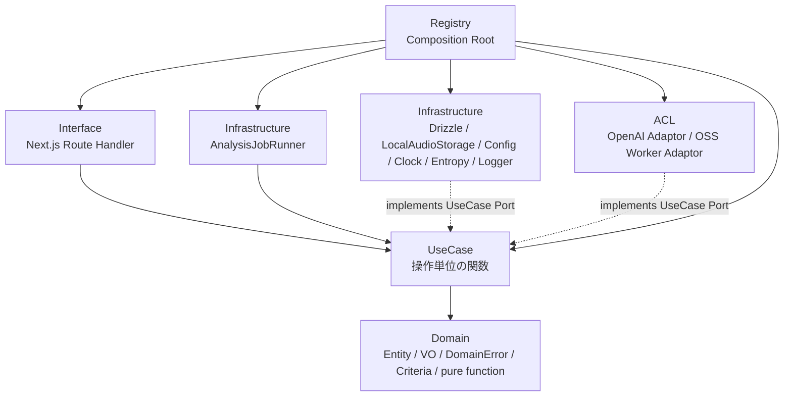
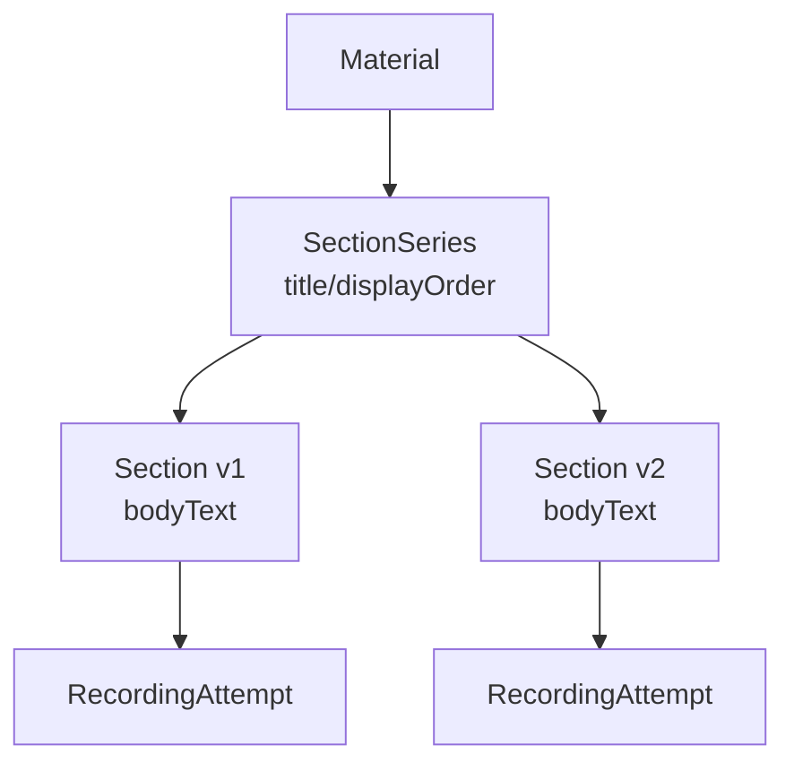

# 詳細設計書

## 1. はじめに

### 1.1 目的

本文書は、NativeTrace のローカルMVPを実装するための横断詳細設計を定義する。対象は Next.js 側のサーバー処理、UseCase、Domain、Infrastructure、ACL、OSS Worker連携境界であり、React UIコンポーネントの詳細レイアウトは対象外とする。

設計方針はオニオンアーキテクチャを採用する。TypeScript側ではクラス構文を使用せず、関数型ドメインモデリングに基づき、`type`、branded type、factory関数、pure function、UseCase Port、依存注入関数で表現する。エラー表現には `neverthrow`、境界入力バリデーションにはZodを使用する。

### 1.2 関連文書

| 文書 | 参照内容 |
|---|---|
| [要件定義書](../01-requirements/requirements-specification.md) | MVP範囲、録音、解析、履歴、削除、スコア |
| [基本設計書](../02-system-design/system-design.md) | Next.js、OSS Worker、ジョブキュー、保存方式 |
| [ドメイン層設計書](./domain.md) | 集約、DomainError、Criteria、Domain関数 |
| [ユースケース層設計書](./use-case.md) | UseCase一覧、transaction境界、DTO生成 |
| [インフラストラクチャ層設計書](./infrastructure.md) | Drizzle、SQLite、Storage、Runner、Config |
| [ACL設計書](./acl.md) | OpenAI/OSS Worker Adaptor、AssessmentResultDraft |

### 1.3 対応する基本設計項目

| 基本設計ID | 項目 | 本文書での扱い |
|---|---|---|
| [SD-001](../02-system-design/system-design.md#sd-001) | 教材管理 | Materialを題材コンテナとして扱う |
| [SD-002](../02-system-design/system-design.md#sd-002) | セクション管理 | SectionSeriesとSection本文版を扱う |
| [SD-003](../02-system-design/system-design.md#sd-003) | ブラウザ録音 | 録音保存、音声ファイル保存、解析開始を定義 |
| [SD-006](../02-system-design/system-design.md#sd-006) | 自動解析開始 | `submitPracticeAttempt` でAnalysisRunとAnalysisJobを作成する |
| [SD-007](../02-system-design/system-design.md#sd-007) | OpenAI API解析 | ACL Adaptorとして定義 |
| [SD-008](../02-system-design/system-design.md#sd-008) | OSS Worker解析 | ACL Adaptorと同期HTTP worker境界として定義 |
| [SD-009](../02-system-design/system-design.md#sd-009) | ジョブ管理 | `AnalysisJobRunner`、DB lease、retry、cancelを定義 |
| [SD-010](../02-system-design/system-design.md#sd-010) | エンジン別比較 | 統合せずengine別に保存・表示する |
| [SD-012](../02-system-design/system-design.md#sd-012) | 本文ハイライト | UseCase層でUI非依存ハイライトDTOを生成する |
| [SD-014](../02-system-design/system-design.md#sd-014) | 録音再生 | Range対応音声APIの責務を定義 |

## 2. アーキテクチャ方針

### 2.1 レイヤー構成

図1: Domainは最内層であり、UseCase、Interface、Infrastructure、ACLへ依存しない。Repository、Storage、EngineなどのPortはUseCase層配下に置く。

### 2.2 レイヤー責務

| レイヤー | 責務 | 禁止事項 |
|---|---|---|
| Domain | 集約、値オブジェクト、DomainError、Criteria、Domain Event、状態遷移pure function | Repository、DB、Storage、HTTP、OpenAI SDK、OSS Worker DTOへの依存 |
| UseCase | 1ユーザー操作または1内部操作を関数として表現し、Domain関数とUseCase Portを組み合わせる | Infrastructure/ACL具象実装、Route Handler型、DB row型、外部DTOへの依存 |
| Interface | HTTP/FormData/Response変換、HTTP status mapping、Range response | Drizzle repositoryやEngine Adaptorの直接生成 |
| Infrastructure | Drizzle repository実装、LocalAudioStorage、Config、Clock、Entropy、Logger、Runner起動 | UseCase/Interfaceへの逆依存 |
| ACL | OpenAI API、OSS Worker APIとの通信、外部responseの `AssessmentResultDraft` 正規化 | 外部response型のUseCase漏洩、結果統合 |
| Registry | Composition Rootとして具象実装を生成し依存注入する | ビジネスロジック |

### 2.3 TypeScript実装規約

- クラス構文は使用しない。
- UseCase suffixは付けない。
- UseCase関数は `const execute = createSubmitPracticeAttempt(dependencies); await execute(input);` の形式にする。
- UseCaseの戻り値は `ResultAsync<XxxOutput, DomainError>` に統一する。
- Repository専用Error型は作らず、Domain層の `DomainError` をプロジェクト共通の型付きエラーとして使う。
- 自己識別子フィールドは `identifier` とする。
- 他集約参照フィールドは `material`、`sectionSeries`、`section`、`recordingAttempt` のように関連先名で表す。
- 通常集約IdentifierはDomain側の `generate(dependencies): XxxIdentifier` が完成型を返す。
- Infrastructureは `EntropyProvider` としてULID/UUIDv4の生値だけを供給する。
- Choice Typeは `as const` objectとderived typeで表現する。

## 3. Domain設計要約

### 3.1 集約

| 集約 | 役割 |
|---|---|
| Material | 題材コンテナ。タイトル、任意ソース情報、削除状態を持つ |
| SectionSeries | 題材内の練習セクション系列。タイトル、表示順、削除状態を持つ |
| Section | SectionSeriesに属する本文版。本文改訂時は新しいSectionを作る |
| RecordingAttempt | 1回の録音試行 |
| AudioFile | 保存済み音声ファイルのライフサイクル |
| AnalysisRun | 録音に対する解析実行単位 |
| AnalysisJob | エンジンごとの解析ジョブ |
| AssessmentResult | エンジン別の不変な解析結果 |
| AnalysisEngine | Cloud / OSS Worker engineのドメイン表現 |

### 3.2 Section版管理

MVPではユーザーがSectionごとに英文本文を貼り付ける。題材に長文全文を保持してそこから切り出す方式は採用しない。

図2: SectionSeriesは系列、Sectionは本文版である。録音・解析履歴は具体的なSection版に紐づける。

### 3.3 Criteria

Repository PortはUseCase層に置くが、検索意図を表すCriteriaはDomain層のChoice Typeとして定義する。Criteriaはpage/sortも含む検索仕様全体を表す。MVPではoffset/limit方式のみ実装必須とする。

## 4. UseCase設計要約

### 4.1 UseCase一覧

| UseCase | 種別 | 目的 |
|---|---|---|
| `browsePracticeMaterials` | Query | 題材一覧を取得する |
| `prepareMaterial` | Command | 題材を作成する |
| `reviseMaterial` | Command | 題材情報を改訂する |
| `retireMaterial` | Command | 題材と配下系列を通常表示から外す |
| `viewMaterialPracticePlan` | Query | 題材配下のSectionSeriesと最新版Sectionを取得する |
| `definePracticeSection` | Command | SectionSeriesと初版Sectionを同時作成する |
| `revisePracticeSection` | Command | SectionSeriesと必要に応じて新Section版を作る |
| `retirePracticeSectionSeries` | Command | SectionSeries全体を通常表示から外す |
| `viewPracticeWorkspace` | Query | 録音、進捗、結果、ハイライトDTOを返す |
| `submitPracticeAttempt` | Command | 音声保存と自動解析開始を行う |
| `reassessPracticeAttempt` | Command | 既存録音で新しいAnalysisRunを作る |
| `cancelAssessmentRun` | Command | AnalysisRun単位で協調キャンセルする |
| `runAssessmentJob` | Internal Command | 1件のAnalysisJobをlease取得して実行する |
| `reviewPracticeHistory` | Query | SectionSeries/Section版単位の履歴を返す |
| `discardRecordingAttempt` | Command | 録音試行を削除し音声ファイルを物理削除する |
| `discardAssessmentRun` | Command | AnalysisRun単位で解析結果を参照不可にする |
| `openRecordingAudio` | Query | 音声再生に必要なメタデータを解決する |

### 4.2 submitPracticeAttempt

`submitPracticeAttempt` はブラウザ録音Must、音声ファイルアップロードShouldを同じUseCaseとして扱う。入力検証後、音声ファイルを先に物理保存し、DB transactionで `RecordingAttempt`、`AudioFile`、`AnalysisRun`、`AnalysisJob` をまとめて作成する。DB transaction失敗時は保存済み音声ファイルを補償削除する。

処理は解析完了を待たず、すぐ返す。進捗はWorkspaceのポーリングで確認する。

### 4.3 runAssessmentJob

`runAssessmentJob` はHTTP endpointを持たず、内部Runner専用である。処理は以下の順序で行う。

1. `AnalysisJobRepository.leaseNextRunnableJob` でDB leaseを取得する。
2. キャンセル状態を確認する。
3. RecordingAttempt、AudioFile、Section本文を取得する。
4. `openStream: () => AudioStorage.openReadStream(storageKey)` をEngine inputへ設定する。
5. `PronunciationAssessmentEngineRegistry` でAnalysisJobに対応するAdaptorを解決し、`PronunciationAssessmentEngine` Portへ共通解析要求を渡す。
6. ACLから返った `AssessmentResultDraft` を共通検証し、Finding identifierを付与する。
7. `AssessmentResult` を作成し、jobをsucceededにする。
8. 失敗時はretryableかつ`attemptCount < maxAttempts`の場合だけDomain関数でrequeueし、それ以外はfailedにする。

期限切れrunning jobの二重実行可能性はMVPでは許容し、保存時のlease token一致で整合性を守る。

## 5. Infrastructure設計要約

### 5.1 Repository

Repository PortはUseCase層配下に定義し、Drizzle実装はInfrastructure層に置く。

命名規約:

| 操作 | 命名 |
|---|---|
| 識別子による単一取得 | `find(identifier: XxxIdentifier)` |
| 識別子以外の単一取得 | `findByXxx(...)` |
| 検索による一覧取得 | `search(criteria: XxxSearchCriteria)` |
| 永続化 | `persist(aggregate)` |
| 削除 | `terminate(identifier: XxxIdentifier)` |
| 複数識別子取得 | `ofIdentifiers(identifiers, throwOnMissing)` |

単一取得で存在しない場合は `null` を返さず、`DomainError` の `notFound` caseを返す。

### 5.2 SQLite / Drizzle

| 項目 | 方針 |
|---|---|
| ORM | Drizzle ORM |
| SQLite driver | `better-sqlite3` |
| PRAGMA | WAL、busy timeout、foreign keys ON、synchronous NORMAL |
| migration | Drizzle Kit。起動時自動migrationはMVPでは行わない |
| transaction | `TransactionManager` Port経由。ネストtransactionはMVPでは禁止 |

### 5.3 LocalAudioStorage

音声保存はstream入力を基本とし、`.tmp` に書いてからatomic renameする。storage keyは `AudioFile.identifier` ベースで作り、Material/Section名や元ファイル名をpathへ含めない。Range対応の実ファイル読み取り計画はStorage側で作る。

録音削除時はDB論理削除を先にcommitし、その後に音声ファイルを物理削除する。物理削除失敗時は`delete_failed`状態とログを残し、同じ`discardRecordingAttempt`を削除済み録音へ再実行して物理削除を再試行できる。既に物理削除済みなら冪等成功とする。

### 5.4 AnalysisJobRunner

`AnalysisJobRunner` はNext.js Node.js runtime内で起動し、2秒ごとに `runAssessmentJob` を呼ぶ。MVPの `maxConcurrency` は1とする。Next.js dev serverのhot reload対策としてglobal singleton guardを持つ。複数プロセス間の排他はDB leaseで守る。

## 6. ACL設計要約

### 6.1 Adaptor

具象実装名のsuffixは `Adaptor` に統一する。

| Adaptor | 外部 |
|---|---|
| `OpenAiPronunciationAssessmentAdaptor` | OpenAI API |
| `OssWorkerPronunciationAssessmentAdaptor` | OSS Worker API |

MVPの `PronunciationAssessmentEngine` Portは `assess` のみ持つ。中止メソッドは持たない。

### 6.2 AssessmentResultDraft

`AssessmentResultDraft` はDomain型ではなくUseCase/ACL境界DTOである。ACLはOpenAI/OSS Worker固有出力をscores、summary、identifierなしfindings、segments、metadata、tokenizerVersion、rawResponseへ正規化する。UseCase層はDraftを共通検証し、Finding identifierを付与して正式な `AssessmentResult` を作成する。

ACL出力の `textRange` はSection本文に対するUTF-16 code unit offsetとする。token rangeはUseCase層の共通tokenizerで付与する。`audioRange` はミリ秒整数に統一する。

### 6.3 raw response

raw responseは外部レスポンスをそのまま保存せず、ACLで保存用Envelopeに包む。上限は1engine結果あたり1MBとし、超過時は `truncated`、`originalSizeBytes`、`storedSizeBytes` を保存する。通常ログへraw response本文は出さない。

## 7. Interface / Route Handler

Route HandlerはHTTP境界だけを担当する。

| Route | Method | UseCase |
|---|---|---|
| `/api/v1/materials` | GET | `browsePracticeMaterials` |
| `/api/v1/materials` | POST | `prepareMaterial` |
| `/api/v1/materials/{materialIdentifier}` | PATCH | `reviseMaterial` |
| `/api/v1/materials/{materialIdentifier}` | DELETE | `retireMaterial` |
| `/api/v1/materials/{materialIdentifier}/practice-plan` | GET | `viewMaterialPracticePlan` |
| `/api/v1/materials/{materialIdentifier}/section-series` | POST | `definePracticeSection` |
| `/api/v1/section-series/{sectionSeriesIdentifier}` | PATCH | `revisePracticeSection` |
| `/api/v1/section-series/{sectionSeriesIdentifier}` | DELETE | `retirePracticeSectionSeries` |
| `/api/v1/sections/{sectionIdentifier}/workspace` | GET | `viewPracticeWorkspace` |
| `/api/v1/sections/{sectionIdentifier}/practice-attempts` | POST | `submitPracticeAttempt` |
| `/api/v1/recording-attempts/{recordingAttemptIdentifier}/analysis-runs` | POST | `reassessPracticeAttempt` |
| `/api/v1/analysis-runs/{analysisRunIdentifier}/cancel` | POST | `cancelAssessmentRun` |
| `/api/v1/history` | GET | `reviewPracticeHistory` |
| `/api/v1/recording-attempts/{recordingAttemptIdentifier}` | DELETE | `discardRecordingAttempt` |
| `/api/v1/analysis-runs/{analysisRunIdentifier}` | DELETE | `discardAssessmentRun` |
| `/api/v1/recording-attempts/{recordingAttemptIdentifier}/audio` | GET | `openRecordingAudio` |

`runAssessmentJob` はRouteを持たない。

## 8. Range対応

音声APIはRangeリクエストに対応する。

| 条件 | HTTP |
|---|---|
| Rangeなし | `200 OK` |
| 有効なRangeあり | `206 Partial Content` |
| 不正Range | `416 Range Not Satisfiable` |

APIはローカルファイルパスを公開しない。部分再生は `AssessmentFinding.audioRange` をUIが解釈して制御する。

## 9. Error / Logging

### 9.1 DomainError

プロジェクト共通の失敗型はDomain層の `DomainError` とする。DB失敗、transaction失敗、storage失敗、assessment engine失敗、共通解析schema不正の独立型`AssessmentSchemaInvalidError`も `DomainError` のcaseとして扱う。

Route Handlerは `DomainError` をHTTP statusへ明示的に変換する。HTTP概念をUseCase/Domainへ持ち込まない。

### 9.2 Logging

ログに出してよいものは集約identifier、engine kind、job status、duration、attemptCount、error code、raw response sizeなどに限定する。英文本文全文、音声データ、OpenAI API key、raw response本文、ローカル絶対パスは通常ログへ出さない。

## 10. OSS Worker内部方針

OSS Workerは初期実装をHaskellとするが、Next.js側境界名や環境変数名に実装言語名を出さない。Next.jsからは `POST {WORKER_API_ENDPOINT}/v1/pronunciation-assessments` へ`multipart/form-data`の`metadata` JSON partと`audio` binary partを送る同期HTTP APIとして扱う。Worker側にジョブキュー/cancel endpointを持たせず、Next.js側の `AnalysisJob` が状態の正である。

Worker内部は音声デコード、正規化、音声認識、強制アラインメント、発音辞書、連結発話ルール、韻律解析、スコアリング、response構築に分ける。強勢・イントネーションもMVP対象に含めるが、OpenAI APIと同等精度は求めず、基礎指標を安定して出す。

Haskell OSS WorkerはCPU動作をMustとする。GPU利用は任意最適化とし、GPU backendやアクセラレーター固有情報をHTTP契約、ACL、UseCaseへ漏らさない。

## 11. テスト方針

| 対象 | 観点 |
|---|---|
| Domain | Smart Constructor、Choice Type、状態遷移、NonEmptyList |
| UseCase | validation first、transaction、補償削除、cancel、DTO生成 |
| Repository | `find` NotFound、`persist`、`terminate`、`search(criteria)`、DB row復元 |
| Job lease | 二重lease防止、期限切れ再取得、lease token不一致拒否 |
| Storage | stream保存、atomic rename、Range、path traversal防止 |
| ACL | fixture契約テスト、schema validation、raw response truncation、retryable分類 |
| Route | HTTP status mapping、FormData、Range response |

## 変更履歴

| バージョン | 日付 | 変更者 | 変更内容 |
|---|---|---|---|
| 1.0.0 | 2026-06-02 | lihs | 初版作成 |
| 1.0.1 | 2026-06-03 | lihs | Domain/UseCase/Infrastructure/ACL設計との整合更新 |
