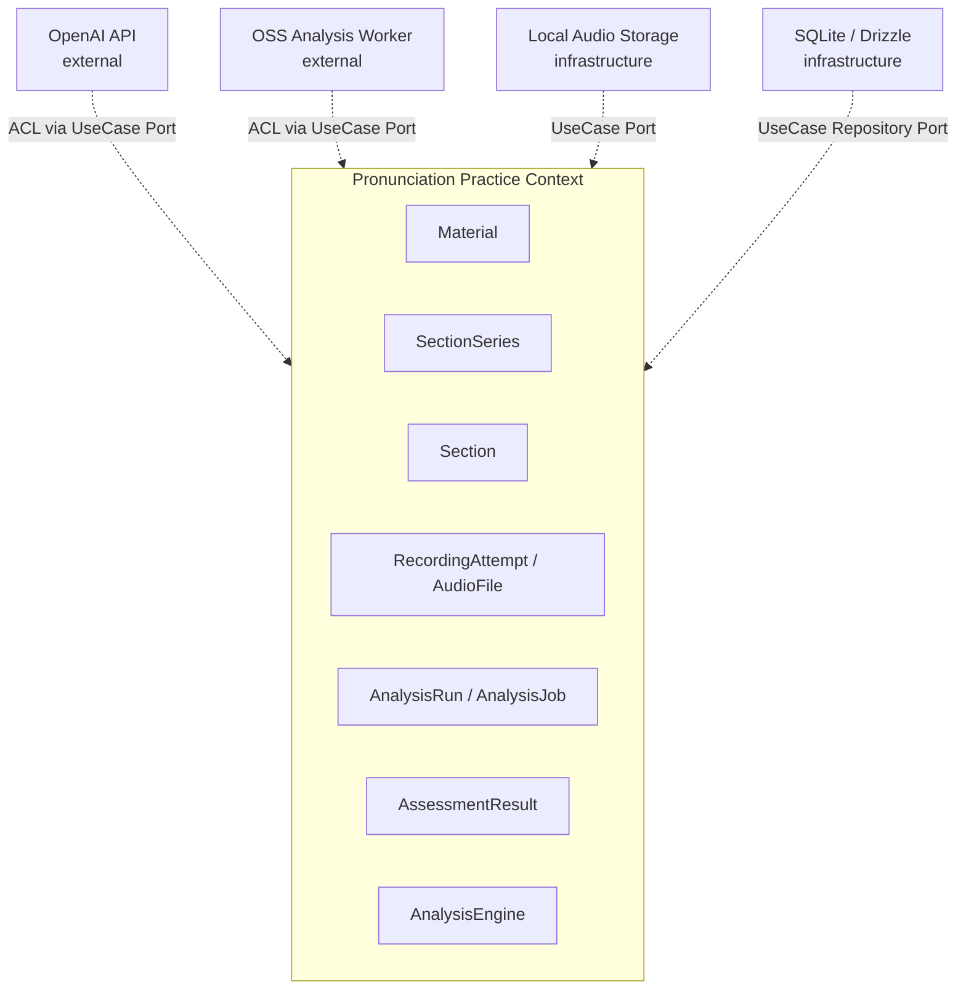
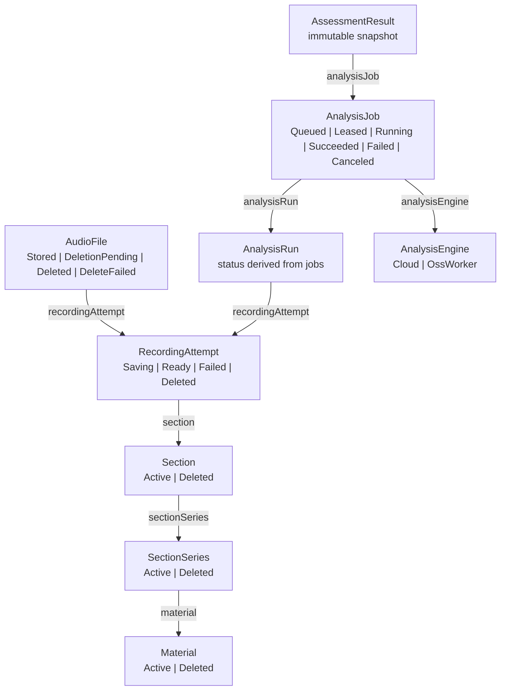
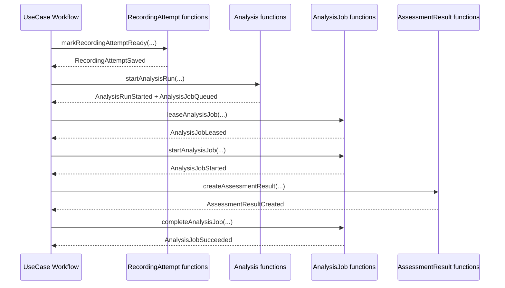
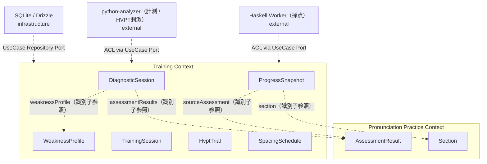
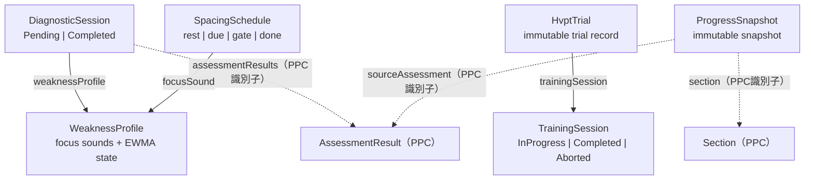

# ドメイン層設計書

## 1. はじめに

### 1.1 目的

本文書は、NativeTrace のドメイン層設計を定義する。設計基準は関数型ドメインモデリングとし、代数的データ型、Smart Constructor、Choice Type、NonEmptyList、Result型、Domain Event によって不正状態を作れないモデルを目指す。

NativeTrace の中心は、題材内のセクション系列に本文版を定義し、そのSectionを練習し、録音停止後に自動解析され、本文ハイライトで結果を確認する `PracticeSection` ワークフローである。本文書では、このワークフローを支える境界づけられたコンテキスト、集約、値オブジェクト、状態型、ドメイン関数、ドメインイベント、仕様/ポリシーを定義する。

TypeScript実装では `class` を使用せず、`type`、branded type、factory関数、pure functionで表現する。ワークフロー入力は `Command`、出力は `Output` と命名する。状態変更を伴うワークフロー/ドメイン関数は `NonEmptyList<DomainEvent>` を返し、派生計算関数はイベントを返さない。

### 1.2 関連文書

**上流文書（入力）:**

- [要件定義書](../01-requirements/requirements-specification.md)
- [基本設計書](../02-system-design/system-design.md)
- [詳細設計書](detailed-design.md)

**同層文書（詳細設計）:**

- [ユースケース層設計書](use-case.md)
- [インフラストラクチャ層設計書](infrastructure.md)
- [ACL設計書](acl.md)

**下流文書（出力）:**

- [API仕様書](../04-api-specification/api-specification.md)
- [データベース設計書](../05-database-design/database-design.md)
- テスト仕様書（未作成）

### 1.3 ドメイン設計原則

- プリミティブ値をドメインに直接露出せず、Domain Wrapperを使う。
- 検証が必要な値はSmart Constructorで生成し、失敗は`Result`で返す。
- 状態はstatusフィールドとoptional fieldではなく、Choice Typeで表現する。
- 集約内エンティティは禁止する。各集約は独立した集約ルートとして扱う。
- 集約間参照は識別子のみで行う。
- 自己識別子フィールドは`identifier`、他集約参照フィールドは`material`、`section`、`recordingAttempt`のように関連先名で表す。
- ランダム性が必要な識別子はUUIDv4、不要で複合識別子にする必要がない識別子はULIDを使う。
- Domainは永続化、Repository、HTTP、OpenAI API、OSS worker、ファイルシステムを知らない。

## 2. 境界づけられたコンテキスト

### 2.1 コンテキストマップ

NativeTrace MVPでは、ドメインコンテキストを単一の `Pronunciation Practice Context` とする。OpenAI APIとOSS解析workerはドメイン外部の実装詳細であり、UseCase層のPortとACLを通して連携する。



### 2.2 コンテキスト定義

| ID | コンテキスト名 | 責務 | 上流下流関係 |
|---|---|---|---|
| DD-001 | Pronunciation Practice Context | 題材、セクション系列、Section本文版、録音、解析実行、解析結果、発音練習履歴に関するドメインルールを管理する | 外部OpenAI API、OSS worker、Storage、DBとはUseCase Port、ACL、Infrastructure経由で連携する |

### 2.3 コンテキスト内モジュール

| モジュール | 責務 |
|---|---|
| Material | 題材コンテナ、タイトル、任意ソース情報、削除状態 |
| SectionSeries | 題材内の練習セクション系列、表示順、タイトル、削除状態 |
| Section | SectionSeriesに属する本文版。本文改訂時に新しい版を作る |
| Recording | 録音試行と録音状態 |
| AudioFile | 音声ファイルの保存・削除ライフサイクル |
| Analysis | 解析実行単位、解析ジョブ、ジョブ状態遷移 |
| Assessment | エンジン別解析結果、スコア、指摘、セグメント |
| AnalysisEngine | クラウド解析/OSS worker解析エンジンのマスタ的ドメイン情報 |

## 3. ユビキタス言語

| 用語 | 英語名 | 定義 | コンテキスト | 関連要件 |
|---|---|---|---|---|
| 発音練習 | PracticeSection | セクション本文を読み上げ、録音し、解析結果を確認する中心ワークフロー | Pronunciation Practice | [REQ-003](../01-requirements/requirements-specification.md#req-003), [REQ-005](../01-requirements/requirements-specification.md#req-005) |
| 題材 | Material | TEDなどの練習元をまとめるコンテナ。本文は直接持たず、Section本文版が本文を持つ | Pronunciation Practice | [REQ-001](../01-requirements/requirements-specification.md#req-001) |
| セクション系列 | SectionSeries | 題材内の練習セクション枠。表示順、タイトル、削除状態を持つ | Pronunciation Practice | [REQ-002](../01-requirements/requirements-specification.md#req-002) |
| セクション本文版 | Section | SectionSeriesに属する英文本文の版。改訂時は旧版を上書きせず新しいSectionを作る | Pronunciation Practice | [REQ-002](../01-requirements/requirements-specification.md#req-002) |
| 録音試行 | RecordingAttempt | セクションに対する1回分の録音 | Pronunciation Practice | [REQ-003](../01-requirements/requirements-specification.md#req-003) |
| 音声ファイル | AudioFile | 録音試行に紐づく保存済み音声ファイルのドメイン表現 | Pronunciation Practice | [REQ-017](../01-requirements/requirements-specification.md#req-017), [REQ-019](../01-requirements/requirements-specification.md#req-019) |
| 解析実行 | AnalysisRun | 録音停止後に開始される解析実行のまとまり | Pronunciation Practice | [REQ-009](../01-requirements/requirements-specification.md#req-009) |
| 解析ジョブ | AnalysisJob | 解析エンジンごとに実行される個別ジョブ | Pronunciation Practice | [REQ-009](../01-requirements/requirements-specification.md#req-009), [REQ-010](../01-requirements/requirements-specification.md#req-010) |
| 解析エンジン | AnalysisEngine | OpenAI APIまたはOSS workerなど、発音解析を実行する能力のドメイン表現 | Pronunciation Practice | [REQ-005](../01-requirements/requirements-specification.md#req-005), [REQ-008](../01-requirements/requirements-specification.md#req-008) |
| 解析結果 | AssessmentResult | エンジン別に保存される不変の解析結果スナップショット | Pronunciation Practice | [REQ-010](../01-requirements/requirements-specification.md#req-010), [REQ-011](../01-requirements/requirements-specification.md#req-011) |
| 指摘 | AssessmentFinding | 発音、本文一致、韻律、連結発話などの問題箇所 | Pronunciation Practice | [REQ-012](../01-requirements/requirements-specification.md#req-012), [REQ-014](../01-requirements/requirements-specification.md#req-014) |
| セグメント | AssessmentSegment | 本文文字範囲と音声時間範囲を結びつける解析単位 | Pronunciation Practice | [REQ-014](../01-requirements/requirements-specification.md#req-014), [REQ-017](../01-requirements/requirements-specification.md#req-017) |
| 比較モード | Comparison Mode | Cloud engineとOSS worker engineを同じ録音に対して実行する解析モード | Pronunciation Practice | [REQ-005](../01-requirements/requirements-specification.md#req-005), [REQ-010](../01-requirements/requirements-specification.md#req-010) |

## 4. 集約設計

### 4.1 集約一覧

集約内エンティティは禁止する。以下のすべてを独立集約として扱う。

| ID | 集約名 | 集約ルート | 不変条件 | 関連要件 |
|---|---|---|---|---|
| DD-010 | Material Aggregate | Material | Activeな題材だけがSectionSeries作成元になれる。タイトルは空でない | [REQ-001](../01-requirements/requirements-specification.md#req-001) |
| DD-011 | SectionSeries Aggregate | SectionSeries | Activeな系列だけが改訂・録音対象Sectionの親になれる。表示順は系列属性として共有する | [REQ-002](../01-requirements/requirements-specification.md#req-002) |
| DD-012 | Section Aggregate | Section | ActiveなSectionだけが録音対象になれる。`bodyText`は空でない。Sectionは作成後本文を変更しない | [REQ-002](../01-requirements/requirements-specification.md#req-002) |
| DD-013 | RecordingAttempt Aggregate | RecordingAttempt | Ready録音試行は必ず保存済み音声ファイルを参照する。Failed録音試行は失敗理由を持つ | [REQ-003](../01-requirements/requirements-specification.md#req-003) |
| DD-014 | AudioFile Aggregate | AudioFile | Stored音声ファイルだけが再生可能。削除失敗は再試行可能 | [REQ-017](../01-requirements/requirements-specification.md#req-017), [REQ-020](../01-requirements/requirements-specification.md#req-020) |
| DD-015 | AnalysisRun Aggregate | AnalysisRun | `AnalysisRun`は少なくとも1つの`AnalysisJob`と組み合わせて状態が判定される | [REQ-009](../01-requirements/requirements-specification.md#req-009) |
| DD-016 | AnalysisJob Aggregate | AnalysisJob | 状態ごとに必要なデータが異なる。Leasedはlease tokenと期限を必ず持つ | [REQ-009](../01-requirements/requirements-specification.md#req-009) |
| DD-017 | AssessmentResult Aggregate | AssessmentResult | 作成後不変。全スコア必須。segmentsはNonEmptyList | [REQ-011](../01-requirements/requirements-specification.md#req-011), [REQ-014](../01-requirements/requirements-specification.md#req-014) |
| DD-018 | AnalysisEngine Aggregate | AnalysisEngine | CloudとOSS workerで必要情報が異なる。無効なエンジンはジョブ作成対象にならない | [REQ-005](../01-requirements/requirements-specification.md#req-005), [REQ-008](../01-requirements/requirements-specification.md#req-008) |

### 4.2 集約関係図



### 4.3 集約詳細

#### 4.3.1 Material Aggregate（DD-010）

##### Choice Type

```typescript
type Material =
  | ActiveMaterial
  | DeletedMaterial;

type ActiveMaterial = Readonly<{
  type: "active";
  identifier: MaterialIdentifier;
  title: MaterialTitle;
  source: MaterialSource | null;
  createdAt: Date;
  updatedAt: Date;
}>;

type DeletedMaterial = Readonly<{
  type: "deleted";
  identifier: MaterialIdentifier;
  title: MaterialTitle;
  deletedAt: Date;
}>;
```

##### 不変条件リスト

| No. | 不変条件 | 検証タイミング | 違反時の振る舞い |
|---|---|---|---|
| 1 | ActiveMaterialのタイトルは空でない | Smart Constructor | `InvalidMaterialTitle`を返す |
| 2 | source情報は任意。指定時はURL、sourceType等をSmart Constructorで検証する | Smart Constructor | `InvalidMaterialSource`を返す |
| 3 | DeletedMaterialからSectionSeriesは作れない | `createSectionSeries` | `MaterialAlreadyDeleted`を返す |

##### トランザクション境界

Material作成は単一集約の作成として1トランザクションで完結する。Material削除は関連SectionSeries等の論理削除を伴うため、UseCaseワークフローで複数集約の状態遷移をまとめて調整する。

#### 4.3.2 SectionSeries Aggregate（DD-011）

```typescript
type SectionSeries =
  | ActiveSectionSeries
  | DeletedSectionSeries;

type ActiveSectionSeries = Readonly<{
  type: "active";
  identifier: SectionSeriesIdentifier;
  material: MaterialIdentifier;
  title: SectionTitle;
  displayOrder: SectionDisplayOrder;
  createdAt: Date;
  updatedAt: Date;
}>;

type DeletedSectionSeries = Readonly<{
  type: "deleted";
  identifier: SectionSeriesIdentifier;
  material: MaterialIdentifier;
  title: SectionTitle;
  deletedAt: Date;
}>;
```

| No. | 不変条件 | 検証タイミング | 違反時の振る舞い |
|---|---|---|---|
| 1 | ActiveSectionSeriesのtitleは空でない | Smart Constructor | `InvalidSectionTitle`を返す |
| 2 | displayOrderは系列属性であり、Section版ごとの差分として持たない | `createSectionSeries` / `reviseSectionSeries` | `InvalidSectionDisplayOrder`を返す |
| 3 | DeletedSectionSeriesには新しいSection版を追加できない | `createSectionVersion` | `SectionSeriesAlreadyDeleted`を返す |

#### 4.3.3 Section Aggregate（DD-012）

```typescript
type Section =
  | ActiveSection;

type ActiveSection = Readonly<{
  type: "active";
  identifier: SectionIdentifier;
  sectionSeries: SectionSeriesIdentifier;
  version: SectionVersion;
  bodyText: SectionBodyText;
  createdAt: Date;
  updatedAt: Date;
}>;
```

| No. | 不変条件 | 検証タイミング | 違反時の振る舞い |
|---|---|---|---|
| 1 | bodyTextは空でない | Smart Constructor | `InvalidSectionBodyText`を返す |
| 2 | bodyTextは最大文字数、英字割合、制御文字禁止を満たす | Smart Constructor | `InvalidSectionBodyText`を返す |
| 3 | Sectionは作成後に本文を変更しない。本文改訂は新しいSection版を作る | `createSectionVersion` | `SectionVersionConflict`を返す |
| 4 | 録音は具体的なSection版に紐づく | `startRecordingAttempt` | `SectionNotRecordable`を返す |

#### 4.3.4 RecordingAttempt Aggregate（DD-013）

```typescript
type RecordingAttempt =
  | SavingRecordingAttempt
  | ReadyRecordingAttempt
  | FailedRecordingAttempt
  | DeletedRecordingAttempt;

type RecordingOrigin =
  | Readonly<{
      type: "browser_recording";
      startedAt: Date;
      endedAt: Date;
      browserInfo: BrowserInfo;
    }>
  | Readonly<{
      type: "uploaded_file";
      originalFileName: OriginalFileName;
      uploadedAt: Date;
    }>;

type SavingRecordingAttempt = Readonly<{
  type: "saving";
  identifier: RecordingAttemptIdentifier;
  section: SectionIdentifier;
  inputKind: RecordingOrigin["type"];
  createdAt: Date;
}>;

type ReadyRecordingAttempt = Readonly<{
  type: "ready";
  identifier: RecordingAttemptIdentifier;
  section: SectionIdentifier;
  audioFile: AudioFileIdentifier;
  origin: RecordingOrigin;
  duration: RecordingDuration;
  createdAt: Date;
}>;

type FailedRecordingAttempt = Readonly<{
  type: "failed";
  identifier: RecordingAttemptIdentifier;
  section: SectionIdentifier;
  inputKind: RecordingOrigin["type"];
  failedAt: Date;
  failureReason: RecordingFailureReason;
}>;

type DeletedRecordingAttempt = Readonly<{
  type: "deleted";
  identifier: RecordingAttemptIdentifier;
  section: SectionIdentifier;
  deletedAt: Date;
}>;
```

| No. | 不変条件 | 検証タイミング | 違反時の振る舞い |
|---|---|---|---|
| 1 | ReadyRecordingAttemptは必ず`audioFile`を持つ | `markRecordingAttemptReady` | 型で表現 |
| 2 | FailedRecordingAttemptは必ず`failureReason`を持つ | `markRecordingAttemptFailed` | 型で表現 |
| 3 | DeletedRecordingAttemptは録音再生・解析対象にできない | 解析開始時 | `RecordingAttemptAlreadyDeleted`を返す |
| 4 | `browser_recording` は `startedAt`、`endedAt`、`browserInfo` をすべて持つ | `createRecordingOrigin` | Choice Typeで表現 |
| 5 | `uploaded_file` は録音時刻・ブラウザ情報を要求せず、`originalFileName` を持つ | `createRecordingOrigin` | Choice Typeで表現 |

#### 4.3.4 AudioFile Aggregate（DD-013）

```typescript
type AudioFile =
  | StoredAudioFile
  | DeletionPendingAudioFile
  | DeletedAudioFile
  | DeleteFailedAudioFile;
```

| 状態 | 必須データ | 許可される操作 |
|---|---|---|
| StoredAudioFile | relativePath, mimeType, sizeBytes, duration | 再生、削除要求 |
| DeletionPendingAudioFile | requestedAt | 物理削除実行 |
| DeletedAudioFile | deletedAt | なし |
| DeleteFailedAudioFile | failedAt, failureReason | 削除再試行 |

#### 4.3.5 AnalysisRun Aggregate（DD-014）

`AnalysisRun`は状態を持たない。状態は子`AnalysisJob`のNonEmptyListから派生する。

```typescript
type AnalysisRun = Readonly<{
  identifier: AnalysisRunIdentifier;
  recordingAttempt: RecordingAttemptIdentifier;
  mode: AnalysisMode;
  createdAt: Date;
}>;

type AnalysisRunStatus =
  | "queued"
  | "running"
  | "partial_succeeded"
  | "succeeded"
  | "failed"
  | "canceled";
```

| No. | 不変条件 | 検証タイミング | 違反時の振る舞い |
|---|---|---|---|
| 1 | AnalysisRunの状態判定にはNonEmptyList<AnalysisJob>が必要 | `deriveAnalysisRunStatus` | 空配列を型で禁止 |
| 2 | `comparison`ではCloudとOSS workerのジョブが必要 | `buildAnalysisJobsForMode` | `AnalysisEngineUnavailable`を返す |

#### 4.3.6 AnalysisJob Aggregate（DD-015）

```typescript
type AnalysisJob =
  | QueuedAnalysisJob
  | LeasedAnalysisJob
  | RunningAnalysisJob
  | SucceededAnalysisJob
  | FailedAnalysisJob
  | CanceledAnalysisJob;
```

| 状態 | 必須データ | 許可される遷移 |
|---|---|---|
| QueuedAnalysisJob | queuedAt | leased, canceled |
| LeasedAnalysisJob | leaseToken, leaseExpiresAt, attemptCount, maxAttempts | running, queued（retry）, canceled |
| RunningAnalysisJob | startedAt, leaseToken, attemptCount, maxAttempts | succeeded, failed, queued（retry）, canceled |
| SucceededAnalysisJob | finishedAt | なし |
| FailedAnalysisJob | finishedAt, failureReason | なし |
| CanceledAnalysisJob | canceledAt | なし |

`retryAnalysisJob` は、`failureKind = "retryable"` かつ `attemptCount < maxAttempts` の場合に限り、`LeasedAnalysisJob` または `RunningAnalysisJob` を `QueuedAnalysisJob` へ戻す。再queue時はlease情報を破棄し、`nextRunAt` と `queuedAt` を更新する。条件を満たさない失敗は `failAnalysisJob` で `FailedAnalysisJob` に確定する。

#### 4.3.7 AssessmentResult Aggregate（DD-016）

`AssessmentResult`は作成後不変のスナップショットである。再解析時は既存結果を更新せず、新しい`AnalysisJob`と`AssessmentResult`を作成する。

```typescript
type AssessmentResult = Readonly<{
  identifier: AssessmentResultIdentifier;
  analysisJob: AnalysisJobIdentifier;
  scores: ScoreSet;
  summary: AssessmentSummary;
  findings: ReadonlyArray<AssessmentFinding>;
  segments: NonEmptyList<AssessmentSegment>;
  metadata: AssessmentEngineMetadata;
  tokenizerVersion: TokenizerVersion;
  raw: UnknownEngineRawResult;
  engineSnapshot: AnalysisEngineSnapshot;
  createdAt: Date;
}>;

type AssessmentFinding = Readonly<{
  identifier: AssessmentFindingIdentifier;
  category: FindingCategory;
  severity: FindingSeverity;
  textRange: TextRange;
  audioRange: AudioRange | null;
  expected: PronunciationEvidence;
  detected: PronunciationEvidence;
  messageJa: string;
  messageEn: string | null;
  scoreImpact: number;
  confidence: Confidence0To1;
}>;

const FindingCategory = {
  ACCURACY: "accuracy",
  PRONUNCIATION: "pronunciation",
  CONNECTED_SPEECH: "connectedSpeech",
  PROSODY: "prosody",
  NATIVE_LIKENESS: "nativeLikeness",
} as const;

type FindingCategory =
  typeof FindingCategory[keyof typeof FindingCategory];

const FindingSeverity = {
  CRITICAL: "critical",
  MAJOR: "major",
  MINOR: "minor",
  SUGGESTION: "suggestion",
} as const;

type FindingSeverity =
  typeof FindingSeverity[keyof typeof FindingSeverity];

type PronunciationEvidence = Readonly<{
  text: string | null;
  ipa: string | null;
}>;
```

| No. | 不変条件 | 検証タイミング | 違反時の振る舞い |
|---|---|---|---|
| 1 | `ScoreSet`は全スコアを必ず持つ | `createAssessmentResult` | `IncompleteScoreSet`を返す |
| 2 | 各スコアは0から100の整数 | `createScore0To100` | `InvalidScore`を返す |
| 3 | confidenceは0から1の小数 | `createConfidence0To1` | `InvalidConfidence`を返す |
| 4 | findingsは空を許可する | `createAssessmentResult` | 空配列は成功 |
| 5 | segmentsはNonEmptyList | `createAssessmentResult` | `EmptyAssessmentSegments`を返す |
| 6 | 全Findingは一意な`identifier`を持ち、Highlightはその識別子を参照する | `createAssessmentResult` | `InvalidAssessmentFinding`を返す |
| 7 | `summary`、`metadata`、`tokenizerVersion`を必ず保存する | `createAssessmentResult` | `AssessmentSchemaInvalidError`を返す |

#### 4.3.8 AnalysisEngine Aggregate（DD-017）

```typescript
type AnalysisEngine =
  | CloudAnalysisEngine
  | OssWorkerAnalysisEngine;

type CloudAnalysisEngine = Readonly<{
  type: "cloud";
  identifier: AnalysisEngineIdentifier;
  displayName: AnalysisEngineDisplayName;
  provider: CloudProvider;
  modelName: ModelName;
  externalSendingRequired: true;
  enabled: boolean;
  configuration: AnalysisEngineConfiguration;
}>;

type OssWorkerAnalysisEngine = Readonly<{
  type: "oss_worker";
  identifier: AnalysisEngineIdentifier;
  displayName: AnalysisEngineDisplayName;
  workerVersion: WorkerVersion;
  modelName: ModelName;
  rulesetVersion: RulesetVersion;
  enabled: boolean;
  configuration: AnalysisEngineConfiguration;
}>;

const AssessmentEngineFailureKind = {
  RETRYABLE: "retryable",
  NON_RETRYABLE: "nonRetryable",
} as const;

type AssessmentEngineFailureKind =
  typeof AssessmentEngineFailureKind[keyof typeof AssessmentEngineFailureKind];
```

## 5. エンティティ

| ID | 名前 | 所属集約 | 識別子型 | ライフサイクル |
|---|---|---|---|---|
| DD-020 | Material | Material | MaterialIdentifier（ULID） | Active → Deleted |
| DD-021 | SectionSeries | SectionSeries | SectionSeriesIdentifier（ULID） | Active → Deleted |
| DD-022 | Section | Section | SectionIdentifier（ULID） | 作成後不変 |
| DD-023 | RecordingAttempt | RecordingAttempt | RecordingAttemptIdentifier（ULID） | Saving → Ready / Failed → Deleted |
| DD-024 | AudioFile | AudioFile | AudioFileIdentifier（ULID） | Stored → DeletionPending → Deleted / DeleteFailed |
| DD-025 | AnalysisRun | AnalysisRun | AnalysisRunIdentifier（ULID） | 作成後不変。状態はAnalysisJobから派生 |
| DD-026 | AnalysisJob | AnalysisJob | AnalysisJobIdentifier（ULID） | Queued → Leased → Running → Succeeded / Failed / Canceled |
| DD-027 | AssessmentResult | AssessmentResult | AssessmentResultIdentifier（ULID） | 作成後不変 |
| DD-028 | AnalysisEngine | AnalysisEngine | AnalysisEngineIdentifier（ULID） | Cloud / OssWorker、enabled切替 |

## 6. 値オブジェクト

| ID | 名前 | 所属集約 | 等価性基準 | バリデーションルール |
|---|---|---|---|---|
| DD-030 | MaterialIdentifier | Material | ULID値の一致 | ULID形式 |
| DD-031 | MaterialTitle | Material | 文字列の一致 | 空でない、前後空白正規化後に有効 |
| DD-032 | MaterialSource | Material | 各属性の一致 | 任意。指定時はsourceType、URL等が有効 |
| DD-033 | SectionSeriesIdentifier | SectionSeries | ULID値の一致 | ULID形式 |
| DD-034 | SectionDisplayOrder | SectionSeries | 整数値の一致 | 0以上 |
| DD-035 | SectionIdentifier | Section | ULID値の一致 | ULID形式 |
| DD-036 | SectionVersion | Section | 正整数値の一致 | 1以上 |
| DD-037 | SectionBodyText | Section | 文字列の一致 | 空不可、最大文字数、英字割合、制御文字禁止 |
| DD-038 | RecordingAttemptIdentifier | RecordingAttempt | ULID値の一致 | ULID形式 |
| DD-039 | RecordingDuration | RecordingAttempt | ミリ秒値の一致 | 0より大きい |
| DD-040 | BrowserInfo | RecordingAttempt | 各属性の一致 | browserName、deviceType等が有効 |
| DD-041 | AudioFileIdentifier | AudioFile | ULID値の一致 | ULID形式 |
| DD-042 | AudioMimeType | AudioFile | MIME type文字列の一致 | 対応形式のみ |
| DD-043 | AudioFileSize | AudioFile | byte数の一致 | 0より大きい |
| DD-044 | AnalysisRunIdentifier | AnalysisRun | ULID値の一致 | ULID形式 |
| DD-045 | AnalysisJobIdentifier | AnalysisJob | ULID値の一致 | ULID形式 |
| DD-046 | AnalysisLeaseToken | AnalysisJob | UUID値の一致 | UUIDv4形式 |
| DD-047 | AnalysisEngineIdentifier | AnalysisEngine | ULID値の一致 | ULID形式 |
| DD-048 | AssessmentResultIdentifier | AssessmentResult | ULID値の一致 | ULID形式 |
| DD-049 | Score0To100 | AssessmentResult | 整数値の一致 | 0から100の整数 |
| DD-050 | Confidence0To1 | AssessmentResult | 小数値の一致 | 0以上1以下 |
| DD-051 | TextRange | AssessmentResult | start/endの一致 | `startOffset < endOffset` |
| DD-052 | AudioRange | AssessmentResult | start/endの一致 | `startMilliseconds < endMilliseconds` |
| DD-053 | NonEmptyList<T> | 複数 | 先頭要素と残り要素の一致 | 1要素以上 |
| DD-054 | Pagination | Search Criteria | Choice Type | MVPではoffset/limitのみ |
| DD-055 | AssessmentFindingIdentifier | AssessmentResult | ULID値の一致 | ULID形式 |
| DD-056 | PronunciationEvidence | AssessmentResult | textとIPAの一致 | text/ipaは属性単位でNULL可 |
| DD-057 | TokenizerVersion | AssessmentResult | 文字列値の一致 | 空でないversion文字列 |

### 6.1 DomainError

`DomainError` はcaseごとに独立型を定義する。ACL変換後の共通解析結果が契約を満たさない場合は、engine通信失敗とは区別して `AssessmentSchemaInvalidError` を返す。

```typescript
export type AssessmentSchemaInvalidError = Readonly<{
  type: "assessmentSchemaInvalid";
  reason: string;
}>;

export type DomainError =
  | ValidationFailedError
  | NotFoundError
  | InvalidStateTransitionError
  | PersistenceFailedError
  | TransactionFailedError
  | AudioStorageFailedError
  | AssessmentEngineFailedError
  | AssessmentSchemaInvalidError;
```

## 7. ドメインサービス関数

ドメインサービスはクラスではなく、単一集約に自然に属さないドメイン関数として表現する。

| ID | 関数名 | 入力 | 出力 | 責務 |
|---|---|---|---|---|
| DD-060 | createSectionSeries | ActiveMaterial, SectionTitle, SectionDisplayOrder | Result<CreateSectionSeriesOutput, DomainError> | 題材内の練習セクション系列を作成する |
| DD-061 | createSectionVersion | ActiveSectionSeries, SectionBodyText, SectionVersion | Result<CreateSectionVersionOutput, DomainError> | SectionSeriesに属する本文版を作成する |
| DD-062 | reviseSectionSeries | ActiveSectionSeries, SectionTitle, SectionDisplayOrder | Result<ReviseSectionSeriesOutput, DomainError> | 系列のタイトルと表示順を改訂する |
| DD-063 | retireSectionSeries | ActiveSectionSeries | Result<RetireSectionSeriesOutput, DomainError> | SectionSeriesを通常表示から外す |
| DD-064 | markRecordingAttemptReady | SavingRecordingAttempt, StoredAudioFile, RecordingMetadata | Result<MarkRecordingAttemptReadyOutput, DomainError> | 保存中録音試行をReadyへ遷移させる |
| DD-065 | markRecordingAttemptFailed | SavingRecordingAttempt, RecordingFailureReason | Result<MarkRecordingAttemptFailedOutput, DomainError> | 保存中録音試行をFailedへ遷移させる |
| DD-066 | requestAudioFileDeletion | StoredAudioFile | RequestAudioFileDeletionOutput | 音声ファイル削除要求状態へ遷移させる |
| DD-067 | buildAnalysisJobsForMode | AnalysisRun, AnalysisMode, NonEmptyList<AnalysisEngine> | Result<BuildAnalysisJobsOutput, DomainError> | 解析モードから必要なジョブを生成する |
| DD-068 | leaseAnalysisJob | QueuedAnalysisJob, AnalysisLeaseToken, Date | LeaseAnalysisJobOutput | queuedジョブをleasedへ遷移させる |
| DD-069 | startAnalysisJob | LeasedAnalysisJob, Date | StartAnalysisJobOutput | leasedジョブをrunningへ遷移させる |
| DD-070 | completeAnalysisJob | RunningAnalysisJob, AssessmentResult, Date | CompleteAnalysisJobOutput | runningジョブをsucceededへ遷移させる |
| DD-071 | failAnalysisJob | RunningAnalysisJob, AnalysisJobFailureReason, Date | FailAnalysisJobOutput | runningジョブをfailedへ遷移させる |
| DD-072 | deriveAnalysisRunStatus | NonEmptyList<AnalysisJob> | AnalysisRunStatus | 子ジョブ状態からAnalysisRun状態を派生計算する |
| DD-073 | createAssessmentResult | CreateAssessmentResultCommand | Result<CreateAssessmentResultOutput, DomainError> | 不変条件を満たす解析結果を作成する |
| DD-074 | retryAnalysisJob | LeasedAnalysisJob \| RunningAnalysisJob, AssessmentEngineFailureKind, Date | Result<RetryAnalysisJobOutput, DomainError> | retryableかつ試行上限未満のジョブをqueuedへ戻す |

状態変更を伴う関数の`Output`は`events: NonEmptyList<DomainEvent>`を持つ。`deriveAnalysisRunStatus`のような派生計算関数はイベントを返さない。

`deriveAnalysisRunStatus` は次の優先順で決定する。

1. 1件以上が `running` または `leased` なら `running`
2. 実行中がなく1件以上が `queued` なら `queued`
3. 全Jobが `succeeded` なら `succeeded`
4. 1件以上が `succeeded` かつ残りが `failed` または `canceled` なら `partial_succeeded`
5. 全Jobが `canceled` なら `canceled`
6. 成功Jobがなく、1件以上が `failed` で残りも `failed` または `canceled` なら `failed`

これにより、キャンセル要求後も完了済みJobを保持したまま、子Jobの実状態からRun状態を再計算できる。

## 8. ドメインイベント

### 8.1 イベント一覧

| ID | イベント名 | 発行元 | トリガー条件 | ペイロード | 購読者 |
|---|---|---|---|---|---|
| DD-080 | MaterialCreated | Material | 題材が作成された | material, occurredAt | UseCase |
| DD-081 | SectionSeriesCreated | SectionSeries | セクション系列が作成された | sectionSeries, material, occurredAt | UseCase |
| DD-082 | SectionCreated | Section | Section本文版が作成された | section, sectionSeries, occurredAt | UseCase |
| DD-083 | SectionSeriesRetired | SectionSeries | セクション系列が通常表示から外された | sectionSeries, occurredAt | UseCase |
| DD-084 | RecordingAttemptStarted | RecordingAttempt | 録音試行が開始された | recordingAttempt, section, occurredAt | UseCase |
| DD-085 | RecordingAttemptSaved | RecordingAttempt | 録音音声が保存されReadyになった | recordingAttempt, audioFile, occurredAt | UseCase |
| DD-086 | RecordingAttemptFailed | RecordingAttempt | 録音保存が失敗した | recordingAttempt, failureReason, occurredAt | UseCase |
| DD-087 | AnalysisRunStarted | AnalysisRun | 解析実行が開始された | analysisRun, recordingAttempt, mode, occurredAt | UseCase |
| DD-088 | AnalysisJobQueued | AnalysisJob | 解析ジョブが作成された | analysisJob, analysisRun, analysisEngine, occurredAt | UseCase |
| DD-089 | AnalysisJobLeased | AnalysisJob | Runnerがジョブleaseを取得した | analysisJob, leaseToken, occurredAt | UseCase |
| DD-090 | AnalysisJobStarted | AnalysisJob | ジョブ実行が始まった | analysisJob, occurredAt | UseCase |
| DD-091 | AnalysisJobSucceeded | AnalysisJob | ジョブが成功した | analysisJob, assessmentResult, occurredAt | UseCase |
| DD-092 | AnalysisJobFailed | AnalysisJob | ジョブが失敗した | analysisJob, failureReason, occurredAt | UseCase |
| DD-093 | AnalysisJobCanceled | AnalysisJob | ジョブがキャンセルされた | analysisJob, occurredAt | UseCase |
| DD-094 | AssessmentResultCreated | AssessmentResult | 解析結果が作成された | assessmentResult, analysisJob, occurredAt | UseCase |
| DD-095 | RecordingAttemptDeleted | RecordingAttempt | 録音試行が削除された | recordingAttempt, occurredAt | UseCase |
| DD-096 | AudioFileDeletionRequested | AudioFile | 音声ファイル削除が要求された | audioFile, occurredAt | UseCase |
| DD-097 | AudioFileDeleted | AudioFile | 音声ファイル物理削除が完了した | audioFile, occurredAt | UseCase |
| DD-098 | AudioFileDeletionFailed | AudioFile | 音声ファイル物理削除が失敗した | audioFile, failureReason, occurredAt | UseCase |
| DD-123 | MaterialRevised | Material | 題材メタデータが改訂された | material, occurredAt | UseCase |
| DD-124 | MaterialRetired | Material | 題材が通常表示から外された | material, occurredAt | UseCase |
| DD-125 | SectionRevised | Section | 新しいSection本文版が作成された | section, sectionSeries, occurredAt | UseCase |
| DD-126 | AudioFileStored | AudioFile | 音声ファイル保存が完了した | audioFile, recordingAttempt, occurredAt | UseCase |
| DD-127 | AssessmentRunDiscarded | AnalysisRun | AnalysisRunが通常表示から外された | analysisRun, occurredAt | UseCase |

### 8.2 イベントフロー図



## 9. 検索Criteria

### 9.1 Repository配置方針

Repository PortはDomain層には定義しない。Repository PortはUseCase層配下に定義し、Infrastructure層が実装する。Domain層はRepository、DB、transaction、storage、HTTPを知らない。

ただし、検索意図を表すCriteriaはドメイン語彙であり、Domain層のChoice Typeとして定義する。Repositoryの `search(criteria)` はこのCriteriaを受け取り、InfrastructureがSQL等へ変換する。

### 9.2 Criteria一覧

| ID | Criteria | 対象 | 主なcase |
|---|---|---|---|
| DD-100 | MaterialSearchCriteria | Material | activeMaterials, includingRetiredForHistory |
| DD-101 | SectionSeriesSearchCriteria | SectionSeries | activeSeriesInMaterial, seriesForHistory |
| DD-102 | SectionSearchCriteria | Section | activeLatestSectionsInMaterial, sectionVersionsInSeries, practiceHistorySectionsInSeries |
| DD-103 | RecordingAttemptSearchCriteria | RecordingAttempt | attemptsInSection, attemptsForHistory |
| DD-104 | AnalysisRunSearchCriteria | AnalysisRun | runsByRecordingAttempt, runsForHistory |
| DD-105 | AnalysisJobSearchCriteria | AnalysisJob | jobsByAnalysisRun, runnableJobsForInspection |
| DD-106 | AssessmentResultSearchCriteria | AssessmentResult | resultsByAnalysisRun, resultsByJobs |

### 9.3 Criteria表現ルール

```typescript
type Pagination =
  | { type: "offset"; offset: Offset; limit: Limit };

type SectionSearchCriteria =
  | {
      type: "activeLatestSectionsInMaterial";
      material: MaterialIdentifier;
      pagination: Pagination;
      sort: SectionSort;
    }
  | {
      type: "sectionVersionsInSeries";
      sectionSeries: SectionSeriesIdentifier;
      pagination: Pagination;
      sort: SectionVersionSort;
    }
  | {
      type: "practiceHistorySectionsInSeries";
      sectionSeries: SectionSeriesIdentifier;
      pagination: Pagination;
      sort: PracticeHistorySort;
    };
```

Criteriaはpage/sortも含む検索仕様全体を表す。MVPではoffset/limit方式のみ実装必須とし、カーソル方式は将来追加とする。CriteriaにDB列名、SQL断片、自由文字列のsort expressionを持たせない。

## 10. 仕様/ポリシー

仕様/ポリシーはクラスではなく、述語関数またはドメイン関数として表現する。

| ID | 仕様名 | 対象 | ビジネスルール |
|---|---|---|---|
| DD-110 | canCreateSectionSeries | ActiveMaterial | ActiveMaterialのみSectionSeries作成元にできる |
| DD-111 | canCreateSectionVersion | ActiveSectionSeries, SectionBodyText | ActiveSectionSeriesのみSection版を追加でき、本文は妥当性を満たす |
| DD-112 | canRecordSection | Section | ActiveSectionのみ録音可能 |
| DD-113 | canStartAnalysisRun | RecordingAttempt | ReadyRecordingAttemptのみ解析実行可能 |
| DD-114 | analysisModeRequiresEngines | AnalysisMode, AnalysisEngine list | `cloud_only`はCloud engine、`oss_worker_only`はOSS worker engine、`comparison`は両方が必要 |
| DD-115 | canPlayAudioFile | AudioFile | StoredAudioFileのみ再生可能 |
| DD-116 | canDeleteAudioFilePhysically | AudioFile | DeletionPendingAudioFileまたはDeleteFailedAudioFileのみ物理削除対象 |
| DD-117 | scoreMustBeInteger0To100 | Score0To100 | スコアは0から100の整数 |
| DD-118 | confidenceMustBe0To1 | Confidence0To1 | 信頼度は0以上1以下の小数 |
| DD-119 | assessmentSegmentsMustBeNonEmpty | AssessmentResult | segmentsはNonEmptyListでなければならない |
| DD-128 | canRetryAnalysisJob | LeasedAnalysisJob \| RunningAnalysisJob | retryable失敗かつ`attemptCount < maxAttempts`の場合だけqueuedへ戻せる |

## 11. 外部能力との境界

Domainは外部I/Oを直接実行しない。音声保存、音声削除、発音解析、Repository、transactionはUseCase層のPortとして定義し、InfrastructureまたはACLが実装する。

| ID | 能力 | Port定義場所 | 実装層 |
|---|---|---|---|
| DD-120 | 音声ファイル保存、読み込み、物理削除 | UseCase層 | Infrastructure |
| DD-121 | 録音音声とセクション本文から `AssessmentResultDraft` を生成する | UseCase層 | ACL |
| DD-122 | 集約の永続化、検索、論理削除 | UseCase層 | Infrastructure |

発音解析の具象実装名は `Adaptor` suffixに統一する。OpenAI/OSS Workerの外部モデルやHTTPレスポンスはACL内で `AssessmentResultDraft` へ正規化し、UseCase層で正式な `AssessmentResult` を作る。MVPの発音解析Portは `assess` のみを持ち、中止メソッドは持たない。

## 12. ワークフロー設計

### 12.1 PracticeSection

`PracticeSection` はNativeTraceの中心ワークフローである。UseCase層では複数の関数に分割されるが、Domain上は次の状態遷移とイベント列として捉える。

```text
ActiveSectionSeries + ActiveSection
  -> SavingRecordingAttempt
  -> ReadyRecordingAttempt
  -> AnalysisRun + NonEmptyList<AnalysisJob>
  -> AssessmentResult per succeeded job
```

### 12.2 Command / Output

```typescript
type CreateSectionCommand = Readonly<{
  sectionSeries: SectionSeriesIdentifier;
  bodyText: SectionBodyText;
}>;

type CreateSectionOutput = Readonly<{
  section: ActiveSection;
  events: NonEmptyList<SectionCreated>;
}>;

type StartAnalysisRunCommand = Readonly<{
  recordingAttempt: RecordingAttemptIdentifier;
  mode: AnalysisMode;
}>;

type StartAnalysisRunOutput = Readonly<{
  analysisRun: AnalysisRun;
  analysisJobs: NonEmptyList<AnalysisJob>;
  events: NonEmptyList<DomainEvent>;
}>;
```

## 14. Training Context

### 14.1 はじめに

Training Contextは、`Pronunciation Practice Context`（PPC、DD-001）と並立する第2の境界づけられたコンテキストである（ADR-007）。PPCは「Sectionを1回録音し、1回解析し、結果を確認する」record-once-analyze-onceワークフローを担う。Training Contextは「短時間診断で弱点プロファイルを初期化し、HVPT・産出ドリル・シャドーイングで訓練し、進捗を時系列で可視化する」多セッションの診断 → 訓練 → 進捗ループを担う。両ループはライフサイクルが異なるため、PPCの9集約を改変せず、Training Contextの6集約として独立に設計する。

本コンテキストは§1.3のドメイン設計原則をそのまま継承する。とりわけ集約内エンティティは禁止し（§1.3、L47-49）、集約間参照・コンテキスト間参照はいずれも識別子のみで行う。PPCへの参照（`Section` / `AssessmentResult`）も識別子で保持し、PPC集約の内部型をimportしない（ADR-007制約）。識別子型は`XXXIdentifier`、自身の識別子フィールドは`identifier`、他モデル参照は参照先モデル名のフィールド（suffixに`Identifier`を付けない）で表す。

採点はTraining Context内に重複させない。診断・産出ドリルの評価は、ADR-004が定めたHaskell worker / python-analyzerの採点契約（python-analyzerが生のGOP / NBest計測と`phenomenon`を返し、workerが構造化diffとseverity / scoreImpactを返す）を再利用し、その結果を`HvptTrial` / `TrainingSession` / `ProgressSnapshot`へ保存する（ADR-007、ADR-010）。Training Contextは独自のGOP閾値→severity採点ポリシーを持たない。

### 14.2 コンテキストマップ更新



| 関係 | 種別 | 内容 |
|---|---|---|
| Training Context → PPC | コンテキスト間参照（識別子のみ） | `DiagnosticSession.assessmentResults`、`ProgressSnapshot.section` / `ProgressSnapshot.sourceAssessment` を`SectionIdentifier` / `AssessmentResultIdentifier`で保持する。PPC集約の内部型はimportしない |
| PPC → Training Context | なし | PPCはTraining Contextから何もimportしない（ADR-007制約。依存方向検査で機械的に強制） |
| Training Context → Haskell worker / python-analyzer | UseCase Port + ACL | 診断・ドリル評価はADR-004の採点契約を再利用する。HVPT刺激音はpython-analyzerが配信する（ADR-009） |

### 14.3 コンテキスト定義

| ID | コンテキスト名 | 責務 | 上流下流関係 |
|---|---|---|---|
| DD-002 | Training Context | 短時間診断、弱点プロファイル（focus sound優先度のEWMA更新）、HVPT知覚訓練、産出ドリル、シャドーイング、分散学習スケジュール、進捗スナップショットに関するドメインルールを管理する | PPCを`Section` / `AssessmentResult`識別子で参照する。採点はHaskell worker / python-analyzer（ADR-004）をUseCase Port経由で再利用する。永続化はDBをRepository Port経由で行う |

### 14.4 コンテキスト内モジュール

| モジュール | 責務 |
|---|---|
| DiagnosticSession | 短時間診断1回。読み上げ課題セット参照、取り込んだ`AssessmentResult`識別子群、生成した`WeaknessProfile`参照、完了状態 |
| WeaknessProfile | 学習者ごとの永続プロファイル。focus sound別の優先度（FLランク×出現頻度×習熟度の合成）、EWMA更新の最終更新時刻 |
| TrainingSession | HVPT識別 / 産出ドリル / シャドーイングの1セッション。種別、開始 / 終了、累計分、対象対立 |
| HvptTrial | HVPT識別試行1回。所属`TrainingSession`、刺激参照、対立、正解ラベル、応答、正誤、反応時間 |
| SpacingSchedule | 対立別の次回提示時刻と状態。等間隔スケジューラのステートマシン |
| ProgressSnapshot | 統制課題に限定した進捗スナップショット。CEFR下位尺度、focus別スコア、累計訓練時間 |

### 14.5 ユビキタス言語（Training Context）

| 用語 | 英語名 | 定義 | 関連要件 |
|---|---|---|---|
| 診断セッション | DiagnosticSession | 弱点プロファイルを初期化する短時間（2〜5分）の読み上げ診断1回 | [REQ-121](../01-requirements/pronunciation-feedback-requirements.md#req-121) |
| 弱点プロファイル | WeaknessProfile | 学習者ごとに永続化されるfocus sound優先度の現在値。日常解析結果でEWMA漸進更新される | [REQ-112](../01-requirements/pronunciation-feedback-requirements.md#req-112), [REQ-121](../01-requirements/pronunciation-feedback-requirements.md#req-121) |
| focus sound | FocusSound | いま直すべき音。対象音素・対立、FLランク、優先度スコア、習熟度を持つ値オブジェクト | [REQ-112](../01-requirements/pronunciation-feedback-requirements.md#req-112) |
| 訓練セッション | TrainingSession | HVPT識別 / 産出ドリル / シャドーイングの1セッション。累計訓練時間に積み上がる | [REQ-122](../01-requirements/pronunciation-feedback-requirements.md#req-122), [REQ-123](../01-requirements/pronunciation-feedback-requirements.md#req-123), [REQ-125](../01-requirements/pronunciation-feedback-requirements.md#req-125) |
| HVPT試行 | HvptTrial | 多話者forced-choice識別課題の1試行。刺激・応答・正誤・反応時間を持つ | [REQ-122](../01-requirements/pronunciation-feedback-requirements.md#req-122) |
| 分散学習スケジュール | SpacingSchedule | 対立別の次回提示時刻と状態（rest / due / gate / done）を持つステートマシン | [REQ-127](../01-requirements/pronunciation-feedback-requirements.md#req-127) |
| 進捗スナップショット | ProgressSnapshot | 統制課題に限定したCEFR下位尺度・focus別スコア・累計訓練時間の時刻付きスナップショット | [REQ-129](../01-requirements/pronunciation-feedback-requirements.md#req-129) |
| 対立 | PhonemeContrast | focus soundが対象とする音素対立（例: `/r/`-`/l/`、`/θ/`-`/s/`）。カタログの`contrast`に対応する | [REQ-101](../01-requirements/pronunciation-feedback-requirements.md#req-101), [REQ-122](../01-requirements/pronunciation-feedback-requirements.md#req-122) |

### 14.6 集約一覧（Training Context）

集約内エンティティは禁止する（§1.3）。以下のすべてを独立集約として扱い、集約間参照は識別子のみで行う。

| ID | 集約名 | 集約ルート | 不変条件 | 関連要件 |
|---|---|---|---|---|
| DD-200 | DiagnosticSession Aggregate | DiagnosticSession | Completedな診断のみ`WeaknessProfile`を生成済みとして参照する。取り込んだ`AssessmentResult`はNonEmptyList | [REQ-121](../01-requirements/pronunciation-feedback-requirements.md#req-121) |
| DD-201 | WeaknessProfile Aggregate | WeaknessProfile | 学習者ごと一意。focus soundはNonEmptyList。各focus soundの優先度はFLランク×出現頻度×(1−習熟度)の合成で導出される | [REQ-112](../01-requirements/pronunciation-feedback-requirements.md#req-112), [REQ-113](../01-requirements/pronunciation-feedback-requirements.md#req-113) |
| DD-202 | TrainingSession Aggregate | TrainingSession | Completedなセッションは終了時刻と累計分を持つ。1セッションは20〜30分で打ち切る。trialsは識別子参照 | [REQ-122](../01-requirements/pronunciation-feedback-requirements.md#req-122), [REQ-127](../01-requirements/pronunciation-feedback-requirements.md#req-127) |
| DD-203 | HvptTrial Aggregate | HvptTrial | 識別課題（forced-choice）であり、正解ラベルと応答ラベルを必ず持つ。刺激は識別子参照で内包しない | [REQ-122](../01-requirements/pronunciation-feedback-requirements.md#req-122) |
| DD-204 | SpacingSchedule Aggregate | SpacingSchedule | 対立別に一意。状態はrest / due / gate / doneのChoice Type。間隔はdone遷移のみで開く | [REQ-127](../01-requirements/pronunciation-feedback-requirements.md#req-127) |
| DD-205 | ProgressSnapshot Aggregate | ProgressSnapshot | 統制課題（読み上げ再録音 / ドリル）の結果からのみ生成する。作成後不変 | [REQ-129](../01-requirements/pronunciation-feedback-requirements.md#req-129) |

### 14.7 集約関係図（Training Context）



`TrainingSession`の対象対立と`SpacingSchedule`の対立は、`WeaknessProfile`が保持するfocus soundの`contrast`を介して整合する。`HvptTrial`は`TrainingSession`を識別子参照し、集約内に内包しない（§1.3）。

### 14.8 集約詳細

#### 14.8.1 DiagnosticSession Aggregate（DD-200）

##### Choice Type

```typescript
type DiagnosticSession =
  | PendingDiagnosticSession
  | CompletedDiagnosticSession;

type PendingDiagnosticSession = Readonly<{
  type: "pending";
  identifier: DiagnosticSessionIdentifier;
  learner: LearnerIdentifier;
  promptSet: DiagnosticPromptSet;
  startedAt: Date;
}>;

type CompletedDiagnosticSession = Readonly<{
  type: "completed";
  identifier: DiagnosticSessionIdentifier;
  learner: LearnerIdentifier;
  promptSet: DiagnosticPromptSet;
  assessmentResults: NonEmptyList<AssessmentResultIdentifier>;
  weaknessProfile: WeaknessProfileIdentifier;
  startedAt: Date;
  completedAt: Date;
}>;
```

`DiagnosticPromptSet`は、カタログ（`japanese-l1-catalog.json`）の高FL対立・母音挿入・韻律を網羅する読み上げ課題セットを表す値オブジェクトである（REQ-121）。診断中の各読み上げはPPCの録音 → 解析パスを通り、生成された`AssessmentResult`を`assessmentResults`として識別子参照する（ADR-010: 診断は独自採点パスを持たず既存契約を再利用する）。

| No. | 不変条件 | 検証タイミング | 違反時の振る舞い |
|---|---|---|---|
| 1 | `promptSet`はカタログの高FL対立・母音挿入・韻律を網羅する | Smart Constructor | `InvalidDiagnosticPromptSet`を返す |
| 2 | CompletedDiagnosticSessionは`assessmentResults`をNonEmptyListで持つ | `completeDiagnosticSession` | 型で表現 |
| 3 | CompletedDiagnosticSessionは生成した`weaknessProfile`を必ず参照する | `completeDiagnosticSession` | 型で表現 |
| 4 | 取り込む`AssessmentResult`は統制課題（診断読み上げ）由来に限る | `completeDiagnosticSession` | `NonControlledTaskNotEligible`を返す |

#### 14.8.2 WeaknessProfile Aggregate（DD-201）

`WeaknessProfile`は学習者ごとに永続化される現在値プロファイルである。初期化は`DiagnosticSession`から行い、以後は日常の解析・訓練結果でEWMA更新する。再診断テストは課さない（ADR-010、B-4）。

```typescript
type WeaknessProfile = Readonly<{
  identifier: WeaknessProfileIdentifier;
  learner: LearnerIdentifier;
  diagnosticSession: DiagnosticSessionIdentifier;
  focusSounds: NonEmptyList<FocusSound>;
  lastUpdatedAt: Date;
  createdAt: Date;
}>;

type FocusSound = Readonly<{
  contrast: PhonemeContrast;
  catalogId: CatalogId;
  functionalLoadRank: FunctionalLoadRank;
  occurrenceFrequency: OccurrenceFrequency;
  mastery: Mastery0To1;
  priority: PriorityScore;
}>;
```

`FunctionalLoadRank`はカタログの`functionalLoad`（`max` / `high` / `mid` / `low`）を正規化したランク、`OccurrenceFrequency`は解析横断でのその誤りの観測率、`Mastery0To1`は対立別の習熟度推定である。`PriorityScore`は次式で導出する（ADR-010、REQ-112）。

```text
priority = w1·normalizedFunctionalLoadRank + w2·occurrenceFrequency + w3·(1 − mastery)
```

EWMA更新は、対立別の出現頻度と習熟度に対して次式を適用する（ADR-010）。

```text
profile_new = α·observation + (1 − α)·profile_old
```

平滑化係数`α`および重み`w1` / `w2` / `w3`は**configで持つ**。ドメインロジックに数値リテラルを埋め込まない（ADR-010制約）。masteryが上がると`(1 − mastery)`項が下がり、当該focusの優先度が下がるため、分節 / 韻律の構成比が習熟度に応じて動的に切り替わる（REQ-113の習熟度適応はこの式で表現する）。低FL対立（`/θ/`-`/s/`）は`normalizedFunctionalLoadRank`が低いため「検出するが優先度ラベルは低い」として残る（REQ-112、E-9）。

| No. | 不変条件 | 検証タイミング | 違反時の振る舞い |
|---|---|---|---|
| 1 | `focusSounds`はNonEmptyList | `initializeWeaknessProfile` | `EmptyFocusSounds`を返す |
| 2 | 各`mastery`は0以上1以下の小数 | `createMastery0To1` | `InvalidMastery`を返す |
| 3 | `priority`は§記載の三項合成で導出され、固定リストにしない | `recomputeFocusPriority` | `InvalidPriorityScore`を返す |
| 4 | `α` / `w1` / `w2` / `w3`はconfig由来であり、ドメインに定数埋め込みしない | EWMA更新 / 優先度合成 | 構成違反として静的検査で検出 |
| 5 | EWMA更新時は`lastUpdatedAt`を更新する | `updateWeaknessProfile` | 型で表現 |

#### 14.8.3 TrainingSession Aggregate（DD-202）

```typescript
type TrainingSession =
  | InProgressTrainingSession
  | CompletedTrainingSession
  | AbortedTrainingSession;

type TrainingKind =
  | "hvpt_identification"
  | "production_drill"
  | "shadowing";

type InProgressTrainingSession = Readonly<{
  type: "in_progress";
  identifier: TrainingSessionIdentifier;
  learner: LearnerIdentifier;
  kind: TrainingKind;
  contrast: PhonemeContrast;
  startedAt: Date;
}>;

type CompletedTrainingSession = Readonly<{
  type: "completed";
  identifier: TrainingSessionIdentifier;
  learner: LearnerIdentifier;
  kind: TrainingKind;
  contrast: PhonemeContrast;
  startedAt: Date;
  endedAt: Date;
  durationMinutes: TrainingDurationMinutes;
  sessionAccuracy: Accuracy0To1 | null;
}>;

type AbortedTrainingSession = Readonly<{
  type: "aborted";
  identifier: TrainingSessionIdentifier;
  learner: LearnerIdentifier;
  kind: TrainingKind;
  contrast: PhonemeContrast;
  startedAt: Date;
  abortedAt: Date;
}>;
```

`TrainingSession`は`HvptTrial`を集約内に内包せず、`HvptTrial`側が`trainingSession`を識別子参照する（§1.3）。`sessionAccuracy`はHVPT識別セッションでは`HvptTrial`の正誤から算出されるが、シャドーイングセッションでは分節の細評価をしないため`null`を取りうる（REQ-125）。`durationMinutes`は累計訓練時間（REQ-129）に積み上がる。

| No. | 不変条件 | 検証タイミング | 違反時の振る舞い |
|---|---|---|---|
| 1 | CompletedTrainingSessionは`endedAt`と`durationMinutes`を持つ | `completeTrainingSession` | 型で表現 |
| 2 | 1セッションは20〜30分の上限で打ち切る | `completeTrainingSession` / セッション制御 | 上限超過時は打ち切り（ADR-011、REQ-127） |
| 3 | HVPT識別セッションの`sessionAccuracy`は`HvptTrial`正誤から算出する | `computeSessionAccuracy` | 整合しない場合`InvalidSessionAccuracy`を返す |
| 4 | `kind`は3種別のChoice Type | Smart Constructor | Choice Typeで表現 |

#### 14.8.4 HvptTrial Aggregate（DD-203）

`HvptTrial`は識別課題（多話者forced-choice）1試行の不変記録である（REQ-122、弁別課題ではない）。刺激は識別子参照で保持し、音声実体を内包しない（ADR-009）。

```typescript
type HvptTrial = Readonly<{
  identifier: HvptTrialIdentifier;
  trainingSession: TrainingSessionIdentifier;
  stimulus: StimulusIdentifier;
  contrast: PhonemeContrast;
  correctLabel: ResponseLabel;
  response: ResponseLabel;
  correct: boolean;
  reactionTimeMilliseconds: ReactionTime;
  presentedAt: Date;
}>;

type ResponseLabel =
  | Readonly<{ type: "spelling"; value: string }>
  | Readonly<{ type: "keyword"; value: string }>
  | Readonly<{ type: "ipa"; value: string }>;
```

`stimulus`が参照する刺激は、curated natural speech（VCTK / LibriTTS、CC BY 4.0）またはKokoro合成のいずれかの provenance を持つ（ADR-009）。provenanceと刺激音実体はpython-analyzer側の刺激アセットが管理し、Training Contextは`StimulusIdentifier`で参照するのみとする。`ResponseLabel`は綴り / キーワード / IPAのChoice Typeであり、画像ラベルは取らない（REQ-122）。

| No. | 不変条件 | 検証タイミング | 違反時の振る舞い |
|---|---|---|---|
| 1 | `correct`は`correctLabel`と`response`の一致から導出する | `recordHvptTrial` | 不一致導出時`InvalidTrialCorrectness`を返す |
| 2 | `response` / `correctLabel`は綴り / キーワード / IPAのいずれか（画像不可） | Smart Constructor | Choice Typeで表現 |
| 3 | `reactionTimeMilliseconds`は0より大きい | `createReactionTime` | `InvalidReactionTime`を返す |
| 4 | 刺激は識別子参照で保持し、音声実体を内包しない | `recordHvptTrial` | 型で表現 |

#### 14.8.5 SpacingSchedule Aggregate（DD-204）

`SpacingSchedule`は対立別の分散学習ステートマシンである（ADR-011、REQ-127）。状態はrest / due / gate / doneの4状態を取り、間隔はdone遷移（セッション正答率≥60%）でのみ開く。

```typescript
type SpacingSchedule = Readonly<{
  identifier: SpacingScheduleIdentifier;
  learner: LearnerIdentifier;
  focusSound: WeaknessProfileIdentifier;
  contrast: PhonemeContrast;
  state: SpacingState;
  nextPresentationAt: Date;
  recentAccuracy: Accuracy0To1 | null;
  updatedAt: Date;
}>;

type SpacingState =
  | "rest"
  | "due"
  | "gate"
  | "done";
```

状態遷移は持続状態（最終セッション時刻、セッション正答率）と現在時刻の純関数であり、乱数を含まない（ADR-011制約）。遷移規則は次の通り。

| 遷移 | 条件 | 効果 |
|---|---|---|
| `rest` → `due` | 最終セッションから24時間（interval）経過 | 提示候補になる |
| `due` → セッション | 学習者が`TrainingSession`を実行（20〜30分 / 規定試行数で終了） | セッション正答率を`HvptTrial`正誤から算出 |
| セッション → `done` | セッション正答率 ≥ 60%（gate threshold） | 間隔を開く。`nextPresentationAt = now + 24h`、`rest`へ戻る |
| セッション → `gate` | セッション正答率 < 60% | 間隔を開かない。短間隔で再提示し、24時間クロックを進めない |

interval（24時間）、gate threshold（60%）、session cut-off（20〜30分）はREQ-127由来の固定値であり、推定値ではない（ADR-011）。これらを変えるには要件と調査からの再導出を要する。

| No. | 不変条件 | 検証タイミング | 違反時の振る舞い |
|---|---|---|---|
| 1 | `state`はrest / due / gate / doneのChoice Type | Smart Constructor | Choice Typeで表現 |
| 2 | 間隔はdone遷移（正答率≥60%）でのみ開く。sub-60%セッションは24時間クロックを進めない | `applySpacingTransition` | `gate`へ遷移し短間隔で再提示 |
| 3 | 遷移は持続状態と現在時刻の純関数であり乱数を含まない（決定論的） | `applySpacingTransition` | テストで決定論を検証 |
| 4 | 全遷移は`nextPresentationAt` / `state`を集約に書き戻す（メモリ保持にしない） | `applySpacingTransition` | 型で表現 |
| 5 | 対立別に一意（同一対立で複数スケジュールを作らない） | `createSpacingSchedule` | `DuplicateSpacingSchedule`を返す |

#### 14.8.6 ProgressSnapshot Aggregate（DD-205）

`ProgressSnapshot`は統制課題（同一文の再録音 / ドリル正答率）に限定した時刻付き進捗スナップショットである（ADR-008、研究E-2）。自由発話・自発タスクからはスナップショットを生成しない。作成後不変。

```typescript
type ProgressSnapshot = Readonly<{
  identifier: ProgressSnapshotIdentifier;
  learner: LearnerIdentifier;
  section: SectionIdentifier;
  sourceAssessment: AssessmentResultIdentifier;
  taskKind: ControlledTaskKind;
  cefrScores: CefrSubscaleScores;
  focusScores: NonEmptyList<FocusScore>;
  cumulativeTrainingMinutes: CumulativeTrainingMinutes;
  capturedAt: Date;
}>;

type ControlledTaskKind =
  | "rereading"
  | "drill";

type CefrSubscaleScores = Readonly<{
  overall: Score0To100;
  segmental: Score0To100;
  prosodic: Score0To100;
}>;

type FocusScore = Readonly<{
  contrast: PhonemeContrast;
  score: Score0To100;
}>;
```

`section` / `sourceAssessment`はPPCの`Section` / `AssessmentResult`を識別子参照する（コンテキスト間参照は識別子のみ）。`cefrScores`はCEFR音韻統制の全体 / 分節 / 韻律の3下位尺度（REQ-129、§2の二段階モデル）、`focusScores`はfocus sound別スコアの時系列点である。`cumulativeTrainingMinutes`は`TrainingSession.durationMinutes`の累計を写したものである。

| No. | 不変条件 | 検証タイミング | 違反時の振る舞い |
|---|---|---|---|
| 1 | 統制課題（rereading / drill）の結果からのみ生成する。自発タスクからは生成しない | `captureProgressSnapshot` | `NonControlledTaskNotEligible`を返す |
| 2 | `cefrScores`は全体 / 分節 / 韻律の3下位尺度をすべて持つ | `captureProgressSnapshot` | `IncompleteCefrSubscales`を返す |
| 3 | `focusScores`はNonEmptyList | `captureProgressSnapshot` | `EmptyFocusScores`を返す |
| 4 | `section` / `sourceAssessment`はPPC識別子参照で保持する | `captureProgressSnapshot` | 型で表現 |
| 5 | 作成後不変 | — | `updatedAt`を持たない |

### 14.9 エンティティ（Training Context）

| ID | 名前 | 所属集約 | 識別子型 | ライフサイクル |
|---|---|---|---|---|
| DD-210 | DiagnosticSession | DiagnosticSession | DiagnosticSessionIdentifier（ULID） | Pending → Completed |
| DD-211 | WeaknessProfile | WeaknessProfile | WeaknessProfileIdentifier（ULID） | 作成後EWMA更新（current-value） |
| DD-212 | TrainingSession | TrainingSession | TrainingSessionIdentifier（ULID） | InProgress → Completed / Aborted |
| DD-213 | HvptTrial | HvptTrial | HvptTrialIdentifier（ULID） | 作成後不変 |
| DD-214 | SpacingSchedule | SpacingSchedule | SpacingScheduleIdentifier（ULID） | rest ⇄ due → gate / done |
| DD-215 | ProgressSnapshot | ProgressSnapshot | ProgressSnapshotIdentifier（ULID） | 作成後不変 |

### 14.10 値オブジェクト（Training Context）

| ID | 名前 | 所属集約 | 等価性基準 | バリデーションルール |
|---|---|---|---|---|
| DD-230 | DiagnosticSessionIdentifier | DiagnosticSession | ULID値の一致 | ULID形式 |
| DD-231 | LearnerIdentifier | 複数 | ULID値の一致 | ULID形式。ローカルMVPでは単一学習者でも識別子で表す |
| DD-232 | DiagnosticPromptSet | DiagnosticSession | 各属性の一致 | カタログの高FL対立・母音挿入・韻律を網羅する課題集合 |
| DD-233 | WeaknessProfileIdentifier | WeaknessProfile | ULID値の一致 | ULID形式 |
| DD-234 | PhonemeContrast | 複数 | 対立文字列の一致 | カタログの`contrast`に対応する音素対立（例: `/r/`-`/l/`） |
| DD-235 | CatalogId | WeaknessProfile | 文字列の一致 | `japanese-l1-catalog.json`の`id`に一致 |
| DD-236 | FunctionalLoadRank | WeaknessProfile | ランク値の一致 | カタログの`functionalLoad`（max / high / mid / low）を正規化したランク |
| DD-237 | OccurrenceFrequency | WeaknessProfile | 小数値の一致 | 0以上。解析横断の観測率 |
| DD-238 | Mastery0To1 | WeaknessProfile | 小数値の一致 | 0以上1以下 |
| DD-239 | PriorityScore | WeaknessProfile | 小数値の一致 | 三項合成（FLランク×頻度×(1−習熟度)）で導出。固定リストにしない |
| DD-240 | TrainingSessionIdentifier | TrainingSession | ULID値の一致 | ULID形式 |
| DD-241 | TrainingDurationMinutes | TrainingSession | 整数値の一致 | 0より大きい。1セッション上限20〜30分（ADR-011） |
| DD-242 | Accuracy0To1 | TrainingSession / SpacingSchedule | 小数値の一致 | 0以上1以下。セッション正答率 |
| DD-243 | HvptTrialIdentifier | HvptTrial | ULID値の一致 | ULID形式 |
| DD-244 | StimulusIdentifier | HvptTrial | 識別子値の一致 | python-analyzerの刺激アセット識別子 |
| DD-245 | ResponseLabel | HvptTrial | 種別と値の一致 | 綴り / キーワード / IPAのChoice Type（画像不可） |
| DD-246 | ReactionTime | HvptTrial | ミリ秒値の一致 | 0より大きい |
| DD-247 | SpacingScheduleIdentifier | SpacingSchedule | ULID値の一致 | ULID形式 |
| DD-248 | SpacingState | SpacingSchedule | 状態値の一致 | rest / due / gate / doneのChoice Type |
| DD-249 | ProgressSnapshotIdentifier | ProgressSnapshot | ULID値の一致 | ULID形式 |
| DD-250 | ControlledTaskKind | ProgressSnapshot | 種別値の一致 | rereading / drillのChoice Type（自発タスク不可） |
| DD-251 | CefrSubscaleScores | ProgressSnapshot | 3尺度の一致 | overall / segmental / prosodicをすべて持つ。各0〜100整数 |
| DD-252 | FocusScore | ProgressSnapshot | 対立とスコアの一致 | `contrast`と0〜100整数スコア |
| DD-253 | CumulativeTrainingMinutes | ProgressSnapshot | 整数値の一致 | 0以上。`TrainingSession.durationMinutes`の累計 |

`Score0To100`（DD-049）、`Confidence0To1`（DD-050）、`NonEmptyList<T>`（DD-053）はPPCの定義（§6）を共用する。

### 14.11 ドメインサービス関数（Training Context）

| ID | 関数名 | 入力 | 出力 | 責務 |
|---|---|---|---|---|
| DD-260 | completeDiagnosticSession | PendingDiagnosticSession, NonEmptyList<AssessmentResultIdentifier>, WeaknessProfile | Result<CompleteDiagnosticSessionOutput, DomainError> | 診断を完了し`WeaknessProfile`生成を確定する |
| DD-261 | initializeWeaknessProfile | DiagnosticSessionIdentifier, NonEmptyList<FocusSound> | Result<InitializeWeaknessProfileOutput, DomainError> | カタログ射影でfocus soundを初期化する |
| DD-262 | recomputeFocusPriority | FocusSound, PriorityWeights | FocusSound | 三項合成で優先度を再計算する（重みはconfig由来） |
| DD-263 | updateWeaknessProfile | WeaknessProfile, FocusObservation, EwmaConfig | UpdateWeaknessProfileOutput | EWMAで出現頻度・習熟度を漸進更新する（係数はconfig由来） |
| DD-264 | completeTrainingSession | InProgressTrainingSession, TrainingDurationMinutes, Accuracy0To1 \| null, Date | Result<CompleteTrainingSessionOutput, DomainError> | 訓練セッションを完了させる（20〜30分上限） |
| DD-265 | recordHvptTrial | RecordHvptTrialCommand | Result<RecordHvptTrialOutput, DomainError> | 識別試行の正誤・反応時間を記録する |
| DD-266 | computeSessionAccuracy | NonEmptyList<HvptTrial> | Accuracy0To1 | 試行正誤からセッション正答率を派生計算する |
| DD-267 | applySpacingTransition | SpacingSchedule, Accuracy0To1 \| null, Date | SpacingSchedule | 正答率と現在時刻からrest / due / gate / done遷移を決定する（決定論） |
| DD-268 | captureProgressSnapshot | CaptureProgressSnapshotCommand | Result<CaptureProgressSnapshotOutput, DomainError> | 統制課題結果から進捗スナップショットを作成する |

状態変更を伴う関数の`Output`は§7同様に`events: NonEmptyList<DomainEvent>`を持つ。`recomputeFocusPriority` / `computeSessionAccuracy` / `applySpacingTransition`のような派生計算関数はイベントを返さない。`PriorityWeights`（`w1` / `w2` / `w3`）と`EwmaConfig`（`α`）はconfigから注入する値であり、ドメイン定数にしない（ADR-010制約）。

`applySpacingTransition`は次の優先順で決定する（ADR-011）。

1. 現在時刻が`nextPresentationAt`未満なら`rest`を維持する
2. 24時間（interval）経過済みかつ未セッションなら`due`へ遷移する
3. セッション正答率 ≥ 60% なら`done`へ遷移し、`nextPresentationAt = now + 24h`を書き戻して`rest`へ戻す
4. セッション正答率 < 60% なら`gate`へ遷移し、短間隔で再提示する（24時間クロックを進めない）

### 14.12 ドメインイベント（Training Context）

| ID | イベント名 | 発行元 | トリガー条件 | ペイロード | 購読者 |
|---|---|---|---|---|---|
| DD-280 | DiagnosticSessionStarted | DiagnosticSession | 診断が開始された | diagnosticSession, occurredAt | UseCase |
| DD-281 | DiagnosticSessionCompleted | DiagnosticSession | 診断が完了し`WeaknessProfile`が生成された | diagnosticSession, weaknessProfile, occurredAt | UseCase |
| DD-282 | WeaknessProfileInitialized | WeaknessProfile | 弱点プロファイルが初期化された | weaknessProfile, diagnosticSession, occurredAt | UseCase |
| DD-283 | WeaknessProfileUpdated | WeaknessProfile | EWMAで漸進更新された | weaknessProfile, occurredAt | UseCase |
| DD-284 | TrainingSessionStarted | TrainingSession | 訓練セッションが開始された | trainingSession, kind, contrast, occurredAt | UseCase |
| DD-285 | TrainingSessionCompleted | TrainingSession | 訓練セッションが完了した | trainingSession, durationMinutes, sessionAccuracy, occurredAt | UseCase |
| DD-286 | TrainingSessionAborted | TrainingSession | 訓練セッションが中断された | trainingSession, occurredAt | UseCase |
| DD-287 | HvptTrialRecorded | HvptTrial | 識別試行が記録された | hvptTrial, trainingSession, correct, occurredAt | UseCase |
| DD-288 | SpacingScheduleAdvanced | SpacingSchedule | 状態遷移が確定した | spacingSchedule, state, nextPresentationAt, occurredAt | UseCase |
| DD-289 | ProgressSnapshotCaptured | ProgressSnapshot | 進捗スナップショットが作成された | progressSnapshot, section, sourceAssessment, occurredAt | UseCase |

### 14.13 仕様/ポリシー（Training Context）

| ID | 仕様名 | 対象 | ビジネスルール |
|---|---|---|---|
| DD-290 | diagnosticPromptMustCoverHighFl | DiagnosticPromptSet | 診断課題は高FL対立・母音挿入・韻律を網羅する（REQ-121） |
| DD-291 | focusPriorityMustBeDynamic | FocusSound | 優先度は三項合成（FL×頻度×(1−習熟度)）で動的計算し固定リストにしない（REQ-112） |
| DD-292 | profileUpdatesByEwmaNoRediagnosis | WeaknessProfile | 更新はEWMAで行い、再診断テストを課さない（ADR-010、B-4） |
| DD-293 | tuningConstantsLiveInConfig | WeaknessProfile | `α` / `w1` / `w2` / `w3`はconfig由来でドメインに埋め込まない（ADR-010） |
| DD-294 | hvptMustBeIdentificationTask | HvptTrial | HVPTは識別課題（forced-choice）であり弁別課題でない（REQ-122） |
| DD-295 | responseLabelExcludesImage | ResponseLabel | 応答ラベルは綴り / キーワード / IPAに限り画像を取らない（REQ-122） |
| DD-296 | spacingIntervalOpensOnlyOnGatePass | SpacingSchedule | 間隔はdone遷移（正答率≥60%）でのみ開き、sub-60%は24時間クロックを進めない（ADR-011、REQ-127） |
| DD-297 | spacingIsDeterministic | SpacingSchedule | スケジューラは持続状態と時刻の純関数で乱数を含まない（ADR-011） |
| DD-298 | sessionCutoffAt20To30Minutes | TrainingSession | 1セッションは20〜30分で打ち切る（ADR-011、REQ-127） |
| DD-299 | progressSnapshotControlledTasksOnly | ProgressSnapshot | 進捗スナップショットは統制課題（rereading / drill）からのみ生成する（ADR-008、E-2） |
| DD-300 | trainingScoringReusesWorkerContract | TrainingSession / HvptTrial | 診断・ドリル評価はADR-004の採点契約を再利用し、第2の採点ポリシーを持たない（ADR-007） |

### 14.14 外部能力との境界（Training Context）

| ID | 能力 | Port定義場所 | 実装層 |
|---|---|---|---|
| DD-310 | 診断・ドリル録音の採点（GOP / NBest / phenomenon / 構造化diff） | UseCase層 | ACL（Haskell worker / python-analyzer、ADR-004再利用） |
| DD-311 | HVPT刺激音の取得（curated natural / Kokoro合成） | UseCase層 | ACL（python-analyzer刺激アセット、ADR-009） |
| DD-312 | Training Context集約の永続化・検索・更新 | UseCase層 | Infrastructure（Drizzle / SQLite） |

Golden speaker（REQ-128、ADR-012）はGPU任意の別サービスとしてHTTP境界の外側に分離され、その利用ログと効果検証は訓練 / 検証ループに属する。MVPのTraining Contextドメインは golden speaker の合成エンジンを直接知らず、UseCase層のPort経由でA/B利用ログを記録する。本ドメイン設計では golden speaker をTraining Contextの集約にはせず、PPCの`AssessmentResult`と並ぶ音源切替（self golden speaker / native TTS / 自録音）の利用ログとして扱う。

## 15. 変更履歴

| バージョン | 日付 | 変更者 | 変更内容 |
|---|---|---|---|
| 1.0.0 | 2026-06-02 | lihs | 初版作成 |
| 1.1.0 | 2026-06-13 | lihs | Training Context（DD-200〜DD-260）を追記。ADR-007〜012 の診断・訓練・進捗ループを6集約として設計 |
