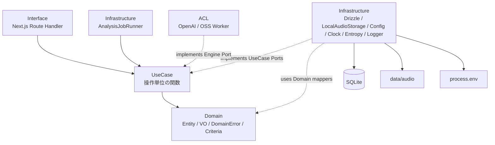

# インフラストラクチャ層設計書

## 1. はじめに

### 1.1 目的

本文書は、NativeTrace のローカルMVPにおけるインフラストラクチャ層の実装設計を定義する。対象は、UseCase層が必要とするDriven Adaptorの具象実装である。

NativeTrace のInfrastructureは、SQLite/Drizzleによる永続化、ローカル音声ファイル保存、DB transaction、内部Runner起動、環境設定、時刻、entropy、loggingを担当する。OpenAI API Adaptor と OSS Worker Adaptor の詳細はACL設計書で扱い、本文書ではComposition Rootから注入される外部Port実装としてのみ扱う。

### 1.2 関連文書

| 関係 | 文書 | 参照内容 |
|---|---|---|
| 上流 | [要件定義書](../01-requirements/requirements-specification.md) | 保存、解析エンジン、履歴、削除、ログインなしMVP |
| 上流 | [基本設計書](../02-system-design/system-design.md) | Next.js、SQLite、Drizzle、OSS worker、ジョブキュー |
| 上流 | [ドメイン層設計書](./domain.md) | 集約、値オブジェクト、DomainError、Criteria |
| 上流 | [ユースケース層設計書](./use-case.md) | UseCase、Port、transaction境界、Runner処理 |
| 同層 | [詳細設計書](./detailed-design.md) | オニオンアーキテクチャ、Range対応、状態遷移 |
| 同層 | [ACL設計書](./acl.md) | OpenAI API Adaptor、OSS Worker Adaptor、raw response上限 |
| 下流 | [データベース設計書](../05-database-design/database-design.md) | テーブル、index、JSONカラム、migration |
| 下流 | [API仕様書](../04-api-specification/api-specification.md) | Route Handler、HTTP Range response |

### 1.3 対象範囲

| 対象 | 本文書で扱う内容 |
|---|---|
| Drizzle永続化 | Repository実装、mapper、SQLite接続、transaction |
| 音声保存 | local file storage、stream保存、atomic rename、物理削除、Range読み取り |
| ジョブ実行 | `AnalysisJobRunner` の起動、tick、多重起動防止、停止処理 |
| 設定 | 環境変数検証、秘匿値の扱い |
| 環境依存adaptor | `Clock`、entropy provider、logger |
| 除外 | OpenAI/OSS Workerレスポンス正規化、HTTP request/response schema、DB DDL詳細 |

## 2. レイヤー位置づけ

### 2.1 オニオンアーキテクチャ上の位置



図1: InfrastructureはUseCase層のPortを実装する外側のadaptorである。Domain層はDB、Drizzle、ファイルシステム、環境変数、HTTP、OpenAI SDKを知らない。

### 2.2 依存方向ルール

| ルール | 内容 |
|---|---|
| Domain純粋性 | Domain層は永続化、Storage、Logger、Config、Runnerを知らない |
| Repository Port | Repository PortはUseCase層配下に定義する |
| Criteria | 検索意図を表すCriteriaはDomain層のChoice Typeとして定義する |
| 具象実装 | Drizzle、better-sqlite3、Node fs、process.envはInfrastructure層に閉じ込める |
| ACL分離 | OpenAI/OSS Worker固有の入出力変換はACL層に閉じ込める |
| 実装形式 | TypeScriptのクラス構文は使わず、factory関数とplain objectでPort実装を返す |

## 3. コンポーネント一覧

| ID | コンポーネント | 種別 | 実装対象 | 概要 |
|---|---|---|---|---|
| DD-200 | `createDrizzleDatabase` | DB adaptor | SQLite connection | better-sqlite3接続とPRAGMA設定 |
| DD-201 | `createDrizzleTransactionManager` | transaction adaptor | `TransactionManager` | Drizzle transactionをUseCaseへ提供 |
| DD-202 | `createDrizzleMaterialRepository` | repository | `MaterialRepository` | Material永続化 |
| DD-203 | `createDrizzleSectionSeriesRepository` | repository | `SectionSeriesRepository` | SectionSeries永続化 |
| DD-204 | `createDrizzleSectionRepository` | repository | `SectionRepository` | Section版永続化 |
| DD-205 | `createDrizzleRecordingAttemptRepository` | repository | `RecordingAttemptRepository` | RecordingAttempt永続化 |
| DD-206 | `createDrizzleAudioFileRepository` | repository | `AudioFileRepository` | AudioFile永続化 |
| DD-207 | `createDrizzleAnalysisRunRepository` | repository | `AnalysisRunRepository` | AnalysisRun永続化 |
| DD-208 | `createDrizzleAnalysisJobRepository` | repository | `AnalysisJobRepository` | AnalysisJob永続化、DB lease |
| DD-209 | `createDrizzleAssessmentResultRepository` | repository | `AssessmentResultRepository` | AssessmentResult永続化 |
| DD-210 | `createLocalAudioStorage` | storage adaptor | `AudioStorage` | 音声stream保存、storage keyからのread stream、物理削除、Range計画 |
| DD-211 | `createAnalysisJobRunner` | runner | internal runner | 2秒tickで `runAssessmentJob` を呼ぶ |
| DD-212 | `createConfigProvider` | config adaptor | runtime config | 環境変数検証 |
| DD-213 | `createSystemClock` | clock adaptor | `Clock` | 現在時刻をDomain時刻型で返す |
| DD-214 | `createEntropyProvider` | entropy adaptor | entropy | ULID/UUIDv4生値供給 |
| DD-215 | `createStructuredLogger` | logger adaptor | `Logger` | 構造化ログ、sanitize |

## 4. Repository実装方針

### 4.1 Port配置

Repository PortはUseCase層配下に定義する。Domain層にはRepository Portを置かない。Domain層は集約、値オブジェクト、Criteria、DomainError、Domain Event、純粋関数だけを持つ。

InfrastructureのDrizzle RepositoryはUseCase Portを実装し、DB rowとDomain型の変換をmapperへ委譲する。

### 4.2 Repository命名ルール

| 操作 | 命名 | 振る舞い |
|---|---|---|
| 識別子による単一取得 | `find(identifier: XxxIdentifier)` | 存在しない場合は `NotFoundError` を返す。`null` は返さない |
| 識別子以外の属性による単一取得 | `findByXxx(...)` | 存在しない場合は `NotFoundError` を返す |
| 検索による一覧取得 | `search(criteria: XxxSearchCriteria)` | Criteriaに従ってページ付き一覧を返す |
| 永続化 | `persist(aggregate)` | insert/updateを実行する |
| 削除 | `terminate(identifier: XxxIdentifier)` | 論理削除または参照不可化を実行する |
| 複数識別子取得 | `ofIdentifiers(identifiers, throwOnMissing)` | `throwOnMissing=true` なら不足時に `NotFoundError`。falseなら存在するものだけ返す |

通常の `find` はActiveな通常参照を対象とする。履歴表示、旧版Section参照、削除済みを含む参照は、Repositoryの抜け道関数ではなくUseCaseとして明示し、Domain Criteriaのcaseで検索意図を表現する。

### 4.3 Criteria設計

CriteriaはDomain層のChoice Typeとして定義する。Criteriaは「何を探すか」「どの順で返すか」「どのページを返すか」を含む検索仕様全体を表す。

```typescript
type Pagination =
  | { type: "offset"; offset: Offset; limit: Limit };

type SectionSearchCriteria =
  | {
      type: "activeLatestSectionsInMaterial";
      material: MaterialIdentifier;
      pagination: Pagination;
      sort: SectionSort;
    }
  | {
      type: "sectionVersionsInSeries";
      sectionSeries: SectionSeriesIdentifier;
      pagination: Pagination;
      sort: SectionVersionSort;
    }
  | {
      type: "practiceHistorySectionsInSeries";
      sectionSeries: SectionSeriesIdentifier;
      pagination: Pagination;
      sort: PracticeHistorySort;
    };
```

InfrastructureはCriteriaのcaseをSQLへ変換する。CriteriaにDB column名、SQL断片、自由文字列のsort expressionを持たせない。MVPで実装必須のPaginationはoffset/limitのみとする。

### 4.4 Repository一覧

| Repository | 主な操作 |
|---|---|
| `MaterialRepository` | `find`, `search`, `persist`, `terminate`, `ofIdentifiers` |
| `SectionSeriesRepository` | `find`, `search`, `persist`, `terminate`, `ofIdentifiers` |
| `SectionRepository` | `find`, `search`, `persist`, `ofIdentifiers` |
| `RecordingAttemptRepository` | `find`, `search`, `persist`, `terminate`, `ofIdentifiers` |
| `AudioFileRepository` | `find`, `findByRecordingAttempt`, `findByRecordingAttemptIncludingDeleted`, `persist`, `terminate`, `markPhysicalDeletionPending`, `markPhysicalDeletionFailed`, `markPhysicallyDeleted` |
| `AnalysisRunRepository` | `find`, `search`, `persist`, `terminate`, `ofIdentifiers` |
| `AnalysisJobRepository` | `find`, `search`, `persist`, `persistAll`, `leaseNextRunnableJob`, lease token付き状態更新 |
| `AssessmentResultRepository` | `find`, `findByAnalysisJob`, `search`, `persist`, `terminateByAnalysisRun` |

## 5. DomainError方針

### 5.1 共通エラー型

Repository専用のError型は定義しない。Infrastructureで発生したDB失敗、transaction失敗、storage失敗、Domain復元失敗、NotFoundは、Domain層に定義した `DomainError` のcaseとして返す。

`DomainError` はcaseごとに独立した型を定義し、呼び出し側が `type` でswitchできるようにする。

```typescript
export type ValidationFailedError = Readonly<{
  type: "validationFailed";
  reason: string;
}>;

export type NotFoundError = Readonly<{
  type: "notFound";
  resource: DomainResourceName;
  identifier: string;
}>;

export type InvalidStateTransitionError = Readonly<{
  type: "invalidStateTransition";
  reason: string;
}>;

export type PersistenceFailedError = Readonly<{
  type: "persistenceFailed";
  operation: PersistenceOperation;
  cause: SanitizedCause;
}>;

export type TransactionFailedError = Readonly<{
  type: "transactionFailed";
  cause: SanitizedCause;
}>;

export type AudioStorageFailedError = Readonly<{
  type: "audioStorageFailed";
  operation: AudioStorageOperation;
  cause: SanitizedCause;
}>;

export type AssessmentEngineFailedError = Readonly<{
  type: "assessmentEngineFailed";
  engine: AnalysisEngine;
  failureKind: AssessmentEngineFailureKind;
  cause: SanitizedCause;
}>;

export type AssessmentSchemaInvalidError = Readonly<{
  type: "assessmentSchemaInvalid";
  reason: string;
}>;

export type DomainError =
  | ValidationFailedError
  | NotFoundError
  | InvalidStateTransitionError
  | PersistenceFailedError
  | TransactionFailedError
  | AudioStorageFailedError
  | AssessmentEngineFailedError
  | AssessmentSchemaInvalidError;
```

Infrastructureは外部例外をそのまま外へ返さず、`SanitizedCause` に変換する。API key、raw response本文、ローカル絶対パス、音声本文相当の情報は `cause` に含めない。

### 5.2 mapperとDomain復元

DB rowからDomain型へ戻すmapperは、必ずSmart Constructorを通す。

| 方向 | 関数 | 失敗 |
|---|---|---|
| DomainからDB row | `fromDomain` / `toPersistence` | 原則成功 |
| DB rowからDomain | `toDomain` / `fromPersistence` | `Result<Domain, DomainError>` |

DB rowの不正値、未知のChoice Typeタグ、範囲外score、壊れたJSON、時刻の復元失敗は `DomainError` として返す。Drizzle row型やDB nullable構造をUseCase/Domainへ漏らさない。

## 6. Drizzle / SQLite設計

### 6.1 採用技術

| 項目 | 方針 |
|---|---|
| ORM/Query Builder | Drizzle ORM |
| SQLite driver | `better-sqlite3` |
| migration | Drizzle Kit |
| DBファイル | ローカルMVPでは単一SQLiteファイル |
| Runtime | Node.js runtime限定。Edge RuntimeではDB adaptorを起動しない |

Drizzleを採用する理由は、SQLに近い形で条件付きUPDATEやtransactionを扱え、Domain型とDB rowの分離をRepository mapperで明示しやすいためである。

### 6.2 SQLite接続設定

`createDrizzleDatabase` は接続直後に以下を設定する。

| 設定 | 値 | 理由 |
|---|---|---|
| `PRAGMA journal_mode` | `WAL` | Route HandlerとRunnerの並行アクセスに備える |
| `PRAGMA busy_timeout` | `5000` | 一時的なlock競合を待つ |
| `PRAGMA foreign_keys` | `ON` | 参照整合性を有効化する |
| `PRAGMA synchronous` | `NORMAL` | ローカルMVPで堅牢性と速度を両立する |

DB書き込みtransactionは短く保つ。音声ファイル書き込み、OpenAI API呼び出し、OSS Worker呼び出しをDB transaction内に入れない。

### 6.3 migration

起動時自動migrationはMVPでは行わない。migrationは開発コマンドで明示実行する。

| 項目 | 配置/コマンド |
|---|---|
| schema定義 | `applications/frontend/src/infrastructure/persistence/drizzle/schema.ts` |
| migrationファイル | `applications/frontend/drizzle/` |
| migration生成 | `drizzle-kit generate` |
| migration適用 | `drizzle-kit migrate` |

テストでは一時SQLiteへmigrationを明示適用する。migration失敗はアプリ起動前チェックまたは開発コマンドで検出する。

## 7. TransactionManager

### 7.1 役割

`TransactionManager` はUseCase層のPortとして定義し、InfrastructureがDrizzle実装を提供する。

```typescript
type TransactionManager = Readonly<{
  transaction: <T>(
    run: (context: TransactionContext) => ResultAsync<T, DomainError>
  ) => ResultAsync<T, DomainError>;
}>;
```

`TransactionContext` はopaque型とし、UseCaseは中身を参照しない。Repository factoryはcontextを受け取り、同じDB transaction上で動くRepository群を返す。

### 7.2 Repository factory

```typescript
const repositories = createDrizzleRepositories({ database });

await transactionManager.transaction((transactionContext) => {
  const transactionalRepositories = repositories.withTransaction(transactionContext);

  return transactionalRepositories.recordingAttemptRepository
    .persist(recordingAttempt)
    .andThen(() => transactionalRepositories.audioFileRepository.persist(audioFile))
    .andThen(() => transactionalRepositories.analysisRunRepository.persist(analysisRun))
    .andThen(() => transactionalRepositories.analysisJobRepository.persistAll(analysisJobs));
});
```

callbackが `Err` を返した場合はrollbackする。callbackが例外を投げた場合もrollbackし、`TransactionFailedError` へ変換する。ネストtransactionはMVPでは禁止し、検出時は `TransactionFailedError` として扱う。

## 8. AnalysisJob lease

### 8.1 原子的lease取得

`DrizzleAnalysisJobRepository` は、lease取得を原子的な1操作として実装する。

```typescript
type LeaseNextRunnableJobInput = Readonly<{
  runnerInstance: RunnerInstanceIdentifier;
  leaseToken: LeaseToken;
  now: Instant;
  leaseDuration: LeaseDuration;
  maxAttempts: AttemptCount;
}>;
```

対象候補:

- `queued` の最古ジョブ
- `leased` または `running` かつ `leasedUntil < now` の期限切れジョブ
- 対応する `AnalysisRun` がキャンセル済み/削除済みではないジョブ
- `attemptCount < maxAttempts` のジョブ

更新内容:

- `leaseOwner = runnerInstance`
- `leaseToken = LeaseToken.generate(...)`
- `leasedUntil = now + leaseDuration`
- `attemptCount = attemptCount + 1`
- statusは `leased`

SQLiteでは条件付きUPDATEで二重取得を防ぐ。更新成功した1件だけを `LeasedAnalysisJob` としてDomain型へ復元する。該当なしの場合は `null` ではなく、UseCase出力として `job: null` を許容する。Repositoryの単一取得ではないため、このnullはNotFound扱いではない。

### 8.2 lease token付き状態更新

以下の状態更新は、必ず `analysisJob.identifier` と `leaseToken` の両方を条件にする。

- `markRunning`
- `markSucceeded`
- `markFailed`
- `requeueForRetry`
- `markCanceled`

期限切れ `running` が再leaseされた場合、古いRunnerが遅れて戻る可能性はMVPで許容する。古い実行結果はlease token不一致により保存されない。OpenAI/OSS Workerの二重実行コストよりDB整合性を優先する。

## 9. LocalAudioStorage

### 9.1 storage key

ローカル音声ファイルの保存先は `AudioFile.identifier` を基準にする。Material名、Section名、元ファイル名をpathへ含めない。

```text
data/audio/
  2026/
    06/
      03/
        aud_01JZ0000000000000000000000.webm
```

DBには絶対パスではなくstorage keyを保存する。`AudioStorage` がstorage keyから実ファイルパスを解決する。将来S3互換storageへ移行する場合も、storage keyをobject keyとして利用できる。

### 9.2 stream保存とatomic rename

`AudioStorage.save` はstream入力を基本とする。

```typescript
type SaveAudioInput = Readonly<{
  audioFile: AudioFile;
  content: ReadableStream<Uint8Array> | NodeJS.ReadableStream;
  expectedByteLength: ByteLength | null;
}>;
```

保存手順:

1. storage keyを決める
2. 同一ディレクトリに `.tmp` ファイルとしてstreamを書き込む
3. 書き込み中に実測byteLengthを計測する
4. 実測byteLengthが上限を超えたら中断し `.tmp` を削除する
5. `expectedByteLength` がある場合は実測値と一致確認する
6. 書き込み完了後、可能ならfsyncする
7. 最終storage keyへrenameする
8. rename後にだけ保存済み音声として返す

MIME type、拡張子、duration、最大10分の業務判断はUseCase/Domain側で行う。Storageはファイルシステム保護としてbyteLengthを実測確認する。

### 9.3 Range読み取り

Route HandlerはHTTP `Range` ヘッダー文字列を受け取り、UseCase `openRecordingAudio` へ渡す。UseCaseは参照可否を確認し、storage key、MIME type、byteLengthを返す。Infrastructure `AudioStorage` はstorage keyとRange指定から読み取り計画を作る。

`AudioStorage` は解析用に `openReadStream(storageKey)` も実装する。`runAssessmentJob` はAudioFileのstorage keyを渡し、返されたread stream生成処理を `AssessmentAudioInput.openStream` としてAdaptorへ渡す。Adaptorへローカル絶対パスは公開しない。

| Range結果 | Infrastructure出力 | Route Handler変換 |
|---|---|---|
| 全体読み取り | `full` | `200 OK` |
| 部分読み取り | `partial` | `206 Partial Content` |
| 範囲不正 | `unsatisfiable` | `416 Range Not Satisfiable` |

Storageはpath traversalを防ぐ。実ファイルが存在しない場合は `AudioStorageFailedError` を返す。ローカル絶対パスをAPI responseや通常ログへ出さない。

### 9.4 物理削除

`discardRecordingAttempt` ではDB論理削除を先にcommitし、その後に `AudioStorage.deletePhysicalFile` を実行する。

1. 初回はDB transactionでRecordingAttempt、関連AnalysisRun、AnalysisJob、AssessmentResultを参照不可化し、AudioFileを `deletion_pending` にする
2. commit後に音声ファイルを物理削除する
3. 成功時はAudioFileを `physically_deleted` に更新する
4. 失敗時はAudioFileを `delete_failed` に更新し、`AudioStorageFailedError` を返す
5. 同じ `discardRecordingAttempt` が削除済みRecordingAttemptへ再実行された場合、AudioFileが `deletion_pending` / `delete_failed` なら物理削除だけを再試行する
6. AudioFileが既に `physically_deleted` の場合、ファイルが存在しなくても冪等成功として返す
7. MVPではcleanup jobは実装せず、APIからの同一操作再実行を再試行経路とする

音声ファイルを先に削除してDB論理削除に失敗する状態は避ける。

## 10. AnalysisJobRunner

### 10.1 責務

`AnalysisJobRunner` はInfrastructureコンポーネントであり、業務処理は持たない。2秒ごとに `runAssessmentJob` UseCaseを呼ぶ。

| 項目 | 方針 |
|---|---|
| 起動場所 | Next.js Node.js runtime |
| tick間隔 | 2秒 |
| 同時実行数 | MVPでは `maxConcurrency = 1` |
| 実行処理 | `runAssessmentJob` UseCase |
| Runner識別子 | `RunnerInstanceIdentifier` を保持 |
| 停止 | 新規tickを止める。実行中ジョブは協調キャンセルまたはlease期限切れに委ねる |
| Edge Runtime | 起動しない |

### 10.2 dev hot reload対策

Next.js dev serverのhot reloadでRunnerが多重起動しないよう、global singleton guardを設ける。

```typescript
type NativeTraceGlobal = typeof globalThis & {
  __nativeTraceAnalysisJobRunner?: AnalysisJobRunnerHandle;
};
```

すでに起動済みなら再利用する。複数プロセス起動時の排他はDB leaseで守る。

## 11. Config / Clock / Entropy / Logger

### 11.1 ConfigProvider

環境変数や設定ファイル読み込みはInfrastructureのConfigProviderに閉じ込める。起動時にZodなどで検証し、不正設定は起動時エラーにする。

| 設定 | 用途 |
|---|---|
| `DATABASE_URL` | SQLiteファイルパス |
| `AUDIO_STORAGE_ROOT` | 音声保存root |
| `WORKER_API_ENDPOINT` | OSS Worker接続先 |
| `OPENAI_API_KEY` | OpenAI API key |
| `ANALYSIS_JOB_POLL_INTERVAL_MS` | Runner tick間隔 |
| `ANALYSIS_JOB_LEASE_DURATION_MS` | lease期限 |
| `ANALYSIS_JOB_MAX_ATTEMPTS` | 最大retry回数 |
| `OSS_WORKER_TIMEOUT_MS` | OSS Worker timeout |

`OPENAI_API_KEY` はブラウザ、ログ、エラー本文へ露出させない。UseCaseには必要な検証済み設定だけを渡す。

### 11.2 Clock

`Clock` はUseCaseを決定的にテストするための薄い環境依存Portである。

```typescript
type Clock = Readonly<{
  now: () => Instant;
}>;
```

`SystemClock.now()` はDomainの時刻型 `Instant` を直接返す。DB rowから時刻を復元する場合はSmart Constructorを通し、失敗時は `DomainError` を返す。

### 11.3 EntropyProvider

識別子生成の振る舞いはDomain側に置く。InfrastructureはULID/UUIDv4の生値を供給するだけである。

```typescript
type EntropyProvider = Readonly<{
  ulid: () => string;
  uuidV4: () => string;
}>;
```

通常集約Identifierの各モジュールは `generate(dependencies): XxxIdentifier` を持つ。lease tokenなどランダム性が必要な値はUUIDv4を使う。`create` は外部入力/DB復元用で `Result<XxxIdentifier, DomainError>`、`generate` は完成したIdentifier型を直接返す。

### 11.4 Logger

Loggerは構造化ログを出すが、内容データを通常ログへ出さない。

ログに出してよいもの:

- 各集約の `identifier`
- engine kind
- job status
- durationMs
- attemptCount
- error code
- raw response size
- storage keyの末尾またはハッシュ

ログに出さないもの:

- 英文本文全文
- 録音音声データ
- OpenAI API key
- OpenAI raw response本文
- OSS Worker raw response本文
- ローカル絶対ファイルパス
- ユーザーのブラウザ録音元ファイル名

## 12. ACLとの接続

Infrastructure文書ではOpenAI/OSS Worker Adaptorの内部仕様を扱わない。Composition Rootで以下を組み立て、UseCase/Runnerへ注入する。

```typescript
const engineRegistry = createPronunciationAssessmentEngineRegistry({
  engines: [
    createOpenAiPronunciationAssessmentAdaptor(openAiDependencies),
    createOssWorkerPronunciationAssessmentAdaptor(ossWorkerDependencies),
  ],
});
```

raw responseのサイズ上限処理、`truncated`、`originalSizeBytes`、`storedSizeBytes` 付与はACL Adaptor側で行う。Repositoryは `AssessmentResult.rawResponse` をDB JSONカラムへ保存するだけで、外部レスポンスの意味判断をしない。

## 13. 実装配置

```text
applications/frontend/src/infrastructure/
  config/
  clock/
  entropy/
  persistence/
    drizzle/
      schema.ts
      database.ts
      transaction-manager.ts
      repositories/
      mappers/
  storage/
    local-audio-storage/
  runner/
    analysis-job-runner/
  logging/
```

ACL実装は `applications/frontend/src/acl/` に配置し、Infrastructure配下には置かない。Route Handlerは `applications/frontend/src/app/api/` またはInterface層の規約に従って配置し、DrizzleやLocalAudioStorageを直接生成しない。

## 14. テスト方針

| 対象 | 必須観点 |
|---|---|
| Drizzle mapper | Smart Constructorを通す。不正rowが `DomainError` になる |
| Repository `find` | 存在しない場合に `NotFoundError` を返し、nullを返さない |
| Repository `persist` | insert/updateがDomain型からDB rowへ正しく変換される |
| Repository `terminate` | 論理削除、参照不可化、対象なしNotFound |
| Repository `search` | Domain Criteriaのcaseごとに正しいSQLへ変換される |
| `ofIdentifiers` | `throwOnMissing` true/falseの挙動 |
| TransactionManager | commit、rollback、callback `Err`、例外、ネスト禁止 |
| AnalysisJob lease | 二重lease防止、期限切れ再取得、lease token不一致更新拒否 |
| retry/cancel | retry可能失敗、最大試行回数、キャンセル済みRun除外 |
| LocalAudioStorage | stream保存、100MB超過中断、`.tmp` cleanup、atomic rename、storage keyからのread stream |
| Range | full/partial/unsatisfiable、path traversal防止 |
| 物理削除 | `deletion_pending` / `delete_failed`再実行、既に`physically_deleted`の冪等成功 |
| Runner | 2秒tick、maxConcurrency=1、singleton guard、shutdown |
| Logger | 秘密値、本文、raw response本文、絶対パスを出さない |

## 15. 既存文書との整合更新メモ

本文書では、grill結果に基づき以下を正とする。

- Repository PortはDomain層ではなくUseCase層配下に置く
- Repository専用Error型は使わず、Domain層の `DomainError` を共通エラーとして使う
- Repositoryの単一取得はNotFoundをtyped errorで返し、nullを返さない
- Repository永続化操作名は `persist`
- Repository削除操作名は `terminate`
- CriteriaはDomain層のChoice Typeとして定義し、page/sortもCriteriaに含める
- 識別子生成はDomain側の `generate` が完成したIdentifier型を返す

Repository配置、Repository専用Error型禁止、識別子生成責務は [domain.md](./domain.md)、[use-case.md](./use-case.md)、[detailed-design.md](./detailed-design.md) と同じルールに統一する。

## 変更履歴

| バージョン | 日付 | 変更者 | 変更内容 |
|---|---|---|---|
| 1.0.0 | 2026-06-03 | lihs | 初版作成 |
