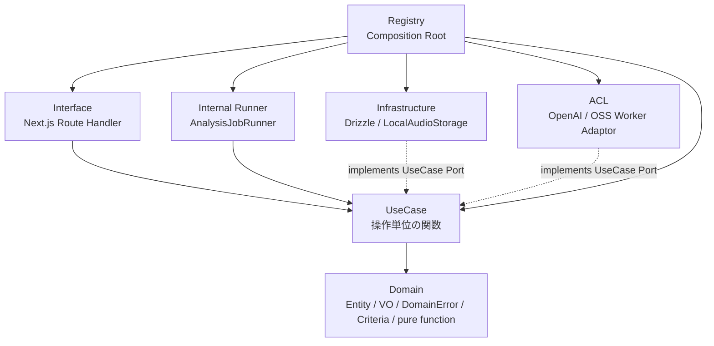
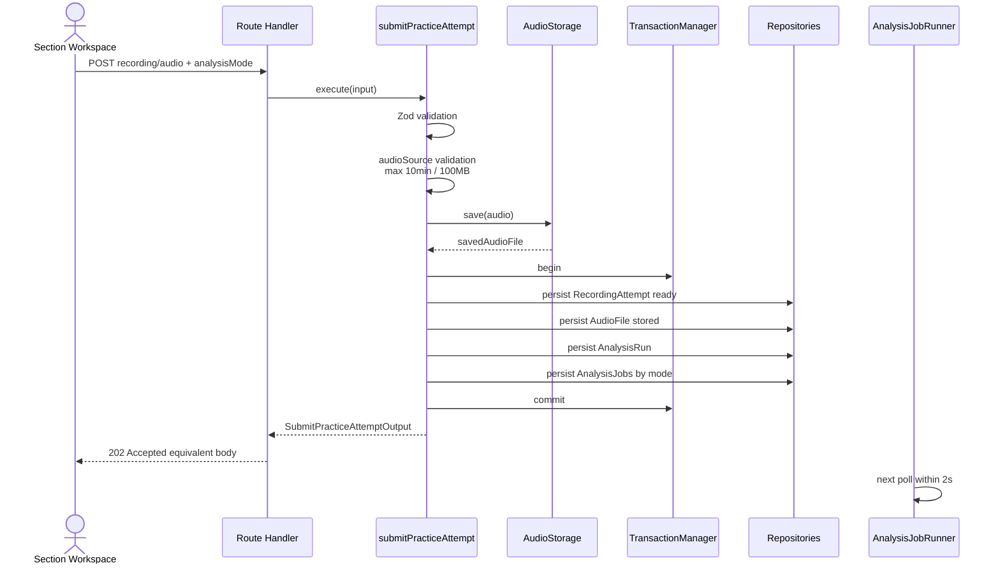

# ユースケース層設計書

## 1. はじめに

### 1.1 目的

本文書は、NativeTrace のローカルMVPにおける UseCase層の設計を定義する。UseCase層は、Next.js Route Handler と Domain層の間に位置し、ユーザー操作または内部Runner操作に対応する処理単位を関数として表現する。

NativeTrace の中心操作は、題材にセクションを追加し、セクション本文を読み上げて録音し、録音停止後にOpenAI APIとOSS workerの解析を自動開始し、同じ画面でエンジン別結果を比較することである。UseCase層はこの操作を、Domain関数、Repository Port、AudioStorage Port、PronunciationAssessmentEngine Port、TransactionManager、EntropyProviderを組み合わせて実現する。

### 1.2 関連文書

| 文書 | 参照先 | 備考 |
|---|---|---|
| 要件定義書 | [requirements-specification.md](../01-requirements/requirements-specification.md) | 機能要件、MVP範囲、スコア、重大度、保存方針 |
| 基本設計書 | [system-design.md](../02-system-design/system-design.md) | Next.js、OSS worker、ジョブキュー、画面構成 |
| 横断詳細設計書 | [detailed-design.md](./detailed-design.md) | レイヤー構成、Route Handler、Runner、Range対応 |
| ドメイン層設計書 | [domain.md](./domain.md) | 集約、値オブジェクト、Domain Event、Port |
| ACL設計書 | [acl.md](./acl.md) | OpenAI API Adaptor、OSS Worker Adaptorの詳細 |
| API仕様書 | [api-specification.md](../04-api-specification/api-specification.md) | HTTP request/response schema |

### 1.3 用語定義

| 用語 | 定義 |
|---|---|
| UseCase | 1つのユーザー操作、または1つの内部アプリケーション操作を表す関数 |
| Command | 状態変更を伴うUseCaseの分類 |
| Query | 状態変更を伴わずDTOを返すUseCaseの分類 |
| Internal Command | Route Handlerから直接呼ばれず、内部Runnerから呼ばれる状態変更UseCase |
| DTO | UseCase層の入出力境界オブジェクト。Domain型やDB rowを外部へ漏らさない |
| SectionSeries | 題材内の練習セクション枠。表示順、タイトル、削除状態を持つ独立集約 |
| Section | SectionSeriesの本文版。改訂時は旧版を上書きせず新しいSectionを作る |
| AssessmentResultDraft | ACLがエンジン固有出力を変換した共通解析結果案 |

## 2. 設計方針

### 2.1 レイヤー位置づけ

UseCase層はオニオンアーキテクチャの内側寄りに位置し、Domain層とUseCase層配下のPortに依存する。Infrastructure、ACL、Interfaceの具象実装はComposition Rootで注入される。



図1: UseCase層の位置づけ。UseCase層はRoute Handler型、DB row型、OpenAI SDK型、OSS worker HTTP型を直接参照しない。

### 2.2 基本原則

| 原則 | 方針 |
|---|---|
| 操作粒度 | 1ユーザー操作または1内部操作 = 1 UseCase関数 |
| 実装形式 | TypeScriptのクラス構文は使用せず、`createX(dependencies)` が実行関数を返す |
| 命名 | CRUD名ではなく実際の操作目的を表す。`UseCase` suffix、`Command` suffix、`Query` suffixは付けない |
| 入出力 | `XxxInput` / `XxxOutput` で統一する |
| 失敗表現 | `neverthrow` の `ResultAsync<XxxOutput, DomainError>` で統一する |
| バリデーション | Zodで境界入力を検証し、Domain値はSmart Constructorで作る |
| 依存方向 | UseCase層のPortとDomain型に依存し、Infrastructure/ACLの具象名に依存しない |
| トランザクション | 状態変更UseCaseがトランザクション境界を所有する |
| 認可 | MVPではログインなしのため、UseCase Inputにユーザー識別子を持たせない |

### 2.3 関数シグネチャ規約

UseCase関数は以下の形式で統一する。

```typescript
import { type ResultAsync } from "neverthrow";

export type SubmitPracticeAttemptDependencies = Readonly<{
  transactionManager: TransactionManager;
  sectionRepository: SectionRepository;
  recordingAttemptRepository: RecordingAttemptRepository;
  audioFileRepository: AudioFileRepository;
  analysisRunRepository: AnalysisRunRepository;
  analysisJobRepository: AnalysisJobRepository;
  audioStorage: AudioStorage;
  entropyProvider: EntropyProvider;
  clock: Clock;
  logger: Logger;
}>;

export const createSubmitPracticeAttempt =
  (dependencies: SubmitPracticeAttemptDependencies) =>
  (input: SubmitPracticeAttemptInput): ResultAsync<SubmitPracticeAttemptOutput, DomainError> => {
    return submitPracticeAttemptFlow(dependencies, input);
  };
```

呼び出し側は `const execute = createSubmitPracticeAttempt(dependencies); await execute(input);` の形にする。

### 2.4 Command / Query 分離方針

| 項目 | 方針 |
|---|---|
| 分離レベル | 論理分離。DBは同一SQLiteを共有する |
| Command | Domain関数による状態遷移、Repository保存、AudioStorage操作、Domain Event回収を行う |
| Query | DTO生成に必要なRepository参照と派生計算のみ行う。状態変更しない |
| Internal Command | Route Handlerを持たず、内部Runnerから呼ばれる。ジョブleaseと解析結果保存を行う |
| 整合性 | CommandはDBトランザクションで強整合性を確保する。Queryは最新コミット済み状態を読む |

## 3. ユースケースカタログ

### 3.1 ユースケース一覧

| ID | 名前 | 種別 | アクター | 入力DTO | 出力DTO | 概要 |
|---|---|---|---|---|---|---|
| DD-120 | `browsePracticeMaterials` | Query | ユーザー | `BrowsePracticeMaterialsInput` | `BrowsePracticeMaterialsOutput` | 題材一覧を軽量DTOで取得する |
| DD-121 | `prepareMaterial` | Command | ユーザー | `PrepareMaterialInput` | `PrepareMaterialOutput` | 題材コンテナを作成する |
| DD-122 | `reviseMaterial` | Command | ユーザー | `ReviseMaterialInput` | `ReviseMaterialOutput` | 題材メタデータを更新する |
| DD-123 | `retireMaterial` | Command | ユーザー | `RetireMaterialInput` | `RetireMaterialOutput` | 題材と配下の通常表示対象を論理削除する |
| DD-124 | `viewMaterialPracticePlan` | Query | ユーザー | `ViewMaterialPracticePlanInput` | `ViewMaterialPracticePlanOutput` | 題材配下のSectionSeries一覧と最新版Sectionを取得する |
| DD-125 | `definePracticeSection` | Command | ユーザー | `DefinePracticeSectionInput` | `DefinePracticeSectionOutput` | SectionSeriesと初版Sectionを同時に作成する |
| DD-126 | `revisePracticeSection` | Command | ユーザー | `RevisePracticeSectionInput` | `RevisePracticeSectionOutput` | Section本文改訂として新しいSection版を作成する |
| DD-127 | `retirePracticeSectionSeries` | Command | ユーザー | `RetirePracticeSectionSeriesInput` | `RetirePracticeSectionSeriesOutput` | SectionSeries全体を通常表示から外す |
| DD-128 | `viewPracticeWorkspace` | Query | ユーザー | `ViewPracticeWorkspaceInput` | `ViewPracticeWorkspaceOutput` | 1つのSectionを中心に録音、解析、最新結果、ハイライトDTOを返す |
| DD-129 | `submitPracticeAttempt` | Command | ユーザー | `SubmitPracticeAttemptInput` | `SubmitPracticeAttemptOutput` | 録音またはアップロード音声を保存し、選択解析モードで解析ジョブを作成する |
| DD-130 | `reassessPracticeAttempt` | Command | ユーザー | `ReassessPracticeAttemptInput` | `ReassessPracticeAttemptOutput` | 既存録音から新しいAnalysisRunを追加する |
| DD-131 | `cancelAssessmentRun` | Command | ユーザー | `CancelAssessmentRunInput` | `CancelAssessmentRunOutput` | AnalysisRun単位で未完了ジョブをキャンセルする |
| DD-132 | `runAssessmentJob` | Internal Command | AnalysisJobRunner | `RunAssessmentJobInput` | `RunAssessmentJobOutput` | DB leaseを取得して1件の解析ジョブを実行する |
| DD-133 | `reviewPracticeHistory` | Query | ユーザー | `ReviewPracticeHistoryInput` | `ReviewPracticeHistoryOutput` | SectionSeries単位、Section版単位で練習履歴を取得する |
| DD-134 | `discardRecordingAttempt` | Command | ユーザー | `DiscardRecordingAttemptInput` | `DiscardRecordingAttemptOutput` | 録音試行を削除し、音声ファイルを物理削除し、関連解析を参照不可にする |
| DD-135 | `discardAssessmentRun` | Command | ユーザー | `DiscardAssessmentRunInput` | `DiscardAssessmentRunOutput` | AnalysisRun単位で解析結果を通常表示から外す |
| DD-136 | `openRecordingAudio` | Query | ユーザー | `OpenRecordingAudioInput` | `OpenRecordingAudioOutput` | Range対応Routeが音声再生に必要な保存先とメタデータを解決する |

### 3.2 ユースケース依存関係図

```mermaid
graph TD
    Browse["browsePracticeMaterials"]
    Prepare["prepareMaterial"]
    ReviseMaterial["reviseMaterial"]
    RetireMaterial["retireMaterial"]
    Plan["viewMaterialPracticePlan"]
    DefineSection["definePracticeSection"]
    ReviseSection["revisePracticeSection"]
    RetireSeries["retirePracticeSectionSeries"]
    Workspace["viewPracticeWorkspace"]
    Submit["submitPracticeAttempt"]
    Reassess["reassessPracticeAttempt"]
    CancelRun["cancelAssessmentRun"]
    RunJob["runAssessmentJob"]
    History["reviewPracticeHistory"]
    DiscardRecording["discardRecordingAttempt"]
    DiscardRun["discardAssessmentRun"]
    OpenAudio["openRecordingAudio"]

    MaterialRepo["MaterialRepository"]
    SectionSeriesRepo["SectionSeriesRepository"]
    SectionRepo["SectionRepository"]
    RecordingRepo["RecordingAttemptRepository"]
    AudioFileRepo["AudioFileRepository"]
    AnalysisRunRepo["AnalysisRunRepository"]
    AnalysisJobRepo["AnalysisJobRepository"]
    AssessmentRepo["AssessmentResultRepository"]
    AudioStorage["AudioStorage"]
    EngineRegistry["PronunciationAssessmentEngineRegistry"]

    Browse --> MaterialRepo
    Prepare --> MaterialRepo
    ReviseMaterial --> MaterialRepo
    RetireMaterial --> MaterialRepo
    RetireMaterial --> SectionSeriesRepo
    Plan --> MaterialRepo
    Plan --> SectionSeriesRepo
    Plan --> SectionRepo
    DefineSection --> MaterialRepo
    DefineSection --> SectionSeriesRepo
    DefineSection --> SectionRepo
    ReviseSection --> SectionSeriesRepo
    ReviseSection --> SectionRepo
    RetireSeries --> SectionSeriesRepo
    Workspace --> SectionRepo
    Workspace --> RecordingRepo
    Workspace --> AnalysisRunRepo
    Workspace --> AnalysisJobRepo
    Workspace --> AssessmentRepo
    Submit --> SectionRepo
    Submit --> AudioStorage
    Submit --> RecordingRepo
    Submit --> AudioFileRepo
    Submit --> AnalysisRunRepo
    Submit --> AnalysisJobRepo
    Reassess --> RecordingRepo
    Reassess --> AnalysisRunRepo
    Reassess --> AnalysisJobRepo
    CancelRun --> AnalysisRunRepo
    CancelRun --> AnalysisJobRepo
    RunJob --> AnalysisJobRepo
    RunJob --> RecordingRepo
    RunJob --> AudioFileRepo
    RunJob --> AudioStorage
    RunJob --> SectionRepo
    RunJob --> EngineRegistry
    RunJob --> AssessmentRepo
    History --> SectionSeriesRepo
    History --> SectionRepo
    History --> RecordingRepo
    History --> AnalysisRunRepo
    History --> AssessmentRepo
    DiscardRecording --> RecordingRepo
    DiscardRecording --> AudioFileRepo
    DiscardRecording --> AudioStorage
    DiscardRecording --> AnalysisRunRepo
    DiscardRecording --> AssessmentRepo
    DiscardRun --> AnalysisRunRepo
    DiscardRun --> AssessmentRepo
    OpenAudio --> RecordingRepo
    OpenAudio --> AudioFileRepo
```



図2: UseCaseとPortの依存関係。ACLのOpenAI/OSS worker固有処理は `PronunciationAssessmentEngine` Port実装の内側に閉じ込める。

## 4. Command / Query 設計

### 4.1 Commandユースケース一覧

| ID | 名前 | 主な副作用 | トランザクション | Domain Event |
|---|---|---|---|---|
| DD-121 | `prepareMaterial` | Material作成 | 要 | `MaterialCreated` |
| DD-122 | `reviseMaterial` | Materialメタデータ更新 | 要 | `MaterialRevised` |
| DD-123 | `retireMaterial` | Materialと配下SectionSeriesの論理削除 | 要 | `MaterialRetired`, `SectionSeriesRetired` |
| DD-125 | `definePracticeSection` | SectionSeriesと初版Section作成 | 要 | `SectionSeriesCreated`, `SectionCreated` |
| DD-126 | `revisePracticeSection` | 新しいSection版作成 | 要 | `SectionRevised` |
| DD-127 | `retirePracticeSectionSeries` | SectionSeries論理削除 | 要 | `SectionSeriesRetired` |
| DD-129 | `submitPracticeAttempt` | 音声保存、RecordingAttempt/AudioFile/AnalysisRun/AnalysisJob作成 | 要 | `RecordingAttemptSaved`, `AudioFileStored`, `AnalysisRunStarted`, `AnalysisJobQueued` |
| DD-130 | `reassessPracticeAttempt` | 既存録音に新しいAnalysisRun/AnalysisJob作成 | 要 | `AnalysisRunStarted`, `AnalysisJobQueued` |
| DD-131 | `cancelAssessmentRun` | 未完了AnalysisJobをキャンセル | 要 | `AnalysisJobCanceled` |
| DD-134 | `discardRecordingAttempt` | RecordingAttempt論理削除、音声物理削除、関連解析参照不可化 | 要 | `RecordingAttemptDeleted`, `AudioFileDeleted` |
| DD-135 | `discardAssessmentRun` | AnalysisRunと配下結果の通常表示除外 | 要 | `AssessmentRunDiscarded` |

### 4.2 Queryユースケース一覧

| ID | 名前 | キャッシュ | ページネーション | 主なDTO |
|---|---|---|---|---|
| DD-120 | `browsePracticeMaterials` | 任意。MVPではなし | あり | 題材一覧 |
| DD-124 | `viewMaterialPracticePlan` | なし | なし | SectionSeries一覧、最新版Section、版要約 |
| DD-128 | `viewPracticeWorkspace` | なし | なし | 録音、解析進捗、エンジン別最新結果、ハイライト |
| DD-133 | `reviewPracticeHistory` | なし | あり | SectionSeries別、Section版別の履歴 |
| DD-136 | `openRecordingAudio` | なし | なし | 音声保存先、MIME type、サイズ、削除状態 |

### 4.3 Internal Commandユースケース

| ID | 名前 | 起動元 | 実行間隔 | 排他 | リトライ |
|---|---|---|---|---|---|
| DD-132 | `runAssessmentJob` | Next.jsプロセス内 `AnalysisJobRunner` | 2秒ごとのDBポーリング | DB lease必須 | 最大3回 |

`runAssessmentJob` はHTTPエンドポイントにしない。Runnerは `queued` または期限切れ `leased` のジョブをDB leaseで取得し、協調キャンセルを確認しながら1件ずつ実行する。

## 5. 入出力DTO設計

### 5.1 主要入力DTO

| DTO | 主なフィールド | バリデーション |
|---|---|---|
| `BrowsePracticeMaterialsInput` | `pagination` | `pagination` はDomain Criteria内のoffset/limitを使う |
| `PrepareMaterialInput` | `title`, `source` | `title` は空不可。`source` は任意 |
| `ReviseMaterialInput` | `material`, `title`, `source` | `material` はULID。更新対象フィールドは少なくとも1つ |
| `RetireMaterialInput` | `material` | Active Materialのみ対象 |
| `ViewMaterialPracticePlanInput` | `material` | Active Materialまたは履歴表示可能なMaterial |
| `DefinePracticeSectionInput` | `material`, `title`, `bodyText`, `displayOrder` | `material`, `title`, `bodyText`, `displayOrder` 必須。`title` と本文は空不可、本文は最大文字数内、英字割合を満たす、制御文字不可 |
| `RevisePracticeSectionInput` | `sectionSeries`, `title`, `displayOrder`, `bodyText` | Active SectionSeriesのみ対象。`title`, `displayOrder`, `bodyText` の少なくとも1つを指定。本文検証は作成時と同じ |
| `RetirePracticeSectionSeriesInput` | `sectionSeries` | Active SectionSeriesのみ対象 |
| `ViewPracticeWorkspaceInput` | `section` | 具体的なSection版を指定。旧版も表示可能 |
| `SubmitPracticeAttemptInput` | `section`, `audioSource`, `analysisMode` | `analysisMode` 必須。音声形式、最大10分、最大100MBを保存前に検証 |
| `ReassessPracticeAttemptInput` | `recordingAttempt`, `analysisMode` | Ready RecordingAttemptのみ対象。`analysisMode` 必須 |
| `CancelAssessmentRunInput` | `analysisRun` | 未完了ジョブを持つAnalysisRunを対象 |
| `RunAssessmentJobInput` | `leaseOwner`, `leaseDurationSeconds`, `maxAttempts` | `leaseOwner` 必須。`maxAttempts` 既定値3 |
| `ReviewPracticeHistoryInput` | `sectionSeries`, `material`, `pagination` | SectionSeries単位を基本にし、Material絞り込み可。ページングはoffset/limit |
| `DiscardRecordingAttemptInput` | `recordingAttempt` | 未削除、または削除済みかつAudioFileが`deletion_pending` / `delete_failed`のRecordingAttemptを対象にできる |
| `DiscardAssessmentRunInput` | `analysisRun` | 削除済みでないAnalysisRunのみ対象 |
| `OpenRecordingAudioInput` | `recordingAttempt` | Ready RecordingAttemptのみ対象 |

### 5.2 主要出力DTO

| DTO | 主なフィールド | 備考 |
|---|---|---|
| `BrowsePracticeMaterialsOutput` | `materials`, `page` | Section本文プレビューは含めない |
| `PrepareMaterialOutput` | `material`, `events` | 作成されたMaterial概要 |
| `ViewMaterialPracticePlanOutput` | `material`, `sectionSeriesItems` | `latestSection` を主に返し、旧版は `versionSummaries` |
| `DefinePracticeSectionOutput` | `sectionSeries`, `section`, `events` | SectionSeriesと初版Sectionを返す |
| `RevisePracticeSectionOutput` | `sectionSeries`, `newSection`, `previousLatestSection`, `events` | 本文変更時は旧版を上書きしない。系列メタデータだけの変更では `newSection` は `null` |
| `ViewPracticeWorkspaceOutput` | `section`, `sectionTokens`, `recordingAttempts`, `latestAnalysisRun`, `highlightRangesByEngine` | UI非依存のハイライトDTOを含む |
| `SubmitPracticeAttemptOutput` | `recordingAttempt`, `audioFile`, `analysisRun`, `analysisJobs`, `events` | 解析完了を待たずに返す |
| `CancelAssessmentRunOutput` | `analysisRun`, `canceledJobs`, `events` | `analysisRun.status` は更新後の子Jobから派生した値 |
| `RunAssessmentJobOutput` | `job`, `result`, `retryScheduled`, `events` | ジョブ未取得時は `job: null` |
| `ReviewPracticeHistoryOutput` | `sectionSeriesGroups`, `page` | SectionSeries単位でまとめ、版ごとに履歴を分ける |
| `OpenRecordingAudioOutput` | `audioFile`, `storageKey`, `mimeType`, `sizeBytes` | Route HandlerがRangeを解釈し、AudioStorageでstreamを開く |

### 5.3 Choice Type DTO

```typescript
export type AudioSourceInput =
  | Readonly<{
      type: "browser_recording";
      file: FileLike;
      mimeType: SupportedAudioMimeType;
      durationMilliseconds: number;
      startedAt: Instant;
      endedAt: Instant;
      browserInfo: BrowserInfoInput;
    }>
  | Readonly<{
      type: "uploaded_file";
      file: FileLike;
      mimeType: SupportedAudioMimeType;
      durationMilliseconds: number;
      originalFileName: string;
    }>;

export type AnalysisModeInput =
  | "cloud_only"
  | "oss_worker_only"
  | "comparison";

export type MaterialSourceInput = Readonly<{
  sourceUrl: string | null;
  sourceTitle: string | null;
  speakerName: string | null;
  sourceType: "ted" | "youtube" | "article" | "book" | "other" | null;
}>;
```

### 5.4 Workspace DTO

`viewPracticeWorkspace` は、1つのSectionを中心に、録音と解析を同一画面で扱うためのDTOを返す。比較モードでも統合結果は作らない。

```typescript
export type ViewPracticeWorkspaceOutput = Readonly<{
  section: SectionWorkspaceSectionOutput;
  sectionTokens: ReadonlyArray<SectionTokenOutput>;
  recordingAttempts: ReadonlyArray<RecordingAttemptSummaryOutput>;
  latestAnalysisRun: AnalysisRunWorkspaceOutput | null;
  highlightRangesByEngine: ReadonlyArray<EngineHighlightRangesOutput>;
}>;

export type EngineHighlightRangesOutput = Readonly<{
  analysisEngine: AnalysisEngineIdentifier;
  engineKind: "cloud" | "oss_worker";
  result: AssessmentResultIdentifier;
  highlights: ReadonlyArray<HighlightRangeOutput>;
}>;

export type HighlightRangeOutput = Readonly<{
  finding: AssessmentFindingIdentifier;
  severity: "critical" | "major" | "minor" | "suggestion";
  category: "accuracy" | "pronunciation" | "connectedSpeech" | "prosody" | "nativeLikeness";
  textRange: Readonly<{ startChar: number; endChar: number }>;
  tokenRange: Readonly<{ startTokenIndex: number; endTokenIndex: number }>;
  audioRange: Readonly<{ startMilliseconds: number; endMilliseconds: number }> | null;
  scoreImpact: number;
  confidence: number;
}>;
```

UseCase層は重大度、カテゴリ、文字範囲、トークン範囲、音声範囲を構造化して返す。色、アイコン、ラベル表示、レイアウトはUI側で決める。

### 5.5 本文トークン化

UseCase層共通の本文トークン化を正とする。トークン列は保存せず、必要時に決定的に計算する。

| 項目 | 方針 |
|---|---|
| 基本 | 英語本文向け軽量ルールベース |
| 空白 | 空白区切りを基本にする |
| 句読点 | 表示本文の文字オフセットを保持したまま分離する |
| 短縮形 | `don't`, `I'm`, `can't` などは1語として保持する |
| リンキング/省略 | トークン化ではなくAssessmentFindingで扱う |
| バージョン | `AssessmentResult` に `tokenizerVersion` を保存する |

## 6. トランザクション境界

### 6.1 共通方針

- 状態変更UseCaseはUseCase単位でトランザクション境界を持つ。
- 外部API呼び出しは原則としてDBトランザクション外で行う。
- 音声ファイル保存はDBトランザクション外の副作用になるため、DB保存失敗時は補償処理で物理削除する。
- Domain EventはDomain関数の戻り値として受け取り、DBコミット後に必要な後続処理へ渡す。MVPでは外部イベントブローカーは使わない。

### 6.2 トランザクション境界一覧

| ID | UseCase | トランザクション範囲 | 外部副作用 | 失敗時の扱い |
|---|---|---|---|---|
| DD-121 | `prepareMaterial` | Material作成 | なし | DB rollback |
| DD-122 | `reviseMaterial` | Material更新 | なし | DB rollback |
| DD-123 | `retireMaterial` | Material、SectionSeriesの論理削除 | なし | DB rollback |
| DD-125 | `definePracticeSection` | SectionSeries、初版Section作成 | なし | DB rollback |
| DD-126 | `revisePracticeSection` | SectionSeries更新、必要に応じた新Section版作成 | なし | DB rollback |
| DD-127 | `retirePracticeSectionSeries` | SectionSeries論理削除 | なし | DB rollback |
| DD-129 | `submitPracticeAttempt` | RecordingAttempt、AudioFile、AnalysisRun、AnalysisJob作成 | 音声ファイル保存 | DB失敗時は保存済み音声を物理削除 |
| DD-130 | `reassessPracticeAttempt` | AnalysisRun、AnalysisJob作成 | なし | DB rollback |
| DD-131 | `cancelAssessmentRun` | 未完了AnalysisJobのキャンセルとRun状態projection更新 | エンジン側キャンセルは任意 | DBを正とし、エンジン停止不能なら結果保存前に破棄 |
| DD-132 | `runAssessmentJob` | lease取得、running化、結果保存、状態更新 | AudioStorage stream読み取り、エンジン呼び出し | 再試行可能ならqueuedへ戻す。不能ならfailed |
| DD-134 | `discardRecordingAttempt` | RecordingAttempt、AudioFile、関連解析の参照不可化 | 音声ファイル物理削除 | 物理削除失敗時はDeleteFailedとして再試行可能にする |
| DD-135 | `discardAssessmentRun` | AnalysisRunと配下結果の参照不可化 | なし | DB rollback |

### 6.3 `submitPracticeAttempt` の境界

`submitPracticeAttempt` は解析完了を待たず、録音保存とジョブ作成が完了した時点で返す。



図3: 録音保存と自動解析開始。DB上のRecordingAttempt、AudioFile、AnalysisRun、AnalysisJob作成は1トランザクションにする。

## 7. ジョブ実行設計

### 7.1 起動方式

MVPではNext.jsプロセス内の `AnalysisJobRunner` が2秒間隔でDBをポーリングし、`runAssessmentJob` を呼ぶ。`submitPracticeAttempt` や `reassessPracticeAttempt` 後の通知は最適化として許容するが、取りこぼし対策としてポーリングを正とする。

### 7.2 DB lease

`runAssessmentJob` は、`queued` または期限切れ `leased` のジョブを、以下の情報で排他的に取得する。

| フィールド | 用途 |
|---|---|
| `leaseOwner` | Runnerインスタンス識別 |
| `leaseToken` | lease更新と完了更新の照合 |
| `leasedUntil` | 期限切れleaseの再取得判定 |
| `attemptCount` | 最大試行回数判定 |

### 7.3 リトライ方針

| 失敗分類 | 例 | 扱い |
|---|---|---|
| 再試行可能 | OpenAI API一時エラー、OSS worker一時停止、ネットワークタイムアウト | `attemptCount` を増やして `queued` へ戻す |
| 再試行不能 | 音声形式不正、本文不整合、エンジン非対応、解析スキーマ不正 | `failed` に確定 |
| 最大試行超過 | `attemptCount >= 3` | `failed` に確定 |
| キャンセル済み | AnalysisRunまたはAnalysisJobがキャンセル済み | 結果を保存せず `canceled` に確定 |

再試行可能失敗ではDomainの `retryAnalysisJob` を呼び、`attemptCount < maxAttempts` の場合だけ `leased` / `running` から `queued` へ戻す。再queue時はlease情報を消去し、次回実行時刻を設定する。

### 7.4 協調キャンセル

`runAssessmentJob` は以下のタイミングでキャンセル状態を確認する。

1. lease取得直後
2. エンジン呼び出し前
3. エンジン結果を `AssessmentResultDraft` として検証した後
4. `AssessmentResult` 保存直前

外部エンジンへ渡した処理を強制停止できない場合でも、結果保存前にキャンセル済みであれば結果を破棄する。

`cancelAssessmentRun` は未完了Jobだけを `canceled` に更新し、その後に全Jobから `deriveAnalysisRunStatus` を再計算する。全Job canceledなら`canceled`、成功済みJobがあり残りをcancelした場合は`partial_succeeded`となるため、応答を常に`canceled`へ固定しない。

### 7.5 エンジン出力の正規化

OpenAI APIとOSS workerの固有出力はACLで共通 `AssessmentResultDraft` に変換する。UseCase層は `AssessmentResultDraft` だけを受け取り、以下の共通バリデーションを行う。

| 項目 | 検証 |
|---|---|
| スコア | Overall、Accuracy、Native-likeness、Pronunciation、Connected Speech、Prosody がすべて0から100の整数 |
| confidence | 0から1の小数 |
| findings | 空配列を許可。存在する場合は本文範囲、重大度、カテゴリ、score impactを検証 |
| segments | NonEmptyList。本文範囲と音声時間範囲を検証 |
| summary | 日本語要約必須。英語要約は任意 |
| metadata | engine別version、schema version、実行情報を検証して保存 |
| tokenizerVersion | 空でないversionで、UseCase共通tokenizerのversionと一致すること |
| rawResponse | 1エンジン結果あたり最大1MB。超過時は切り詰めて `truncated: true` と `originalSizeBytes` を保存 |

ACL DraftのFindingには識別子を要求しない。UseCaseが正式な `AssessmentResult` を生成する際、`EntropyProvider` で全Findingへ `AssessmentFindingIdentifier` を付与し、Highlight参照に同じ識別子を使う。Draftが共通schemaを満たさない場合は独立した `AssessmentSchemaInvalidError` を返す。

スコアはエンジンごとの値をそのまま保存する。UseCase層でOpenAIとOSS workerの点数を補正、統合、平均化しない。

## 8. 依存Port設計

### 8.1 Port一覧

| Port | 責務 |
|---|---|
| `MaterialRepository` | Materialの保存、取得、一覧、論理削除 |
| `SectionSeriesRepository` | SectionSeriesの保存、取得、題材内一覧、表示順管理、論理削除 |
| `SectionRepository` | Section版の保存、取得、系列内版一覧、最新版取得 |
| `RecordingAttemptRepository` | RecordingAttemptの保存、取得、Section別一覧、論理削除 |
| `AudioFileRepository` | AudioFileの保存、取得、削除状態更新 |
| `AnalysisRunRepository` | AnalysisRunの保存、取得、録音別一覧、参照不可化 |
| `AnalysisJobRepository` | AnalysisJob作成、DB lease、状態更新、キャンセル |
| `AssessmentResultRepository` | AssessmentResult保存、取得、AnalysisRun別一覧、参照不可化 |
| `AudioStorage` | 音声ファイル保存、読み取り、物理削除 |
| `PronunciationAssessmentEngine` | 共通解析要求を受け、`AssessmentResultDraft` を返す |
| `PronunciationAssessmentEngineRegistry` | AnalysisJobのengineから対応するAdaptorを解決する |
| `TransactionManager` | DBトランザクション境界 |
| `EntropyProvider` | DomainのIdentifier `generate` が使うULID/UUIDv4生値供給 |
| `Clock` | 現在時刻取得 |
| `Logger` | UseCase実行ログ、失敗ログ |

`PronunciationAssessmentEngine` と `PronunciationAssessmentEngineRegistry` はUseCase層のPortとして定義する。ACLはこれらの具象実装を提供する。

```typescript
export type AudioStorage = Readonly<{
  save: (input: SaveAudioInput) => ResultAsync<StoredAudio, DomainError>;
  openReadStream: (
    storageKey: AudioStorageKey
  ) => ResultAsync<NodeJS.ReadableStream, DomainError>;
  deletePhysicalFile: (
    storageKey: AudioStorageKey
  ) => ResultAsync<void, DomainError>;
}>;

export type PronunciationAssessmentEngineRegistry = Readonly<{
  find: (
    engine: AnalysisEngine
  ) => Result<PronunciationAssessmentEngine, DomainError>;
}>;
```

### 8.2 UseCase別Port対応表

| UseCase | 使用Port |
|---|---|
| `browsePracticeMaterials` | `MaterialRepository` |
| `prepareMaterial` | `MaterialRepository`, `TransactionManager`, `EntropyProvider`, `Clock`, `Logger` |
| `reviseMaterial` | `MaterialRepository`, `TransactionManager`, `Clock`, `Logger` |
| `retireMaterial` | `MaterialRepository`, `SectionSeriesRepository`, `TransactionManager`, `Clock`, `Logger` |
| `viewMaterialPracticePlan` | `MaterialRepository`, `SectionSeriesRepository`, `SectionRepository`, `RecordingAttemptRepository`, `AnalysisRunRepository` |
| `definePracticeSection` | `MaterialRepository`, `SectionSeriesRepository`, `SectionRepository`, `TransactionManager`, `EntropyProvider`, `Clock`, `Logger` |
| `revisePracticeSection` | `SectionSeriesRepository`, `SectionRepository`, `TransactionManager`, `EntropyProvider`, `Clock`, `Logger` |
| `retirePracticeSectionSeries` | `SectionSeriesRepository`, `TransactionManager`, `Clock`, `Logger` |
| `viewPracticeWorkspace` | `SectionRepository`, `RecordingAttemptRepository`, `AnalysisRunRepository`, `AnalysisJobRepository`, `AssessmentResultRepository`, `AudioFileRepository` |
| `submitPracticeAttempt` | `SectionRepository`, `RecordingAttemptRepository`, `AudioFileRepository`, `AnalysisRunRepository`, `AnalysisJobRepository`, `AudioStorage`, `TransactionManager`, `EntropyProvider`, `Clock`, `Logger` |
| `reassessPracticeAttempt` | `RecordingAttemptRepository`, `AnalysisRunRepository`, `AnalysisJobRepository`, `TransactionManager`, `EntropyProvider`, `Clock`, `Logger` |
| `cancelAssessmentRun` | `AnalysisRunRepository`, `AnalysisJobRepository`, `TransactionManager`, `Clock`, `Logger` |
| `runAssessmentJob` | `AnalysisJobRepository`, `AnalysisRunRepository`, `RecordingAttemptRepository`, `AudioFileRepository`, `AudioStorage`, `SectionRepository`, `AssessmentResultRepository`, `PronunciationAssessmentEngineRegistry`, `TransactionManager`, `EntropyProvider`, `Clock`, `Logger` |
| `reviewPracticeHistory` | `SectionSeriesRepository`, `SectionRepository`, `RecordingAttemptRepository`, `AnalysisRunRepository`, `AssessmentResultRepository` |
| `discardRecordingAttempt` | `RecordingAttemptRepository`, `AudioFileRepository`, `AudioStorage`, `AnalysisRunRepository`, `AnalysisJobRepository`, `AssessmentResultRepository`, `TransactionManager`, `Clock`, `Logger` |
| `discardAssessmentRun` | `AnalysisRunRepository`, `AnalysisJobRepository`, `AssessmentResultRepository`, `TransactionManager`, `Clock`, `Logger` |
| `openRecordingAudio` | `RecordingAttemptRepository`, `AudioFileRepository` |

## 9. エラー設計

### 9.1 共通方針

UseCase層は例外を業務フローとして投げない。すべて `ResultAsync<XxxOutput, DomainError>` で返す。`DomainError` はプロジェクト共通の型付きエラーであり、HTTP概念を持たない。Route層で明示的にHTTPステータスへマッピングする。

```typescript
export type SubmitPracticeAttemptResult =
  ResultAsync<SubmitPracticeAttemptOutput, DomainError>;
```

### 9.2 エラー分類

| DomainError case | 意味 | Route層の代表HTTP変換 |
|---|---|---|
| `validationFailed` | 入力形式や境界値が不正 | 400 |
| `notFound` | 対象が存在しない、または通常表示対象外 | 404 |
| `invalidStateTransition` | 状態競合、キャンセル済み、削除済み | 409 |
| `persistenceFailed` | DBアクセス失敗 | 500 |
| `transactionFailed` | トランザクション開始、commit、rollback失敗 | 500 |
| `audioStorageFailed` | 音声保存、読み取り、物理削除失敗 | 500 |
| `assessmentEngineFailed` | 解析エンジン失敗 | 502 |
| `assessmentSchemaInvalid` | ACL変換後の共通結果が不正 | 502 |

Route Handlerはこの対応表を参考にするが、最終的なHTTPレスポンス仕様はAPI仕様書で定義する。

## 10. Route Handler対応表

| Route | Method | 対応UseCase | 備考 |
|---|---|---|---|
| `/api/v1/materials` | GET | `browsePracticeMaterials` | 軽量一覧 |
| `/api/v1/materials` | POST | `prepareMaterial` | 題材コンテナ作成 |
| `/api/v1/materials/{materialIdentifier}` | PATCH | `reviseMaterial` | メタデータ更新 |
| `/api/v1/materials/{materialIdentifier}` | DELETE | `retireMaterial` | 題材削除 |
| `/api/v1/materials/{materialIdentifier}/practice-plan` | GET | `viewMaterialPracticePlan` | SectionSeries一覧 |
| `/api/v1/materials/{materialIdentifier}/section-series` | POST | `definePracticeSection` | SectionSeriesと初版Section作成 |
| `/api/v1/section-series/{sectionSeriesIdentifier}` | PATCH | `revisePracticeSection` | 新しいSection版作成 |
| `/api/v1/section-series/{sectionSeriesIdentifier}` | DELETE | `retirePracticeSectionSeries` | 系列全体を非表示 |
| `/api/v1/sections/{sectionIdentifier}/workspace` | GET | `viewPracticeWorkspace` | 旧版Sectionも表示可能 |
| `/api/v1/sections/{sectionIdentifier}/practice-attempts` | POST | `submitPracticeAttempt` | FormData。ブラウザ録音Must、アップロードShould |
| `/api/v1/recording-attempts/{recordingAttemptIdentifier}/analysis-runs` | POST | `reassessPracticeAttempt` | 新しいAnalysisRunを追加 |
| `/api/v1/analysis-runs/{analysisRunIdentifier}/cancel` | POST | `cancelAssessmentRun` | 協調キャンセル |
| `/api/v1/history` | GET | `reviewPracticeHistory` | SectionSeries基本、Material絞り込み可 |
| `/api/v1/recording-attempts/{recordingAttemptIdentifier}` | DELETE | `discardRecordingAttempt` | 音声物理削除 |
| `/api/v1/analysis-runs/{analysisRunIdentifier}` | DELETE | `discardAssessmentRun` | 録音は残す |
| `/api/v1/recording-attempts/{recordingAttemptIdentifier}/audio` | GET | `openRecordingAudio` | Route HandlerがRange requestを処理 |

`runAssessmentJob` はRoute Handlerに対応しない。Next.jsプロセス内Runnerだけが内部関数として呼び出す。

## 11. 主要UseCase詳細

### 11.1 DD-125 `definePracticeSection`

| 項目 | 内容 |
|---|---|
| 種別 | Command |
| 目的 | 題材配下に新しい練習セクション枠と初版本文を作る |
| 事前条件 | MaterialがActiveである |
| 事後条件 | SectionSeriesと初版Sectionが保存され、同じ `sectionSeries` を共有する |

処理:

1. `DefinePracticeSectionInput` をZodで検証する。
2. Materialを取得し、Activeであることを確認する。
3. `bodyText` をDomain VOへ変換する。空文字、最大文字数、英字割合、制御文字を検証する。
4. `SectionSeries` を作成する。`displayOrder` は系列属性として保持する。
5. 初版 `Section` を作成する。
6. 同一トランザクションで `SectionSeries` と `Section` を保存する。
7. `DefinePracticeSectionOutput` を返す。

### 11.2 DD-126 `revisePracticeSection`

| 項目 | 内容 |
|---|---|
| 種別 | Command |
| 目的 | セクション系列のタイトル、表示順、本文を改訂する |
| 事前条件 | SectionSeriesがActiveである |
| 事後条件 | 本文変更時は旧Sectionを保持し、新Sectionが最新版になる。タイトルまたは表示順だけの変更ではSection版を増やさない |

過去の録音・解析結果は旧Sectionに紐づけたまま保持する。本文を上書きしないため、録音が読んだ本文と解析基準本文がずれない。`displayOrder` はSectionSeriesの属性であり、Section版ごとの差分としては持たない。

### 11.3 DD-128 `viewPracticeWorkspace`

| 項目 | 内容 |
|---|---|
| 種別 | Query |
| 目的 | 録音、解析進捗、エンジン別結果を同一画面で表示するDTOを作る |
| 事前条件 | 指定Sectionが通常表示可能、または履歴から明示的に開かれている |
| 事後条件 | 状態変更なし |

比較モードの結果は `resultsByEngine` と `highlightRangesByEngine` で並列に返す。統合スコアや統合ハイライトは作らない。

進捗更新はMVPではクライアントから1から2秒間隔のポーリングで取得する。

### 11.4 DD-129 `submitPracticeAttempt`

| 項目 | 内容 |
|---|---|
| 種別 | Command |
| 目的 | 録音またはアップロード音声を保存し、選択解析モードで自動解析を開始する |
| 事前条件 | SectionがActiveで録音可能である |
| 事後条件 | Ready RecordingAttempt、Stored AudioFile、AnalysisRun、AnalysisJobが作成される |

`analysisMode` は入力必須とする。`cloud_only` はOpenAI APIジョブのみ、`oss_worker_only` はOSS workerジョブのみ、`comparison` は両方のジョブを作成する。

`audioSource` は `browser_recording | uploaded_file` のChoice Typeとする。ブラウザ録音はMust、音声アップロードはShouldだが、UseCaseとしては同じ `submitPracticeAttempt` に含める。

`browser_recording` は `startedAt`、`endedAt`、`browserInfo` を必須とする。`uploaded_file` はこれらを要求せず、`originalFileName` を必須とする。両caseをnullableフィールドの組み合わせへ平坦化せず、Domainの `RecordingOrigin` に変換する。

### 11.5 DD-130 `reassessPracticeAttempt`

| 項目 | 内容 |
|---|---|
| 種別 | Command |
| 目的 | 既存録音を使って新しいAnalysisRunを作る |
| 事前条件 | RecordingAttemptがReadyで、音声ファイルがStoredである |
| 事後条件 | 過去結果を上書きせず、新しいAnalysisRunとAnalysisJobが追加される |

モデル、採点rubric、OSS worker設定の違いで結果が変わるため、過去のAnalysisRunとAssessmentResultは保持する。

### 11.6 DD-132 `runAssessmentJob`

| 項目 | 内容 |
|---|---|
| 種別 | Internal Command |
| 目的 | 1件のAnalysisJobをlease取得して解析し、結果を保存する |
| 事前条件 | queuedまたは期限切れleasedのAnalysisJobが存在する |
| 事後条件 | ジョブがsucceeded、failed、canceled、または再queuedになる |

処理:

1. DB leaseでジョブを1件取得する。該当ジョブがなければ `job: null` を返す。
2. キャンセル状態を確認する。
3. RecordingAttempt、AudioFile、Section本文を取得する。
4. `openStream: () => AudioStorage.openReadStream(audioFile.storageKey)` として、storage keyから保存済み音声のread streamを開く関数を用意する。
5. `PronunciationAssessmentEngineRegistry.find(analysisJob.analysisEngine)` で対応Adaptorを解決する。
6. `AssessmentAudioInput.openStream` に手順4のstream生成関数を設定し、`PronunciationAssessmentEngine` Portへ共通解析要求を渡す。
7. ACLから返った `AssessmentResultDraft` を共通検証し、FindingへIdentifierを付与する。
8. `AssessmentResult` を作成し、ジョブを `succeeded` にする。
9. 失敗時はDomainの `retryAnalysisJob` と `attemptCount < maxAttempts` に従い、`queued` または `failed` にする。

### 11.7 DD-133 `reviewPracticeHistory`

| 項目 | 内容 |
|---|---|
| 種別 | Query |
| 目的 | 練習履歴をSectionSeries単位で確認する |
| 事前条件 | 対象MaterialまたはSectionSeriesが存在する |
| 事後条件 | 状態変更なし |

履歴はSectionSeries単位でまとめ、版ごとにRecordingAttemptとAnalysisRunを分けて返す。Material単位の絞り込みを許容する。

## 12. 削除設計

### 12.1 削除方針

| 対象 | UseCase | 削除方式 |
|---|---|---|
| Material | `retireMaterial` | 論理削除。配下SectionSeriesも通常表示から外す |
| SectionSeries | `retirePracticeSectionSeries` | 系列全体を論理削除。特定Section版だけの削除はMVP外 |
| RecordingAttempt | `discardRecordingAttempt` | DBは論理削除。音声ファイルは物理削除 |
| AnalysisRun | `discardAssessmentRun` | AnalysisRun単位で論理削除。配下Job/Resultも通常表示から外す |

### 12.2 録音削除時の関連解析

`discardRecordingAttempt` を実行した場合、録音音声が消えるため、紐づく `AnalysisRun` / `AnalysisJob` / `AssessmentResult` は通常画面から参照不可にする。履歴DTO、Workspace DTOからも除外する。

初回実行ではDB論理削除をcommitした後に物理削除する。物理削除失敗時はAudioFileを `delete_failed` として保存する。以後、同じ `discardRecordingAttempt` を削除済みRecordingAttemptに対して再実行でき、AudioFileが `deletion_pending` または `delete_failed` なら物理削除だけを冪等に再試行する。AudioFileが既に `physically_deleted` の場合は成功扱いとし、関連集約の削除処理を重ねて実行しない。MVPでは専用cleanup jobを追加しない。

## 13. 認可制御

MVPではログイン機能を入れない。UseCase層は `user` や所有者識別子を入力に持たず、所有者チェックを行わない。

将来ログインを導入する場合は、Route層で認証済み主体を解決し、UseCase Inputにactor情報を追加する。RepositoryとDBには後から所有者列を追加できる余地を残す。

## 14. 実装配置方針

### 14.1 ディレクトリ

```text
applications/frontend/src/usecase/
  browse-practice-materials/
  prepare-material/
  revise-material/
  retire-material/
  view-material-practice-plan/
  define-practice-section/
  revise-practice-section/
  retire-practice-section-series/
  view-practice-workspace/
  submit-practice-attempt/
  reassess-practice-attempt/
  cancel-assessment-run/
  run-assessment-job/
  review-practice-history/
  discard-recording-attempt/
  discard-assessment-run/
  open-recording-audio/
```

各ディレクトリは `index.ts`, `input.ts`, `output.ts`, `errors.ts`, `dependencies.ts`, `schema.ts`, `create.ts` を基本単位とする。規模が小さいUseCaseではファイル統合を許容する。

### 14.2 テスト方針

| 観点 | テスト内容 |
|---|---|
| validation first | 入力不正時にRepository、Storage、Engineが呼ばれない |
| transaction | 成功時commit、失敗時rollback、音声保存後DB失敗時の補償削除 |
| domain rule | 削除済みMaterial/SectionSeries/Sectionで操作できない |
| job lease | 同じジョブを二重取得しない。期限切れleaseは再取得できる |
| retry | 再試行可能失敗と再試行不能失敗を分ける |
| cancellation | キャンセル済みRunの結果を保存しない |
| DTO mapping | 比較モードでエンジン別結果を統合しない |
| tokenizer | 文字オフセットとトークン範囲が本文と一致する |

## 15. 変更履歴

| バージョン | 日付 | 変更者 | 変更内容 |
|---|---|---|---|
| 1.0.0 | 2026-06-02 | lihs | 初版作成 |
