# データベース設計書

## 1. はじめに

### 1.1 目的

本文書は、英語発音チェックWebアプリケーション「NativeTrace」のローカルMVPにおけるデータベース設計を定義する。対象は、SQLite + Drizzle ORMで管理する教材、セクション版、録音試行、音声ファイルメタデータ、解析ジョブ、解析結果である。

DBはDomainのための永続化手段であり、DB都合の命名や採番をDomainへ持ち込まない。物理カラム名もDomainの識別子・参照命名に寄せ、Repository mapperの変換責務を最小化する。

### 1.2 関連文書

| 文書 | 関連内容 |
|---|---|
| [要件定義書](../01-requirements/requirements-specification.md) | 保存、削除、録音、解析、履歴、ローカルMVP |
| [基本設計書](../02-system-design/system-design.md) | SQLite、Drizzle、ジョブキュー、音声ファイル保存 |
| [詳細設計書](../03-detailed-design/detailed-design.md) | オニオンアーキテクチャ、状態遷移、Range対応 |
| [ドメイン層設計書](../03-detailed-design/domain.md) | 集約、Choice Type、DomainError、識別子生成 |
| [ユースケース層設計書](../03-detailed-design/use-case.md) | Repository Port、transaction境界、UseCase入出力 |
| [インフラストラクチャ層設計書](../03-detailed-design/infrastructure.md) | Drizzle adaptor、DB lease、LocalAudioStorage、migration |
| [ACL設計書](../03-detailed-design/acl.md) | AssessmentResultDraft、raw response envelope |
| [API仕様書](../04-api-specification/api-specification.md) | API DTO、Range再生、HTTP error mapping |

## 2. データベース方針

### 2.1 DBMS

| 項目 | 内容 |
|---|---|
| DBMS | SQLite |
| バージョン | 3.x |
| ORM / Query Builder | Drizzle ORM |
| Driver | better-sqlite3 |
| Migration | Drizzle Kit |
| 文字コード | UTF-8 |
| 照合順序 | SQLite default `BINARY` |
| 保存先 | ローカルMVPでは単一SQLiteファイル |

接続直後に以下のPRAGMAを設定する。

| PRAGMA | 値 | 目的 |
|---|---|---|
| `journal_mode` | `WAL` | Route HandlerとRunnerの並行アクセスに備える |
| `busy_timeout` | `5000` | 一時的なlock競合を待つ |
| `foreign_keys` | `ON` | 参照整合性を有効化する |
| `synchronous` | `NORMAL` | ローカルMVPで速度と堅牢性を両立する |

### 2.2 命名規則

| 対象 | 規則 | 例 |
|---|---|---|
| テーブル名 | スネークケース・複数形 | `materials`, `recording_attempts` |
| カラム名 | スネークケース | `created_at`, `version_number` |
| 主キー | `identifier` | `materials.identifier` |
| 外部参照 | 参照先名。関連先識別子suffixにはしない | `sections.section_series`, `recording_attempts.section` |
| インデックス | `idx_テーブル名_用途` | `idx_sections_latest` |
| ユニーク制約 | `uq_テーブル名_用途` | `uq_audio_files_recording_attempt` |
| CHECK制約 | `ck_テーブル名_用途` | `ck_analysis_jobs_status` |
| 外部キー制約 | `fk_テーブル名_参照先` | `fk_sections_section_series` |

識別子カラムはすべて `TEXT` とし、Domainの `generate(...)` が生成したULID / UUIDv4文字列を保存する。DB側の自動採番、`rowid` 依存、default識別子生成は使わない。

### 2.3 共通カラム

主要テーブルは以下の共通カラムを持つ。

| カラム名 | 型 | NULL | 説明 |
|---|---|---|---|
| `identifier` | TEXT | NO | 主キー。Domain生成済み識別子 |
| `created_at` | TEXT | NO | UTC ISO-8601形式の作成日時 |
| `updated_at` | TEXT | NO | UTC ISO-8601形式の更新日時 |
| `deleted_at` | TEXT | YES | 論理削除日時。通常参照では `NULL` のみ対象 |

`sections` と `assessment_results` は作成後不変のスナップショットであるため、`updated_at` は持たない。削除済み参照を通常Repository関数の抜け道で扱わず、必要な履歴表示はUseCaseとCriteriaで意図を明示する。

### 2.4 JSON保存方針

SQLiteではJSONを `TEXT` として保存し、`json_valid(...)` CHECK制約で壊れたJSONを防ぐ。Repository mapperは保存・復元時にZodで共通検証し、壊れたrowは `DomainError` へ変換する。

| カラム | 内容 |
|---|---|
| `materials.source_json` | TED等の任意source情報 |
| `recording_attempts.browser_info_json` | `browser_recording` のブラウザ、OS、端末種別、録音API情報 |
| `analysis_jobs.engine_config_json` | ジョブ作成時点のエンジン設定 |
| `assessment_results.assessment_result_json` | 正規化済みAssessmentResult本文 |
| `assessment_results.raw_response_json` | ACLで保存用Envelope化したraw response |
| `assessment_results.engine_snapshot_json` | 結果作成時点のAnalysisEngine snapshot |

raw response本文はDBへ保存するが、ログには出力しない。

## 3. 論理ER図

```mermaid
erDiagram
    materials ||--o{ section_series : has
    section_series ||--o{ sections : versions
    sections ||--o{ recording_attempts : records
    recording_attempts ||--|| audio_files : stores
    recording_attempts ||--o{ analysis_runs : analyzed_by
    analysis_runs ||--o{ analysis_jobs : has
    analysis_jobs ||--o| assessment_results : produces

    materials {
        TEXT identifier PK
        TEXT title
        TEXT source_json
        TEXT created_at
        TEXT updated_at
        TEXT deleted_at
    }
    section_series {
        TEXT identifier PK
        TEXT material FK
        TEXT title
        INTEGER display_order
        TEXT created_at
        TEXT updated_at
        TEXT deleted_at
    }
    sections {
        TEXT identifier PK
        TEXT section_series FK
        INTEGER version_number
        TEXT body_text
        TEXT body_text_hash
        TEXT created_at
        TEXT deleted_at
    }
    recording_attempts {
        TEXT identifier PK
        TEXT section FK
        TEXT status
        TEXT input_kind
        TEXT started_at
        TEXT ended_at
        INTEGER duration_milliseconds
        TEXT browser_info_json
        TEXT original_file_name
        TEXT created_at
        TEXT updated_at
        TEXT deleted_at
    }
    audio_files {
        TEXT identifier PK
        TEXT recording_attempt FK
        TEXT storage_key
        TEXT status
        TEXT mime_type
        INTEGER size_bytes
        INTEGER duration_milliseconds
        TEXT created_at
        TEXT updated_at
        TEXT deleted_at
        TEXT physical_deleted_at
    }
    analysis_runs {
        TEXT identifier PK
        TEXT recording_attempt FK
        TEXT mode
        TEXT status
        TEXT created_at
        TEXT updated_at
        TEXT deleted_at
    }
    analysis_jobs {
        TEXT identifier PK
        TEXT analysis_run FK
        TEXT engine
        TEXT status
        INTEGER attempt_count
        INTEGER max_attempts
        TEXT next_run_at
        TEXT lease_token
        TEXT leased_until
        TEXT created_at
        TEXT updated_at
        TEXT deleted_at
    }
    assessment_results {
        TEXT identifier PK
        TEXT analysis_job FK
        INTEGER overall_score
        INTEGER accuracy_score
        INTEGER native_likeness_score
        INTEGER pronunciation_score
        INTEGER connected_speech_score
        INTEGER prosody_score
        TEXT assessment_result_json
        TEXT raw_response_json
        TEXT engine_snapshot_json
        TEXT tokenizer_version
        TEXT created_at
        TEXT deleted_at
    }
```

## 4. 物理ER図

ローカルMVPでは論理ER図と物理ER図の差分はない。音声ファイル実体はDB BLOBにせず、ローカルファイルシステムへ保存し、DBには `audio_files.storage_key` と再生・検証用メタデータだけを保存する。

`AnalysisEngine` はRepository対象のDBマスタにしない。Composition Root / ACLのEngine Registryで解決し、DBには `analysis_jobs.engine`、`analysis_jobs.engine_config_json`、`assessment_results.engine_snapshot_json` としてジョブ作成時点・結果作成時点のスナップショットを残す。

## 5. テーブル定義

### DB-001: materials 

題材コンテナを管理する。本文は持たず、本文は配下の `sections.body_text` に保存する。

| カラム名 | データ型 | NULL | デフォルト | 説明 |
|---|---|---|---|---|
| `identifier` | TEXT | NO | - | 主キー。MaterialIdentifier |
| `title` | TEXT | NO | - | 題材タイトル |
| `source_json` | TEXT | YES | - | 任意source情報 |
| `created_at` | TEXT | NO | - | UTC ISO-8601 |
| `updated_at` | TEXT | NO | - | UTC ISO-8601 |
| `deleted_at` | TEXT | YES | - | 論理削除日時 |

**制約:**

| 制約名 | 種別 | カラム | 説明 |
|---|---|---|---|
| `pk_materials` | PRIMARY KEY | `identifier` | 主キー |
| `ck_materials_title_not_blank` | CHECK | `title` | `length(trim(title)) > 0` |
| `ck_materials_source_json` | CHECK | `source_json` | `source_json IS NULL OR json_valid(source_json)` |

**インデックス:**

| インデックス名 | カラム | 種別 | 説明 |
|---|---|---|---|
| `idx_materials_active_updated` | `deleted_at`, `updated_at` | BTREE | 題材一覧、更新順表示 |

### DB-002: section_series 

題材内の練習セクション系列を管理する。タイトルと表示順は系列属性であり、本文版ごとには持たせない。

| カラム名 | データ型 | NULL | デフォルト | 説明 |
|---|---|---|---|---|
| `identifier` | TEXT | NO | - | 主キー。SectionSeriesIdentifier |
| `material` | TEXT | NO | - | 所属Material |
| `title` | TEXT | NO | - | セクション系列タイトル |
| `display_order` | INTEGER | NO | - | 題材内表示順 |
| `created_at` | TEXT | NO | - | UTC ISO-8601 |
| `updated_at` | TEXT | NO | - | UTC ISO-8601 |
| `deleted_at` | TEXT | YES | - | 論理削除日時 |

**制約:**

| 制約名 | 種別 | カラム | 説明 |
|---|---|---|---|
| `pk_section_series` | PRIMARY KEY | `identifier` | 主キー |
| `fk_section_series_materials` | FOREIGN KEY | `material` | `materials(identifier)` を参照 |
| `ck_section_series_title_not_blank` | CHECK | `title` | `length(trim(title)) > 0` |
| `ck_section_series_display_order` | CHECK | `display_order` | `display_order >= 0` |

**インデックス:**

| インデックス名 | カラム | 種別 | 説明 |
|---|---|---|---|
| `idx_section_series_material_order` | `material`, `deleted_at`, `display_order` | BTREE | 題材詳細のSectionSeries一覧 |

### DB-003: sections 

Section本文版を管理する。本文改訂時は既存rowを更新せず、新しい `version_number` のrowを追加する。

| カラム名 | データ型 | NULL | デフォルト | 説明 |
|---|---|---|---|---|
| `identifier` | TEXT | NO | - | 主キー。SectionIdentifier |
| `section_series` | TEXT | NO | - | 所属SectionSeries |
| `version_number` | INTEGER | NO | - | 系列内の本文版番号 |
| `body_text` | TEXT | NO | - | 練習対象英文本文 |
| `body_text_hash` | TEXT | NO | - | 本文ハッシュ。重複検出・調査用 |
| `created_at` | TEXT | NO | - | UTC ISO-8601 |
| `deleted_at` | TEXT | YES | - | 論理削除日時 |

**制約:**

| 制約名 | 種別 | カラム | 説明 |
|---|---|---|---|
| `pk_sections` | PRIMARY KEY | `identifier` | 主キー |
| `fk_sections_section_series` | FOREIGN KEY | `section_series` | `section_series(identifier)` を参照 |
| `uq_sections_series_version` | UNIQUE | `section_series`, `version_number` | 系列内版番号の一意性 |
| `ck_sections_version_number` | CHECK | `version_number` | `version_number >= 1` |
| `ck_sections_body_text_not_blank` | CHECK | `body_text` | `length(trim(body_text)) > 0` |

**インデックス:**

| インデックス名 | カラム | 種別 | 説明 |
|---|---|---|---|
| `idx_sections_latest` | `section_series`, `deleted_at`, `version_number` | BTREE | 最新版取得、版一覧 |
| `idx_sections_body_hash` | `section_series`, `body_text_hash` | BTREE | 同一系列内の本文重複調査 |

最新版は `section_series` 内で `deleted_at IS NULL` かつ `version_number` 最大のrowとして解決する。`section_series` に最新版ポインタは持たせない。

### DB-004: recording_attempts 

Section本文版に対する1回の録音試行を管理する。録音は必ず具体的なSection本文版へ紐づける。

| カラム名 | データ型 | NULL | デフォルト | 説明 |
|---|---|---|---|---|
| `identifier` | TEXT | NO | - | 主キー。RecordingAttemptIdentifier |
| `section` | TEXT | NO | - | 対象Section本文版 |
| `status` | TEXT | NO | - | `saving` / `ready` / `failed` |
| `input_kind` | TEXT | NO | - | `browser_recording` / `uploaded_file` |
| `started_at` | TEXT | YES | - | 録音開始日時。アップロード時はNULL可 |
| `ended_at` | TEXT | YES | - | 録音終了日時。アップロード時はNULL可 |
| `duration_milliseconds` | INTEGER | YES | - | 音声長。ready時は必須 |
| `browser_info_json` | TEXT | YES | - | `browser_recording` のブラウザ・端末・録音API情報 |
| `original_file_name` | TEXT | YES | - | `uploaded_file` の元ファイル名 |
| `failure_reason` | TEXT | YES | - | 保存失敗理由 |
| `created_at` | TEXT | NO | - | UTC ISO-8601 |
| `updated_at` | TEXT | NO | - | UTC ISO-8601 |
| `deleted_at` | TEXT | YES | - | 論理削除日時 |

**制約:**

| 制約名 | 種別 | カラム | 説明 |
|---|---|---|---|
| `pk_recording_attempts` | PRIMARY KEY | `identifier` | 主キー |
| `fk_recording_attempts_sections` | FOREIGN KEY | `section` | `sections(identifier)` を参照 |
| `ck_recording_attempts_status` | CHECK | `status` | `status IN ('saving', 'ready', 'failed')` |
| `ck_recording_attempts_input_kind` | CHECK | `input_kind` | `input_kind IN ('browser_recording', 'uploaded_file')` |
| `ck_recording_attempts_duration` | CHECK | `duration_milliseconds` | `duration_milliseconds IS NULL OR duration_milliseconds BETWEEN 1 AND 600000` |
| `ck_recording_attempts_browser_info_json` | CHECK | `browser_info_json` | `browser_info_json IS NULL OR json_valid(browser_info_json)` |
| `ck_recording_attempts_ready_duration` | CHECK | `status`, `duration_milliseconds` | `status != 'ready' OR duration_milliseconds IS NOT NULL` |
| `ck_recording_attempts_browser_origin` | CHECK | `input_kind`, `status`, `started_at`, `ended_at`, `browser_info_json` | readyな`browser_recording`では3項目すべて非NULL |
| `ck_recording_attempts_uploaded_origin` | CHECK | `input_kind`, `status`, `started_at`, `ended_at`, `browser_info_json`, `original_file_name` | readyな`uploaded_file`では録音時刻/ブラウザ情報がNULL、元ファイル名が非空 |

**インデックス:**

| インデックス名 | カラム | 種別 | 説明 |
|---|---|---|---|
| `idx_recording_attempts_section_recorded` | `section`, `deleted_at`, `created_at` | BTREE | Workspaceの録音一覧 |
| `idx_recording_attempts_status` | `status`, `deleted_at` | BTREE | 保存失敗・ready検索 |

nullable列はDB上でChoice Typeを表現するための物理表現に限る。Repository mapperは `input_kind` と条件付きCHECKを基に、`browser_recording` または `uploaded_file` のDomain Choice Typeへ復元する。`uploaded_file.uploadedAt` には `created_at` を使う。必須列の欠落や異なるcaseの列混在は `DomainError` とし、nullableフィールドをそのままUseCaseへ渡さない。

### DB-005: audio_files 

音声ファイル実体の保存先と再生・検証用メタデータを管理する。音声BLOBはDBに保存しない。

| カラム名 | データ型 | NULL | デフォルト | 説明 |
|---|---|---|---|---|
| `identifier` | TEXT | NO | - | 主キー。AudioFileIdentifier |
| `recording_attempt` | TEXT | NO | - | 対応RecordingAttempt |
| `storage_key` | TEXT | NO | - | AudioStorage内の相対保存キー |
| `mime_type` | TEXT | NO | - | 音声MIME type |
| `size_bytes` | INTEGER | NO | - | ファイルサイズ |
| `duration_milliseconds` | INTEGER | NO | - | 音声長 |
| `sample_rate` | INTEGER | YES | - | 取得可能な場合のsample rate |
| `channel_count` | INTEGER | YES | - | 取得可能な場合のchannel count |
| `sha256` | TEXT | NO | - | ファイル内容SHA-256 |
| `status` | TEXT | NO | - | 物理ファイル状態 |
| `physical_deleted_at` | TEXT | YES | - | 物理削除完了日時 |
| `delete_failure_reason` | TEXT | YES | - | 物理削除失敗理由 |
| `created_at` | TEXT | NO | - | UTC ISO-8601 |
| `updated_at` | TEXT | NO | - | UTC ISO-8601 |
| `deleted_at` | TEXT | YES | - | 論理削除日時 |

**制約:**

| 制約名 | 種別 | カラム | 説明 |
|---|---|---|---|
| `pk_audio_files` | PRIMARY KEY | `identifier` | 主キー |
| `fk_audio_files_recording_attempts` | FOREIGN KEY | `recording_attempt` | `recording_attempts(identifier)` を参照 |
| `uq_audio_files_recording_attempt` | UNIQUE | `recording_attempt` | 1録音試行につき1音声ファイル |
| `uq_audio_files_storage_key` | UNIQUE | `storage_key` | 保存キーの一意性 |
| `ck_audio_files_status` | CHECK | `status` | `status IN ('stored', 'deletion_pending', 'physically_deleted', 'delete_failed')` |
| `ck_audio_files_size_bytes` | CHECK | `size_bytes` | `size_bytes BETWEEN 1 AND 104857600` |
| `ck_audio_files_duration` | CHECK | `duration_milliseconds` | `duration_milliseconds BETWEEN 1 AND 600000` |
| `ck_audio_files_sample_rate` | CHECK | `sample_rate` | `sample_rate IS NULL OR sample_rate > 0` |
| `ck_audio_files_channel_count` | CHECK | `channel_count` | `channel_count IS NULL OR channel_count > 0` |
| `ck_audio_files_sha256` | CHECK | `sha256` | `length(sha256) = 64` |

**インデックス:**

| インデックス名 | カラム | 種別 | 説明 |
|---|---|---|---|
| `idx_audio_files_recording_attempt` | `recording_attempt` | BTREE | 音声再生対象解決 |
| `idx_audio_files_delete_status` | `status`, `deleted_at`, `updated_at` | BTREE | 物理削除失敗・再試行対象確認 |

`discardRecordingAttempt` ではDB論理削除を先にcommitし、その後に音声ファイルを物理削除する。物理削除失敗時は `status = 'delete_failed'` として追跡する。削除済みRecordingAttemptでもAudioFileが `deletion_pending` / `delete_failed` なら同UseCaseで再試行し、`physically_deleted` なら冪等成功とする。

### DB-006: analysis_runs 

録音試行に対する解析実行単位を管理する。再解析時は既存結果を上書きせず、新しいAnalysisRunを追加する。

| カラム名 | データ型 | NULL | デフォルト | 説明 |
|---|---|---|---|---|
| `identifier` | TEXT | NO | - | 主キー。AnalysisRunIdentifier |
| `recording_attempt` | TEXT | NO | - | 対象RecordingAttempt |
| `mode` | TEXT | NO | - | `cloud_only` / `oss_worker_only` / `comparison` |
| `status` | TEXT | NO | - | UI・検索用projection |
| `started_at` | TEXT | YES | - | 最初のJob開始日時 |
| `completed_at` | TEXT | YES | - | 全Job終端日時 |
| `canceled_at` | TEXT | YES | - | キャンセル要求日時のprojection。派生statusが必ず`canceled`になることは意味しない |
| `created_at` | TEXT | NO | - | UTC ISO-8601 |
| `updated_at` | TEXT | NO | - | UTC ISO-8601 |
| `deleted_at` | TEXT | YES | - | 論理削除日時 |

**制約:**

| 制約名 | 種別 | カラム | 説明 |
|---|---|---|---|
| `pk_analysis_runs` | PRIMARY KEY | `identifier` | 主キー |
| `fk_analysis_runs_recording_attempts` | FOREIGN KEY | `recording_attempt` | `recording_attempts(identifier)` を参照 |
| `ck_analysis_runs_mode` | CHECK | `mode` | `mode IN ('cloud_only', 'oss_worker_only', 'comparison')` |
| `ck_analysis_runs_status` | CHECK | `status` | `status IN ('queued', 'running', 'partial_succeeded', 'succeeded', 'failed', 'canceled')` |

**インデックス:**

| インデックス名 | カラム | 種別 | 説明 |
|---|---|---|---|
| `idx_analysis_runs_recording_attempt_created` | `recording_attempt`, `deleted_at`, `created_at` | BTREE | 録音ごとの解析履歴 |
| `idx_analysis_runs_status` | `status`, `deleted_at`, `updated_at` | BTREE | 実行中・失敗run確認 |

DomainではAnalysisRunの状態は子AnalysisJobから派生する。DBの `status` はWorkspace表示、履歴表示、検索のためのprojectionであり、Domainの不変条件の正にはしない。UseCaseはJob状態更新後に `deriveAnalysisRunStatus` 相当の計算でこのprojectionを更新する。

派生規則は、実行中/leasedがあれば`running`、それらがなくqueuedがあれば`queued`、全succeededなら`succeeded`、1件以上succeededで残りがfailed/canceledなら`partial_succeeded`、全canceledなら`canceled`、成功なしでfailedを含み残りもfailed/canceledなら`failed`とする。キャンセル処理後もこの規則でprojectionを更新する。

### DB-007: analysis_jobs 

解析エンジン別のジョブを管理する。Next.jsプロセス内Runnerが2秒ポーリングし、DB leaseで排他取得する。

| カラム名 | データ型 | NULL | デフォルト | 説明 |
|---|---|---|---|---|
| `identifier` | TEXT | NO | - | 主キー。AnalysisJobIdentifier |
| `analysis_run` | TEXT | NO | - | 所属AnalysisRun |
| `engine` | TEXT | NO | - | `cloud` / `oss_worker` |
| `engine_config_json` | TEXT | NO | - | ジョブ作成時点のエンジン設定 |
| `status` | TEXT | NO | - | ジョブ状態 |
| `priority` | INTEGER | NO | `0` | 実行優先度 |
| `attempt_count` | INTEGER | NO | `0` | 実行試行回数 |
| `max_attempts` | INTEGER | NO | `3` | 最大試行回数 |
| `next_run_at` | TEXT | NO | - | 次回実行可能日時 |
| `lease_owner` | TEXT | YES | - | Runnerインスタンス識別 |
| `lease_token` | TEXT | YES | - | lease更新照合用token |
| `leased_until` | TEXT | YES | - | lease期限 |
| `queued_at` | TEXT | NO | - | queued化日時 |
| `started_at` | TEXT | YES | - | running開始日時 |
| `completed_at` | TEXT | YES | - | 終端日時 |
| `canceled_at` | TEXT | YES | - | キャンセル日時 |
| `last_error_code` | TEXT | YES | - | 最後のエラー分類 |
| `last_error_message` | TEXT | YES | - | Sanitized message |
| `created_at` | TEXT | NO | - | UTC ISO-8601 |
| `updated_at` | TEXT | NO | - | UTC ISO-8601 |
| `deleted_at` | TEXT | YES | - | 論理削除日時 |

**制約:**

| 制約名 | 種別 | カラム | 説明 |
|---|---|---|---|
| `pk_analysis_jobs` | PRIMARY KEY | `identifier` | 主キー |
| `fk_analysis_jobs_analysis_runs` | FOREIGN KEY | `analysis_run` | `analysis_runs(identifier)` を参照 |
| `uq_analysis_jobs_run_engine` | UNIQUE | `analysis_run`, `engine` | 同一Run内で同一engineを重複させない |
| `ck_analysis_jobs_engine` | CHECK | `engine` | `engine IN ('cloud', 'oss_worker')` |
| `ck_analysis_jobs_engine_config_json` | CHECK | `engine_config_json` | `json_valid(engine_config_json)` |
| `ck_analysis_jobs_status` | CHECK | `status` | `status IN ('queued', 'leased', 'running', 'succeeded', 'failed', 'canceled')` |
| `ck_analysis_jobs_attempt_count` | CHECK | `attempt_count` | `attempt_count >= 0` |
| `ck_analysis_jobs_max_attempts` | CHECK | `max_attempts` | `max_attempts >= 1` |
| `ck_analysis_jobs_attempt_limit` | CHECK | `attempt_count`, `max_attempts` | `attempt_count <= max_attempts` |
| `ck_analysis_jobs_lease_fields` | CHECK | `status`, `lease_token`, `leased_until` | `status NOT IN ('leased', 'running') OR (lease_token IS NOT NULL AND leased_until IS NOT NULL)` |

**インデックス:**

| インデックス名 | カラム | 種別 | 説明 |
|---|---|---|---|
| `idx_analysis_jobs_runnable` | `status`, `next_run_at`, `attempt_count`, `max_attempts`, `priority`, `created_at` | BTREE | 試行上限未満のqueuedジョブ取得 |
| `idx_analysis_jobs_expired_lease` | `status`, `leased_until`, `attempt_count`, `max_attempts`, `priority`, `created_at` | BTREE | 試行上限未満の期限切れlease再取得 |
| `idx_analysis_jobs_run_engine` | `analysis_run`, `engine` | BTREE | Workspace比較表示 |
| `idx_analysis_jobs_run_status` | `analysis_run`, `deleted_at`, `status` | BTREE | AnalysisRun状態projection更新 |

#### 5.7.1 lease取得方針

Runnable条件は以下である。

- `status = 'queued' AND next_run_at <= now`
- または `status IN ('leased', 'running') AND leased_until < now`
- `attempt_count < max_attempts`
- 親 `analysis_runs.deleted_at IS NULL`
- 親 `analysis_runs.status != 'canceled'`
- 自身の `deleted_at IS NULL`

取得順は `priority DESC, next_run_at ASC, created_at ASC` とする。取得は条件付きUPDATEで1件だけ確保し、更新成功したrowだけを `LeasedAnalysisJob` として復元する。完了・失敗・キャンセル更新は必ず `identifier` と `lease_token` の両方を条件にする。

### DB-008: assessment_results 

エンジン別の解析結果スナップショットを管理する。1つのAnalysisJobは最大1つのAssessmentResultを生成する。

| カラム名 | データ型 | NULL | デフォルト | 説明 |
|---|---|---|---|---|
| `identifier` | TEXT | NO | - | 主キー。AssessmentResultIdentifier |
| `analysis_job` | TEXT | NO | - | 対応AnalysisJob |
| `overall_score` | INTEGER | NO | - | 総合評価 |
| `accuracy_score` | INTEGER | NO | - | 本文通りに読めているか |
| `native_likeness_score` | INTEGER | NO | - | General Americanらしい自然さ |
| `pronunciation_score` | INTEGER | NO | - | 音素・母音・子音の正確さ |
| `connected_speech_score` | INTEGER | NO | - | リンキング、弱形、脱落、同化、省略 |
| `prosody_score` | INTEGER | NO | - | 強勢、リズム、イントネーション、ポーズ、話速 |
| `assessment_result_json` | TEXT | NO | - | 正規化済み解析結果 |
| `raw_response_json` | TEXT | NO | - | raw response envelope |
| `engine_snapshot_json` | TEXT | NO | - | 解析時点のEngine snapshot |
| `tokenizer_version` | TEXT | NO | - | UseCase共通tokenizer version |
| `created_at` | TEXT | NO | - | UTC ISO-8601 |
| `deleted_at` | TEXT | YES | - | 論理削除日時 |

**制約:**

| 制約名 | 種別 | カラム | 説明 |
|---|---|---|---|
| `pk_assessment_results` | PRIMARY KEY | `identifier` | 主キー |
| `fk_assessment_results_analysis_jobs` | FOREIGN KEY | `analysis_job` | `analysis_jobs(identifier)` を参照 |
| `uq_assessment_results_analysis_job` | UNIQUE | `analysis_job` | 1 job = 1 result |
| `ck_assessment_results_overall_score` | CHECK | `overall_score` | `overall_score BETWEEN 0 AND 100` |
| `ck_assessment_results_accuracy_score` | CHECK | `accuracy_score` | `accuracy_score BETWEEN 0 AND 100` |
| `ck_assessment_results_native_likeness_score` | CHECK | `native_likeness_score` | `native_likeness_score BETWEEN 0 AND 100` |
| `ck_assessment_results_pronunciation_score` | CHECK | `pronunciation_score` | `pronunciation_score BETWEEN 0 AND 100` |
| `ck_assessment_results_connected_speech_score` | CHECK | `connected_speech_score` | `connected_speech_score BETWEEN 0 AND 100` |
| `ck_assessment_results_prosody_score` | CHECK | `prosody_score` | `prosody_score BETWEEN 0 AND 100` |
| `ck_assessment_results_assessment_json` | CHECK | `assessment_result_json` | `json_valid(assessment_result_json)` |
| `ck_assessment_results_raw_response_json` | CHECK | `raw_response_json` | `json_valid(raw_response_json)` |
| `ck_assessment_results_engine_snapshot_json` | CHECK | `engine_snapshot_json` | `json_valid(engine_snapshot_json)` |

**インデックス:**

| インデックス名 | カラム | 種別 | 説明 |
|---|---|---|---|
| `idx_assessment_results_analysis_job` | `analysis_job`, `deleted_at` | BTREE | Jobから結果取得 |
| `idx_assessment_results_scores` | `deleted_at`, `created_at`, `overall_score` | BTREE | 履歴一覧、比較表示 |

`assessment_result_json` にはscores、identifier付きfindings、segments、summary、metadata、tokenizerVersionを保存する。`tokenizer_version` は検索・復元時の明示列でありJSON内の値と一致させる。raw responseとengine snapshotは既存の専用JSON列へ維持する。ハイライトDTOは保存せず、UseCase層が同じFinding identifierと共通tokenizerで都度計算する。

## 6. インデックス設計

### 6.1 インデックス方針

- 通常参照は `deleted_at IS NULL` を前提にするため、一覧系indexには `deleted_at` を含める。
- Workspace表示、履歴表示、ジョブlease取得、音声再生解決をMVPの主要クエリとして最適化する。
- 複合インデックスはクエリの等価条件、削除条件、ソート条件の順に設計する。
- SQLiteでは不要なindexが書き込みコストになるため、全文検索・細粒度Finding検索用indexはMVPでは作らない。

### 6.2 インデックス一覧

| テーブル | インデックス名 | カラム | 用途 |
|---|---|---|---|
| `materials` | `idx_materials_active_updated` | `deleted_at`, `updated_at` | 題材一覧 |
| `section_series` | `idx_section_series_material_order` | `material`, `deleted_at`, `display_order` | 題材詳細 |
| `sections` | `idx_sections_latest` | `section_series`, `deleted_at`, `version_number` | 最新版取得、版一覧 |
| `sections` | `idx_sections_body_hash` | `section_series`, `body_text_hash` | 本文重複調査 |
| `recording_attempts` | `idx_recording_attempts_section_recorded` | `section`, `deleted_at`, `created_at` | Workspace録音一覧 |
| `recording_attempts` | `idx_recording_attempts_status` | `status`, `deleted_at` | 保存状態確認 |
| `audio_files` | `idx_audio_files_recording_attempt` | `recording_attempt` | 音声再生対象解決 |
| `audio_files` | `idx_audio_files_delete_status` | `status`, `deleted_at`, `updated_at` | 物理削除状態確認 |
| `analysis_runs` | `idx_analysis_runs_recording_attempt_created` | `recording_attempt`, `deleted_at`, `created_at` | 録音別解析履歴 |
| `analysis_runs` | `idx_analysis_runs_status` | `status`, `deleted_at`, `updated_at` | 実行中・失敗run確認 |
| `analysis_jobs` | `idx_analysis_jobs_runnable` | `status`, `next_run_at`, `priority`, `created_at` | queuedジョブ取得 |
| `analysis_jobs` | `idx_analysis_jobs_expired_lease` | `status`, `leased_until`, `priority`, `created_at` | 期限切れlease取得 |
| `analysis_jobs` | `idx_analysis_jobs_run_engine` | `analysis_run`, `engine` | エンジン別比較表示 |
| `analysis_jobs` | `idx_analysis_jobs_run_status` | `analysis_run`, `deleted_at`, `status` | Run状態projection更新 |
| `assessment_results` | `idx_assessment_results_analysis_job` | `analysis_job`, `deleted_at` | Job結果取得 |
| `assessment_results` | `idx_assessment_results_scores` | `deleted_at`, `created_at`, `overall_score` | 履歴一覧 |

## 7. マイグレーション方針

### 7.1 マイグレーションツール

| 項目 | 内容 |
|---|---|
| schema定義 | `applications/frontend/src/infrastructure/drizzle/schema.ts` |
| migrationファイル | `applications/frontend/drizzle/` |
| migration生成 | `drizzle-kit generate` |
| migration適用 | `drizzle-kit migrate` |

起動時自動migrationはMVPでは行わない。開発コマンドで明示的に適用し、アプリ起動時はmigration済みDBであることを前提にする。

### 7.2 マイグレーション規則

- ファイル名はDrizzle Kitの生成規則に従う。
- 破壊的変更はMVPでは手動バックアップ後に実施する。
- 識別子生成、日時生成、Domain Choice Typeの意味はmigration SQLへ埋め込まない。
- CHECK制約のChoice Type追加時はDomain、UseCase、ACL、API仕様と同時に更新する。
- テストでは一時SQLiteファイルへ全migrationを適用する。

### 7.3 ロールバック方針

MVPでは自動ロールバックmigrationを必須にしない。DBファイルバックアップからの復元を基本とする。将来の公開・本格使用フェーズでは、migrationごとのdown手順またはリリース単位の復元手順を運用設計で定義する。

## 8. データ保全方針

### 8.1 バックアップ

| 項目 | 内容 |
|---|---|
| バックアップ方式 | SQLiteファイルと音声保存rootを同時にコピー |
| バックアップ頻度 | MVPでは手動。長期利用判断後に自動化を検討 |
| 保持期間 | MVPでは明示しない。運用設計で再定義 |
| リストア手順 | アプリ停止後、SQLiteファイルと音声保存rootを同じ時点のバックアップへ差し替える |

SQLiteだけを復元して音声保存rootが異なる時点に戻ると、`audio_files.storage_key` と実ファイルがずれる。バックアップ・リストアはDBと音声保存rootを同一時点のペアとして扱う。

### 8.2 データ保持ポリシー

| データ | 方針 |
|---|---|
| Material / SectionSeries | 論理削除。通常表示から除外 |
| Section | 版履歴として保持。系列削除時は通常表示から除外 |
| RecordingAttempt | 論理削除。削除時に関連解析も通常表示から除外 |
| AudioFile | DBは論理削除。音声実体は物理削除 |
| AnalysisRun / AnalysisJob / AssessmentResult | 論理削除。再解析では新規Runとして追加 |
| raw response | AssessmentResultと同じライフサイクル。ログ出力は禁止 |

### 8.3 個人情報・機微情報の取り扱い

MVPはログインなしのローカル利用だが、録音音声、解析コメント、raw response、ブラウザ情報は機微な学習データとして扱う。

- 音声ファイル実体はDBへ保存しない。
- raw response本文はDB保存のみとし、通常ログへ出さない。
- `last_error_message` はSanitized messageだけを保存する。
- API key、request header、ローカル絶対パス、音声本文相当の情報をDB error欄やログへ保存しない。
- 暗号化保存はMVPではMustにしない。本格使用判断時にOS権限、DB暗号化、外部公開時の認証と合わせて再検討する。

## 9. 主要クエリ方針

### 9.1 Material practice plan

題材詳細では、`materials` からActive Materialを取得し、`section_series` を `display_order` 順に取得する。各系列の最新版Sectionは `sections.version_number` 最大値で解決し、版一覧は要約のみ返す。

### 9.2 Practice workspace

Workspaceは1つのSection本文版を中心に、録音試行、最新AnalysisRun、エンジン別Job/Resultを取得する。統合結果は作らない。ハイライトDTOは `assessment_results.assessment_result_json` とSection本文からUseCase層で都度計算する。

### 9.3 Practice history

履歴はSectionSeries単位でまとめ、必要に応じてMaterialで絞り込む。録音と解析履歴は具体的なSection本文版ごとに分ける。削除済みRecordingAttempt、削除済みAnalysisRun、削除済みAssessmentResultは通常履歴へ返さない。

### 9.4 Audio range playback

音声再生では `recording_attempts` と `audio_files` を取得し、`audio_files.storage_key`, `mime_type`, `size_bytes` をRoute Handlerへ返す。HTTP Rangeの解釈とstream生成はInfrastructureのAudioStorageが担う。DBはRange断片を保存しない。

### 9.5 Job runner lease

Runnerは2秒ごとに `attempt_count < max_attempts` を満たすrunnable jobを1件取得する。DB transaction内で条件付きUPDATEにより `status = 'leased'`, `lease_owner`, `lease_token`, `leased_until`, `attempt_count`, `updated_at` を更新する。エンジン呼び出しはtransaction外で行い、結果保存時は `identifier` と `lease_token` を条件にする。

## 変更履歴

| バージョン | 日付 | 変更者 | 変更内容 |
|---|---|---|---|
| 1.0.0 | 2026-06-05 | NativeTrace Project | 初版作成 |
